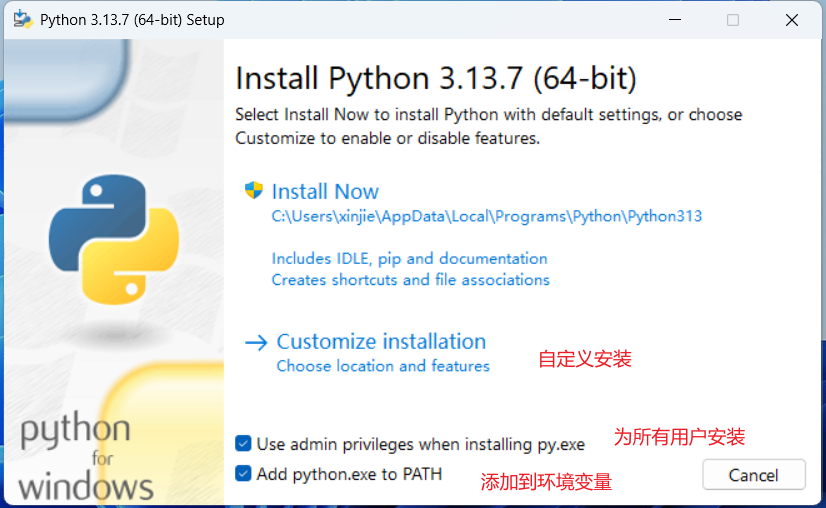
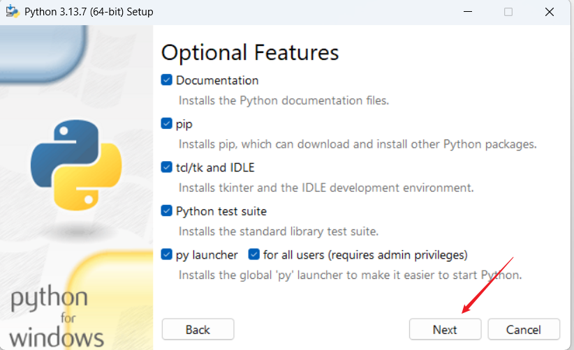
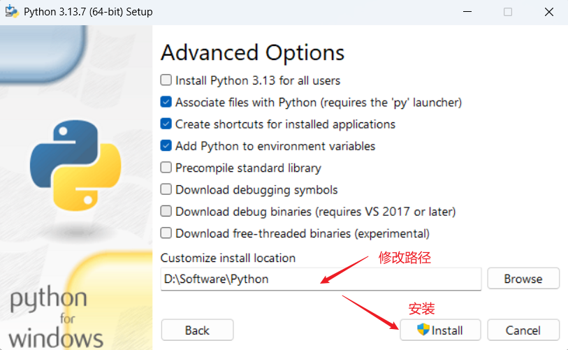

# Python 基础入门教程

[[toc]]

`Python` 是一种简洁且功能强大的编程语言。它的语法清晰易懂，广泛应用于数据分析、人工智能、Web 开发、自动化脚本等领域。

## 一、Python 简介

`Python` 是由 `Guido van Rossum` 于 1989 `年发布的，它的设计理念强调代码可读性，简洁且易于维护。Python` 的语法很接近自然语言，使得开发者能够快速上手。

### Python 的特点

- **简洁易读**：Python 的语法简单，且代码块由缩进而非花括号定义，代码非常整洁。
- **跨平台**：Python 可以运行在 Windows、Linux、macOS 等多种操作系统上。
- **丰富的库和框架**：Python 拥有丰富的标准库和第三方库，可以实现多种复杂功能。
- **面向对象**：Python 支持面向对象编程（OOP），可以帮助你构建更结构化、模块化的代码。

## 二、安装 Python

在开始编程之前，首先需要在你的计算机上安装 Python。

1. **下载 Python**：访问 [Python 官方网站](https://www.python.org/downloads/)，选择适合你操作系统的 Python 版本进行下载。
2. **安装 Python**：下载完成后，运行安装程序。安装时请勾选 “Add Python to PATH” 选项，确保你可以在命令行中直接使用 Python。

**安装时添加到环境变量**

{width=70%}

**next**

{width=70%}

**修改安装目录**

{width=70%}

安装完成后，你可以在终端或者命令提示符中输入以下命令来检查 Python 是否安装成功：

```bash
python --version
```

如果输出了 Python 的版本号，说明安装成功。

## 三、Python 基础语法

### 1. 变量与数据类型

在 Python 中，变量无需声明类型，可以直接赋值。常见的数据类型包括整数（`int`）、浮点数（`float`）、字符串（`str`）、布尔值（`bool`）等。

```python
# 整数类型
x = 10
# 浮点数类型
y = 3.14
# 字符串类型
name = "Python"
# 布尔类型
is_active = True
```

Python 会根据赋值自动推断数据类型，因此你不需要明确声明变量类型。

### 2. 基本运算

Python 支持基本的数学运算，比如加法、减法、乘法、除法、求余等。

```python
a = 5
b = 2

print(a + b)  # 加法
print(a - b)  # 减法
print(a * b)  # 乘法
print(a / b)  # 除法
print(a % b)  # 取余
```

### 3. 字符串操作

字符串是 Python 中最常用的数据类型之一。你可以使用引号定义字符串，可以是单引号 `'` 或双引号 `"`。

```python
str1 = "Hello"
str2 = 'World'

# 字符串连接
greeting = str1 + " " + str2
print(greeting)  # 输出: Hello World

# 字符串重复
echo = str1 * 3
print(echo)  # 输出: HelloHelloHello
```

### 4. 条件语句

Python 使用 `if`、`elif` 和 `else` 来实现条件判断。

```python
x = 10
if x > 5:
    print("x 大于 5")   # [!code highlight] 此处必须缩进，否则编译报错
elif x == 5:
    print("x 等于 5")
else:
    print("x 小于 5")
```

### 5. 循环

Python 支持两种类型的循环：`for` 循环和 `while` 循环。

#### `for` 循环

`for` 循环用于遍历序列（如列表、字符串、字典等）。

```python
for i in range(5):
    print(i)  # 输出: 0 1 2 3 4  # [!code highlight] 同样需要缩进
```

#### `while` 循环

`while` 循环会一直执行直到条件不满足为止。

```python
i = 0
while i < 5:
    print(i)
    i += 1  # 输出: 0 1 2 3 4
```

::: tip range() 函数

range 是 Python 内置的一个“可迭代整数序列生成器”。

range 就是 Python 提供的“轻量级整数序列工厂”，专为循环而生，高效又节省内存。

```python
>>> list(range(5))          # 只给终点
[0, 1, 2, 3, 4]

>>> list(range(2, 7))       # 起点, 终点
[2, 3, 4, 5, 6]

>>> list(range(1, 10, 2))   # 起点, 终点, 步长
[1, 3, 5, 7, 9]

>>> list(range(10, 0, -2))  # 负步长，倒着数
[10, 8, 6, 4, 2]
```

:::

### 6. 函数

函数是 `Python` 中组织代码的基本单元，函数可以接受参数并返回值。

::: warning 函数没有方法体{}

函数的声明格式为：`def 函数名(参数列表):`
Python 的语法把函数体直接写在冒号 + 缩进块里

:::

```python
# 定义一个加法函数
def add(a, b):
    return a + b

result = add(3, 4)
print(result)  # 输出: 7
```

## 四、Python 数据结构

### 1. 列表

列表是 `Python` 中常用的序列类型，可以存储多个元素，支持修改、删除等操作。

```python
# 定义一个列表
fruits = ['apple', 'banana', 'cherry']

# 访问元素
print(fruits[0])  # 输出: apple

# 添加元素
fruits.append('orange')

# 删除元素
fruits.remove('banana')

print(fruits)  # 输出: ['apple', 'cherry', 'orange']
```

`Python` 的列表（list）和`JavaScript`的数组（array）虽然看起来很相似，但在很多方面有重要的区别：

**1. 数据类型限制**

```python
# Python列表 - 可以混合类型，但通常建议单一类型
mixed_list = [1, "hello", 3.14, True, [1, 2]]  # 可以，但不推荐

# 类型提示（Python 3.5+）
from typing import List
numbers: List[int] = [1, 2, 3, 4, 5]  # 指定只能包含整数
```

```javascript
// JS数组 - 非常灵活，混合类型很常见
let mixedArray = [1, "hello", true, {name: "Alice"}, [1, 2, 3]];
```

**2. 负数索引**

```python
# Python支持负数索引（从末尾开始）
my_list = [10, 20, 30, 40, 50]
print(my_list[-1])  # 50（最后一个元素）
print(my_list[-2])  # 40（倒数第二个）
```

```javascript
// JS不支持负数索引
let myArray = [10, 20, 30, 40, 50];
console.log(myArray[-1]);  // undefined
// 需要这样写：
console.log(myArray[myArray.length - 1]);  // 50
```

**3. 切片操作**

```python
# Python强大的切片功能
my_list = [0, 1, 2, 3, 4, 5]
print(my_list[1:4])     # [1, 2, 3]
print(my_list[:3])      # [0, 1, 2]
print(my_list[3:])      # [3, 4, 5]
print(my_list[::2])     # [0, 2, 4]（步长为2）
print(my_list[::-1])    # [5, 4, 3, 2, 1, 0]（反转）
```

```javascript
// JS使用slice()方法
let myArray = [0, 1, 2, 3, 4, 5];
console.log(myArray.slice(1, 4));     // [1, 2, 3]
console.log(myArray.slice(0, 3));     // [0, 1, 2]
console.log(myArray.slice(3));        // [3, 4, 5]
// 没有直接的步长参数，需要自己实现
```

**4. 列表推导式**

```python
# Python列表推导式 - 非常简洁
squares = [x**2 for x in range(10)]  # [0, 1, 4, 9, 16, 25, 36, 49, 64, 81]
even_squares = [x**2 for x in range(10) if x % 2 == 0]  # [0, 4, 16, 36, 64]
```

```javascript
// JS使用map()和filter()
let squares = [...Array(10).keys()].map(x => x ** 2);
let evenSquares = [...Array(10).keys()].filter(x => x % 2 === 0).map(x => x ** 2);
// 或者使用reduce()
```

**5. 方法名称差异**

```python
# Python
my_list = [1, 2, 3]
my_list.append(4)           # 添加元素
my_list.extend([5, 6])      # 扩展列表
my_list.insert(1, 1.5)      # 插入
my_list.remove(2)           # 删除指定值
popped = my_list.pop()      # 弹出最后一个
my_list.sort()              # 排序
my_list.reverse()           # 反转
```

```javascript
// JavaScript
let myArray = [1, 2, 3];
myArray.push(4);            // 添加元素到末尾
myArray.unshift(0);         // 添加到开头
myArray.concat([5, 6]);     // 连接（返回新数组）
myArray.splice(1, 0, 1.5);  // 插入/删除
let popped = myArray.pop(); // 弹出最后一个
let shifted = myArray.shift(); // 弹出第一个
myArray.sort();             // 排序
myArray.reverse();          // 反转
```

**6. 稀疏数组**

```javascript
// JS数组可以是稀疏的
let sparse = [1, , , 4];  // 中间有空位
console.log(sparse.length);  // 4
console.log(sparse[1]);      // undefined
```

```python
# Python列表不能是稀疏的
# my_list = [1, , , 4]  # 语法错误
# 必须显式填充
my_list = [1, None, None, 4]  # 使用None代表空值
```

**7. 解包操作**

```python
# Python的解包
my_list = [1, 2, 3]
a, b, c = my_list  # a=1, b=2, c=3
first, *rest = [1, 2, 3, 4]  # first=1, rest=[2, 3, 4]
```

```javascript
// JS的解构
let myArray = [1, 2, 3];
let [a, b, c] = myArray;  // a=1, b=2, c=3
let [first, ...rest] = [1, 2, 3, 4];  // first=1, rest=[2, 3, 4]
```

**8. 性能特性**

```python
# Python列表是对象数组（存储的是引用）
# 插入/删除操作 O(n)
# 索引访问 O(1)
```

```javascript
// JS数组也是对象，但引擎会优化为连续内存
// 类似Python的性能特征，但引擎优化更多
```

**9. 数组方法返回值**

```python
# Python中修改列表的方法通常返回None
my_list = [3, 1, 2]
result = my_list.sort()
print(result)  # None
print(my_list)  # [1, 2, 3]（原列表被修改）
```

```javascript
// JS中有些方法返回新数组
let myArray = [3, 1, 2];
let sorted = myArray.sort();
console.log(sorted);  // [1, 2, 3]（返回排序后的数组）
console.log(myArray); // [1, 2, 3]（原数组也被修改）
```

主要区别在于Python的列表更强调**一致性**和**可读性**，而JS的数组更强调**灵活性**和**函数式编程风格**。需要我详细解释某个具体方面吗？

### 2. 字典

字典是一种无序的数据结构，通过键值对（key-value）存储数据。

```python
person = {
    'name': 'Alice',
    'age': 25,
    'city': 'New York'
}

# 访问值
print(person['name'])  # 输出: Alice

# 添加或修改值
person['age'] = 26

# 删除键值对
del person['city']

print(person)  # 输出: {'name': 'Alice', 'age': 26}
```

`Python的字典（dict）和JavaScript的对象（Object）`虽然都用于存储键值对，但它们有很多重要的区别：

 **1.键的类型限制**

```python
# Python字典 - 键必须是不可变类型
my_dict = {
    1: "整数键",           # 整数可以
    3.14: "浮点数键",      # 浮点数可以
    "name": "字符串键",    # 字符串可以
    (1, 2): "元组键",      # 元组（不可变）可以
    # [1, 2]: "列表键"     # 错误！列表是可变的，不能作为键
}

# 不同类型键可以共存
print(my_dict[1])          # "整数键"
print(my_dict[3.14])       # "浮点数键"
print(my_dict[(1, 2)])     # "元组键"
```

```javascript
// JS对象 - 键会被自动转换为字符串
let obj = {
    1: "整数键",           // 实际键是 "1"
    "name": "字符串键",
    [1, 2]: "数组键"       // 实际键是 "1,2"
};

console.log(obj[1]);        // "整数键"（1被转换为"1"）
console.log(obj["1"]);      // 同上
console.log(obj[[1, 2]]);   // "数组键"（数组转成字符串"1,2"）

// Symbol类型的键（ES6+）
let sym = Symbol("id");
obj[sym] = "Symbol键";      // Symbol保持唯一性
```

**2.创建方式**

```python
# Python字典
# 字面量
person = {"name": "Alice", "age": 30}

# dict()构造函数
person2 = dict(name="Bob", age=25)  # 注意：键不需要引号

# 从键值对序列创建
pairs = [("name", "Charlie"), ("age", 35)]
person3 = dict(pairs)

# 字典推导式
squares = {x: x**2 for x in range(5)}  # {0: 0, 1: 1, 2: 4, 3: 9, 4: 16}

# zip创建
keys = ["name", "age"]
values = ["David", 40]
person4 = dict(zip(keys, values))
```

```javascript
// JS对象
// 字面量
let person = {name: "Alice", age: 30};

// Object()构造函数
let person2 = new Object();
person2.name = "Bob";
person2.age = 25;

// Object.create()
let proto = {greet() {return "Hello";}};
let person3 = Object.create(proto);
person3.name = "Charlie";

// 计算属性名（ES6+）
let key = "dynamic_key";
let obj = {[key]: "dynamic value"};

// Object.fromEntries()（ES2019）
let entries = [["name", "David"], ["age", 40]];
let person4 = Object.fromEntries(entries);
```

**3.访问方式**

```python
# Python字典
my_dict = {"name": "Alice", "age": 30}

# 直接访问（键不存在会报错）
print(my_dict["name"])      # "Alice"
# print(my_dict["gender"])  # KeyError!

# get()方法（安全访问）
print(my_dict.get("name"))      # "Alice"
print(my_dict.get("gender"))    # None
print(my_dict.get("gender", "Unknown"))  # "Unknown"（默认值）

# setdefault()（如果键不存在，设置默认值）
my_dict.setdefault("city", "New York")  # 设置默认值
print(my_dict)  # {"name": "Alice", "age": 30, "city": "New York"}
```

```javascript
// JS对象
let obj = {name: "Alice", age: 30};

// 点号访问
console.log(obj.name);      // "Alice"
console.log(obj.gender);    // undefined（不会报错）

// 方括号访问（可以访问特殊键名）
console.log(obj["name"]);   // "Alice"
let key = "age";
console.log(obj[key]);      // 30

// 可选链操作符（ES2020）
console.log(obj?.address?.city);  // undefined（安全访问）

// 使用in运算符检查属性
console.log("name" in obj);        // true
console.log("toString" in obj);    // true（继承的属性）

// hasOwnProperty()检查自身属性
console.log(obj.hasOwnProperty("name"));     // true
console.log(obj.hasOwnProperty("toString")); // false
```

**4.方法和操作**

```python
# Python字典方法
my_dict = {"name": "Alice", "age": 30, "city": "New York"}

# 获取所有键、值、项
print(my_dict.keys())      # dict_keys(['name', 'age', 'city'])
print(my_dict.values())    # dict_values(['Alice', 30, 'New York'])
print(my_dict.items())     # dict_items([('name', 'Alice'), ('age', 30), ('city', 'New York')])

# 遍历
for key, value in my_dict.items():
    print(f"{key}: {value}")

# 更新字典
my_dict.update({"age": 31, "job": "Engineer"})  # 更新/添加多个键值

# 删除
del my_dict["city"]                 # 删除键
value = my_dict.pop("age")          # 删除并返回值
last_item = my_dict.popitem()       # 删除并返回最后一个键值对（Python 3.7+ 有序）

# 合并（Python 3.9+）
dict1 = {"a": 1, "b": 2}
dict2 = {"c": 3, "d": 4}
merged = dict1 | dict2              # 合并运算符
dict1 |= dict2                      # 更新运算符
```

```javascript
// JS对象方法
let obj = {name: "Alice", age: 30, city: "New York"};

// 获取键、值、项
console.log(Object.keys(obj));      // ['name', 'age', 'city']
console.log(Object.values(obj));    // ['Alice', 30, 'New York']
console.log(Object.entries(obj));   // [['name', 'Alice'], ['age', 30], ['city', 'New York']]

// 遍历
Object.entries(obj).forEach(([key, value]) => {
    console.log(`${key}: ${value}`);
});

// 合并/复制
let copy = Object.assign({}, obj);          // 浅拷贝
let copy2 = {...obj};                        // 展开运算符（ES2018）
let merged = {...obj, job: "Engineer"};      // 合并

// 删除
delete obj.city;                             // 删除属性

// 冻结对象（不可修改）
Object.freeze(obj);                          // 不能再添加/修改属性
console.log(Object.isFrozen(obj));           // true

// 密封对象（不能添加/删除，但可以修改现有属性）
Object.seal(obj);
```

**5.有序性**

```python
# Python 3.7+ 字典保持插入顺序
my_dict = {}
my_dict["b"] = 2
my_dict["a"] = 1
my_dict["c"] = 3
print(list(my_dict.keys()))  # ['b', 'a', 'c']（保持插入顺序）

# 可以使用OrderedDict（需要时）
from collections import OrderedDict
ordered = OrderedDict()
ordered["x"] = 1
ordered["y"] = 2
```

```javascript
// JS对象属性顺序：
// 1. 整数键（升序）
// 2. 字符串键（按添加顺序）
// 3. Symbol键（按添加顺序）
let obj = {
    "b": 2,
    "1": "first",    // 整数键会排在前面
    "a": 1,
    "2": "second",
    "c": 3
};
console.log(Object.keys(obj));  // ['1', '2', 'b', 'a', 'c']

// Map对象保证插入顺序（ES6+）
let map = new Map();
map.set("b", 2);
map.set("a", 1);
console.log([...map.keys()]);  // ['b', 'a']（保持顺序）
```

**6.原型链 vs 类**

```javascript
// JS对象有原型链
let parent = {greet() {return "Hello";}};
let child = Object.create(parent);
child.name = "Alice";

console.log(child.name);      // "Alice"（自身属性）
console.log(child.greet());   // "Hello"（继承的方法）
console.log(child.toString()); // 继承自Object原型
```

```python
# Python字典是纯粹的哈希表
my_dict = {"name": "Alice"}

# 没有继承链
# my_dict.greet()  # AttributeError!

# 如果需要类似功能，使用自定义类
class Person:
    def __init__(self, name):
        self.name = name

    def greet(self):
        return f"Hello, I'm {self.name}"

person = Person("Alice")
print(person.greet())  # "Hello, I'm Alice"
```

**7.JSON兼容性**

```python
# Python字典转JSON
import json
person = {"name": "Alice", "age": 30}
json_str = json.dumps(person)     # '{"name": "Alice", "age": 30}'
person2 = json.loads(json_str)    # 转回字典

# 注意：Python元组键会被转成字符串
dict_with_tuple = {(1, 2): "value"}
# json.dumps(dict_with_tuple)  # TypeError! 元组键不能JSON序列化
```

```javascript
// JS对象和JSON天生兼容
let obj = {name: "Alice", age: 30};
let jsonStr = JSON.stringify(obj);  // '{"name":"Alice","age":30}'
let obj2 = JSON.parse(jsonStr);      // 转回对象

// 函数、undefined等会被忽略
let obj3 = {method() {}, undef: undefined};
JSON.stringify(obj3);  // '{}'
```

### 3. 元组

元组和列表类似，但是元组是不可变的，一旦创建就不能修改。

元组使用小括号，列表使用方括号。

**1.基本特点**

```python
# 元组使用圆括号 ()
point = (10, 20)
colors = ('red', 'green', 'blue')
person = ('Alice', 30, 'Engineer')

# 也可以不加括号（元组打包）
numbers = 1, 2, 3  # 也是元组

# 单元素元组需要加逗号
single = (5,)      # 正确
not_tuple = (5)    # 这是整数5，不是元组
```

**2.核心特性**

```python
# 1. 不可变性 - 创建后不能修改
my_tuple = (1, 2, 3)
# my_tuple[0] = 10  # 错误！会抛出TypeError

# 2. 可以包含不同类型
mixed = (1, 'hello', 3.14, True)

# 3. 有序性 - 保持元素的插入顺序
print(mixed[0])  # 1
print(mixed[1])  # 'hello'

# 4. 可以嵌套
nested = (1, (2, 3), (4, (5, 6)))
```

**3.常用操作**

```python
# 索引和切片（和列表一样）
my_tuple = (10, 20, 30, 40, 50)
print(my_tuple[0])      # 10
print(my_tuple[-1])     # 50（倒数第一个）
print(my_tuple[1:4])    # (20, 30, 40)（切片返回新元组）

# 连接和重复
t1 = (1, 2)
t2 = (3, 4)
print(t1 + t2)          # (1, 2, 3, 4)
print(t1 * 3)           # (1, 2, 1, 2, 1, 2)

# 成员检查
print(2 in t1)          # True
print(5 not in t1)      # True

# 长度
print(len(my_tuple))    # 5

# 计数和索引
my_tuple = (1, 2, 2, 3, 2)
print(my_tuple.count(2))  # 3（2出现的次数）
print(my_tuple.index(3))  # 3（3第一次出现的位置）
```

**4.元组解包**

```python
# 将元组元素赋值给多个变量
point = (10, 20)
x, y = point  # x=10, y=20

# 交换变量（利用元组打包和解包）
a, b = 1, 2
a, b = b, a  # a=2, b=1

# 使用*收集剩余元素
numbers = (1, 2, 3, 4, 5)
first, *middle, last = numbers
print(first)   # 1
print(middle)  # [2, 3, 4]（注意：得到的是列表）
print(last)    # 5
```

**5.元组 vs 列表**

```python
# 列表可变，元组不可变
my_list = [1, 2, 3]
my_list[0] = 10  # 可以修改

my_tuple = (1, 2, 3)
# my_tuple[0] = 10  # 不能修改

# 元组占用更少内存
import sys
my_list = [1, 2, 3, 4, 5]
my_tuple = (1, 2, 3, 4, 5)
print(sys.getsizeof(my_list))   # 较大（如120字节）
print(sys.getsizeof(my_tuple))  # 较小（如80字节）

# 元组可以作为字典键
locations = {
    (40.71, -74.00): 'New York',
    (51.50, -0.12): 'London'
}
# 列表不能作为字典键
```

**6.常用场景**

```python
# 1. 函数返回多个值
def get_user():
    return 'Alice', 30, 'alice@email.com'
name, age, email = get_user()

# 2. 作为记录（记录固定字段）
person = ('张三', 25, '工程师')

# 3. 保护数据不被修改
DEFAULT_CONFIG = ('localhost', 8080, True)  # 常量用元组

# 4. 用于格式化字符串
print('姓名: %s, 年龄: %d' % ('李四', 28))  # %格式化的参数是元组

# 5. 多值赋值
x, y = 10, 20  # 实际上是元组打包和解包
```

**7.命名元组（namedtuple）**

```python
from collections import namedtuple

# 定义一个有字段名的元组类型
Point = namedtuple('Point', ['x', 'y'])
Person = namedtuple('Person', 'name age job')

# 创建实例
p = Point(10, 20)
person = Person('王五', 28, '设计师')

# 可以通过字段名访问
print(p.x)           # 10
print(person.name)   # '王五'
print(person[0])     # '王五'（也支持索引访问）

# 比普通元组更可读，比类更轻量
```

**8.注意事项**

```python
# 元组中的可变对象可以修改
t = (1, [2, 3], 4)
t[1].append(4)  # 可以修改列表
print(t)  # (1, [2, 3, 4], 4) 元组本身没变，但内容变了

# 单元素元组必须有逗号
t1 = (5,)    # 元组
t2 = (5)     # 整数

# 空元组
empty = ()

# 创建元组的两种方式
a = (1, 2, 3)  # 常用
b = tuple([1, 2, 3])  # 从其他序列转换
c = tuple('hello')  # ('h', 'e', 'l', 'l', 'o')
```

**总结**

元组是Python中**轻量级、不可变**的数据结构，适合：

- 存储不需要修改的数据
- 作为字典的键
- 函数返回多个值
- 保护数据不被意外修改

当需要不可变的数据集合时，优先使用元组而不是列表。

## 五、异常处理

异常处理是`Python`中处理程序运行时错误的机制，让程序能够优雅地处理错误而不是直接崩溃。

**1.基本语法：try-except**

```python
# 最简单的异常处理
try:
    # 可能出错的代码
    number = int(input("请输入一个数字: "))
    result = 10 / number
    print(f"结果是: {result}")
except:
    # 发生异常时执行的代码
    print("出错了！")

# 更推荐的写法：指定异常类型
try:
    number = int(input("请输入一个数字: "))
    result = 10 / number
    print(f"结果是: {result}")
except ValueError:
    print("输入的不是有效的数字！")
except ZeroDivisionError:
    print("不能除以零！")
```

**2.捕获多个异常**

```python
# 方式1：多个except块
try:
    num = int(input("请输入数字: "))
    result = 100 / num
    data = [1, 2, 3]
    print(data[num])
except ValueError:
    print("请输入有效的数字！")
except ZeroDivisionError:
    print("除数不能为0！")
except IndexError:
    print("索引超出范围！")

# 方式2：一个except捕获多种异常
try:
    num = int(input("请输入数字: "))
    result = 100 / num
    data = [1, 2, 3]
    print(data[num])
except (ValueError, ZeroDivisionError, IndexError) as e:
    print(f"发生错误: {e}")
    print(f"错误类型: {type(e).__name__}")
```

**3.完整的异常处理结构**

```python
try:
    # 尝试执行的代码
    file = open("data.txt", "r")
    content = file.read()
    number = int(content)
    result = 100 / number
except FileNotFoundError:
    print("文件不存在！")
except ValueError:
    print("文件内容不是有效的数字！")
except ZeroDivisionError:
    print("文件中的数字不能为0！")
except Exception as e:
    # 捕获所有其他异常
    print(f"其他错误: {e}")
else:
    # 没有异常时执行（可选）
    print(f"计算成功，结果是: {result}")
finally:
    # 无论是否有异常都会执行（可选）
    print("清理工作：关闭文件")
    if 'file' in locals():
        file.close()
```

**4.常见的异常类型**

```python
# 1. ValueError - 值错误
int("abc")  # ValueError: invalid literal for int()

# 2. TypeError - 类型错误
"123" + 456  # TypeError: can only concatenate str to str

# 3. IndexError - 索引错误
list = [1, 2, 3]
list[5]  # IndexError: list index out of range

# 4. KeyError - 键错误
dict = {"name": "Alice"}
dict["age"]  # KeyError: 'age'

# 5. ZeroDivisionError - 除零错误
10 / 0  # ZeroDivisionError: division by zero

# 6. FileNotFoundError - 文件不存在
open("not_exist.txt")  # FileNotFoundError

# 7. AttributeError - 属性错误
"string".nonexistent_method()  # AttributeError

# 8. ImportError - 导入错误
import non_existent_module  # ImportError
```

**5.抛出异常（raise）**

```python
# 手动抛出异常
def withdraw(amount, balance):
    if amount <= 0:
        raise ValueError("取款金额必须大于0")
    if amount > balance:
        raise ValueError("余额不足")
    return balance - amount

# 使用自定义异常
try:
    new_balance = withdraw(-100, 500)
except ValueError as e:
    print(f"取款失败: {e}")

# 重新抛出异常
def process_data(data):
    try:
        result = 10 / data
    except ZeroDivisionError:
        print("记录错误日志...")
        raise  # 重新抛出相同的异常
```

**6.自定义异常**

```python
# 创建自定义异常类（继承Exception）
class InsufficientBalanceError(Exception):
    """余额不足异常"""
    pass

class InvalidAmountError(Exception):
    """无效金额异常"""
    def __init__(self, amount, message="金额无效"):
        self.amount = amount
        self.message = message
        super().__init__(f"{message}: {amount}")

# 使用自定义异常
class BankAccount:
    def __init__(self, balance):
        self.balance = balance

    def withdraw(self, amount):
        if amount <= 0:
            raise InvalidAmountError(amount, "取款金额必须为正数")
        if amount > self.balance:
            raise InsufficientBalanceError(f"余额不足，当前余额: {self.balance}")

        self.balance -= amount
        return self.balance

# 测试
account = BankAccount(1000)
try:
    account.withdraw(1500)
except InsufficientBalanceError as e:
    print(f"错误: {e}")
except InvalidAmountError as e:
    print(f"错误: {e}")
```

**7.异常处理的最佳实践**

```python
# 1. 具体异常优先，通用异常最后
try:
    # 代码
except FileNotFoundError:
    # 具体处理
except PermissionError:
    # 具体处理
except Exception:
    # 其他所有异常
    pass

# 2. 避免空的except块
try:
    # 代码
except:  # 不要这样写！会捕获所有异常，包括键盘中断
    pass  # 空块，隐藏错误

# 3. 尽量缩小try块的范围
# 不好
try:
    file = open("data.txt")
    data = file.read()
    number = int(data)
    result = 100 / number
except:
    pass

# 更好
file = open("data.txt")  # 这个异常单独处理
try:
    data = file.read()
    number = int(data)
    result = 100 / number
except ValueError:
    print("数据格式错误")
except ZeroDivisionError:
    print("除零错误")
finally:
    file.close()

# 4. 使用with语句自动管理资源
try:
    with open("data.txt", "r") as file:
        content = file.read()
        # 自动关闭文件，即使发生异常
except FileNotFoundError:
    print("文件不存在")
```

**8.实际应用示例**

```python
def read_user_data(filename):
    """读取用户数据文件的示例"""
    users = []

    try:
        with open(filename, 'r', encoding='utf-8') as file:
            for line_num, line in enumerate(file, 1):
                try:
                    # 假设每行格式: name,age,city
                    name, age, city = line.strip().split(',')
                    users.append({
                        'name': name,
                        'age': int(age),
                        'city': city
                    })
                except ValueError as e:
                    print(f"第{line_num}行数据格式错误: {e}")
                    continue

    except FileNotFoundError:
        print(f"文件 {filename} 不存在")
        return []
    except PermissionError:
        print(f"没有权限读取文件 {filename}")
        return []
    except Exception as e:
        print(f"读取文件时发生未知错误: {e}")
        return []

    return users

# 使用
users = read_user_data("users.txt")
print(f"成功读取 {len(users)} 个用户")
```

**总结**

异常处理的关键点：

- **try-except**：捕获和处理异常
- **else**：没有异常时执行
- **finally**：无论是否异常都执行
- **raise**：手动抛出异常
- **自定义异常**：创建特定业务异常
- **异常链**：保留异常上下文

良好的异常处理让程序更健壮、更容易调试和维护。
