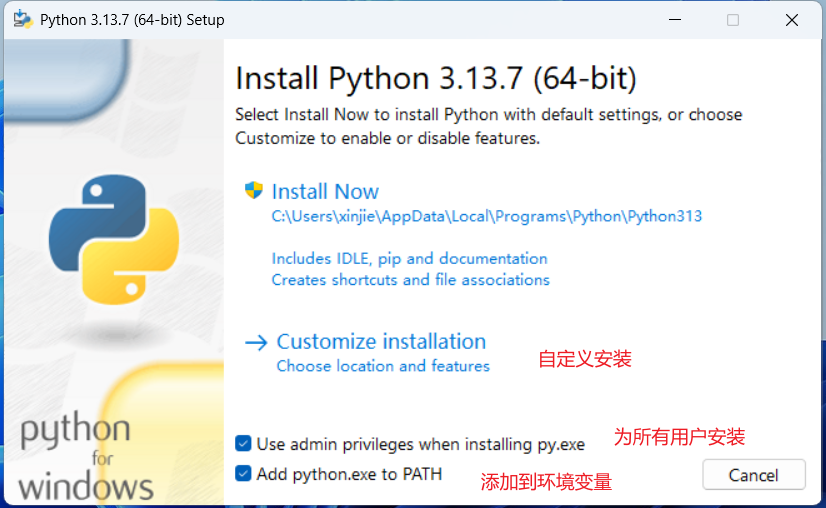
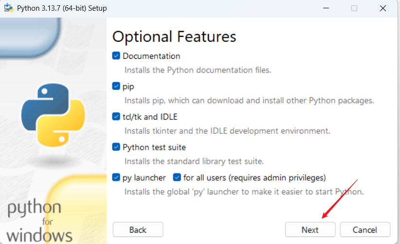
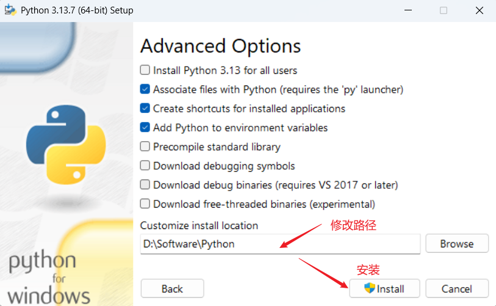

# Python 基础入门教程

[[toc]]

`Python` 是一种简洁且功能强大的编程语言。它的语法清晰易懂，广泛应用于数据分析、人工智能、Web 开发、自动化脚本等领域。

## 一、Python 简介

`Python` 是由 `Guido van Rossum` 于 1989 `年发布的，它的设计理念强调代码可读性，简洁且易于维护。Python` 的语法很接近自然语言，使得开发者能够快速上手。

### Python 的特点

- **简洁易读**：Python 的语法简单，且代码块由缩进而非花括号定义，代码非常整洁。
- **跨平台**：Python 可以运行在 Windows、Linux、macOS 等多种操作系统上。
- **丰富的库和框架**：Python 拥有丰富的标准库和第三方库，可以实现多种复杂功能。
- **面向对象**：Python 支持面向对象编程（OOP），可以帮助你构建更结构化、模块化的代码。

## 二、安装 Python

在开始编程之前，首先需要在你的计算机上安装 Python。

1. **下载 Python**：访问 [Python 官方网站](https://www.python.org/downloads/)，选择适合你操作系统的 Python 版本进行下载。
2. **安装 Python**：下载完成后，运行安装程序。安装时请勾选 “Add Python to PATH” 选项，确保你可以在命令行中直接使用 Python。

**安装时添加到环境变量**

{width=70%}

**next**

{width=70%}

**修改安装目录**

{width=70%}


安装完成后，你可以在终端或者命令提示符中输入以下命令来检查 Python 是否安装成功：

```bash
python --version
```

如果输出了 Python 的版本号，说明安装成功。

## 三、Python 基础语法

### 1. 变量与数据类型

在 Python 中，变量无需声明类型，可以直接赋值。常见的数据类型包括整数（`int`）、浮点数（`float`）、字符串（`str`）、布尔值（`bool`）等。

```python
# 整数类型
x = 10
# 浮点数类型
y = 3.14
# 字符串类型
name = "Python"
# 布尔类型
is_active = True
```

Python 会根据赋值自动推断数据类型，因此你不需要明确声明变量类型。

### 2. 基本运算

Python 支持基本的数学运算，比如加法、减法、乘法、除法、求余等。

```python
a = 5
b = 2

print(a + b)  # 加法
print(a - b)  # 减法
print(a * b)  # 乘法
print(a / b)  # 除法
print(a % b)  # 取余
```

### 3. 字符串操作

字符串是 Python 中最常用的数据类型之一。你可以使用引号定义字符串，可以是单引号 `'` 或双引号 `"`。

```python
str1 = "Hello"
str2 = 'World'

# 字符串连接
greeting = str1 + " " + str2
print(greeting)  # 输出: Hello World

# 字符串重复
echo = str1 * 3
print(echo)  # 输出: HelloHelloHello
```

### 4. 条件语句

Python 使用 `if`、`elif` 和 `else` 来实现条件判断。

```python
x = 10
if x > 5:
    print("x 大于 5")   # [!code highlight] 此处必须缩进，否则编译报错
elif x == 5:
    print("x 等于 5")
else:
    print("x 小于 5")
```

### 5. 循环

Python 支持两种类型的循环：`for` 循环和 `while` 循环。

#### `for` 循环

`for` 循环用于遍历序列（如列表、字符串、字典等）。

```python
for i in range(5):
    print(i)  # 输出: 0 1 2 3 4  # [!code highlight] 同样需要缩进
```

#### `while` 循环

`while` 循环会一直执行直到条件不满足为止。

```python
i = 0
while i < 5:
    print(i)
    i += 1  # 输出: 0 1 2 3 4
```

::: tip range() 函数

range 是 Python 内置的一个“可迭代整数序列生成器”。

range 就是 Python 提供的“轻量级整数序列工厂”，专为循环而生，高效又节省内存。


```python
>>> list(range(5))          # 只给终点
[0, 1, 2, 3, 4]

>>> list(range(2, 7))       # 起点, 终点
[2, 3, 4, 5, 6]

>>> list(range(1, 10, 2))   # 起点, 终点, 步长
[1, 3, 5, 7, 9]

>>> list(range(10, 0, -2))  # 负步长，倒着数
[10, 8, 6, 4, 2]
```
:::

### 6. 函数

函数是 `Python` 中组织代码的基本单元，函数可以接受参数并返回值。

::: warning 函数没有方法体{}

函数的声明格式为：`def 函数名(参数列表):`  
Python 的语法把函数体直接写在冒号 + 缩进块里

:::

```python
# 定义一个加法函数
def add(a, b):
    return a + b

result = add(3, 4)
print(result)  # 输出: 7
```

## 四、Python 数据结构

### 1. 列表

列表是 Python 中常用的序列类型，可以存储多个元素，支持修改、删除等操作。

```python
# 定义一个列表
fruits = ['apple', 'banana', 'cherry']

# 访问元素
print(fruits[0])  # 输出: apple

# 添加元素
fruits.append('orange')

# 删除元素
fruits.remove('banana')

print(fruits)  # 输出: ['apple', 'cherry', 'orange']
```

### 2. 字典

字典是一种无序的数据结构，通过键值对（key-value）存储数据。

```python
person = {
    'name': 'Alice',
    'age': 25,
    'city': 'New York'
}

# 访问值
print(person['name'])  # 输出: Alice

# 添加或修改值
person['age'] = 26

# 删除键值对
del person['city']

print(person)  # 输出: {'name': 'Alice', 'age': 26}
```

### 3. 元组

元组和列表类似，但是元组是不可变的，一旦创建就不能修改。

元组使用小括号，列表使用方括号。

```python
coordinates = (10, 20)

# 访问元素
print(coordinates[0])  # 输出: 10
```

## 五、异常处理

在编程过程中，可能会遇到各种错误和异常。Python 使用 `try`、`except` 块来捕获和处理异常，保证程序不会崩溃。

```python
try:
    x = 1 / 0
except ZeroDivisionError:
    print("不能除以零！")
```
