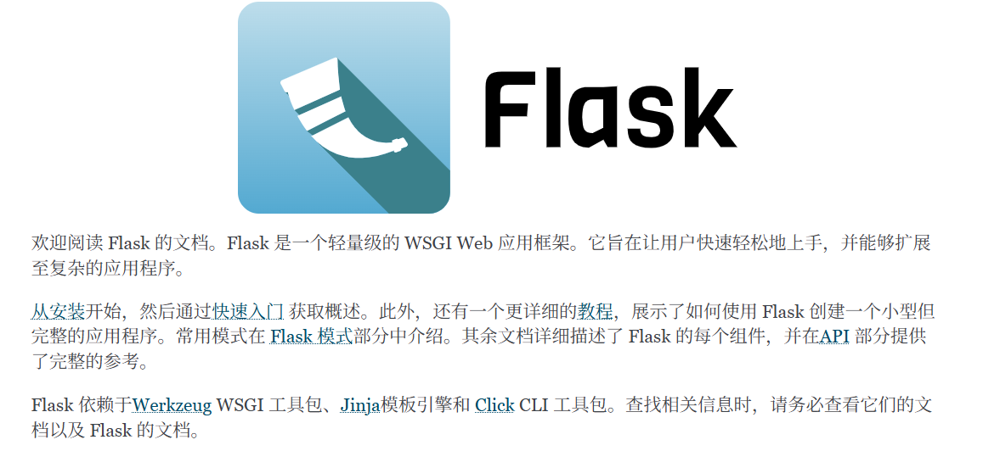

# Flask 入门

[[toc]]

在 `Python Web` 开发中，**[Flask](https://flask.palletsprojects.com/en/stable/)** 是一个非常流行的 Web 框架，它简洁、灵活，非常适合初学者入门。`Flask` 是一个轻量级框架（“微框架”），让开发者能够快速搭建 Web 应用程序。它不强制使用复杂的构架，提供了最基础的 Web 功能，适合用来构建小型应用、原型开发，甚至大规模的生产环境。



**Flask** 是一个基于 **WSGI** 的 Python Web 框架，由 **Armin Ronacher** 创建。`Flask` 具有以下特点：

- **微框架**：Flask 只提供了最基础的功能，例如路由、请求、响应、模板渲染等，其他功能可以根据需要选择第三方库来扩展。
- **灵活性**：Flask 不做过多的强制设计，开发者可以自由选择项目结构、库、数据库等。
- **易于上手**：Flask 的文档详细，学习曲线平缓，适合初学者。
- **大社区和扩展支持**：Flask 拥有庞大的开发社区，并且有大量第三方扩展（如数据库、表单、身份验证等）。

## 一、快速开始

**1. 安装 Flask**

可以使用 `pip` 命令在终端中安装它：

```bash
pip install flask
```

**2. 创建一个简单的 Flask 应用**

`Flask` 的安装完成后，你可以创建一个简单的应用。打开一个新的 Python 文件 `app.py`，并添加以下内容：

```python
from flask import Flask

# 创建一个 Flask 应用实例
app = Flask(__name__)

# 定义一个路由
@app.route('/')
def hello_world():
    return 'Hello, World!'

# 启动 Flask 开发服务器
if __name__ == '__main__':
    app.run(debug=True)
```

这段代码实现了以下几个功能：

1. **创建 Flask 应用实例**：`app = Flask(__name__)` 创建了一个 Flask 应用实例 `app`。
2. **定义路由**：`@app.route('/')` 装饰器用来定义一个路由，绑定到 `/` 路径上。当用户访问这个路径时，`hello_world()` 函数就会被调用，并返回 "Hello, World!" 作为响应。
3. **启动开发服务器**：`app.run(debug=True)` 启动 Flask 内置的开发服务器，并开启调试模式。在调试模式下，当代码修改后，Flask 会自动重载应用，并显示详细的错误信息。

**3. 启动 Flask 应用**

在终端中运行以下命令来启动 Flask 应用：

```bash
python app.py
```

默认情况下，Flask 会在 `http://127.0.0.1:5000/` 启动 Web 服务器。打开浏览器并访问这个地址，你会看到如下输出：

```
Hello, World!
```

## 二、路由与视图

**1. 路由的概念**

`Flask` 使用路由来将请求的 `URL 和 Python` 函数进行映射。当用户访问指定的 URL 时，Flask 会调用相应的视图函数来处理请求。

**2. 路由参数**

你还可以在路由中使用动态参数，允许用户传递一些信息。例如：

```python
@app.route('/greet/<name>')
def greet(name):
    return f'Hello, {name}!'
```

在这个例子中，`<name>` 是一个动态参数，Flask 会将 URL 中的 `name` 部分作为参数传递给 `greet()` 函数。例如，访问 `http://127.0.0.1:5000/greet/John` 时，浏览器会显示：

```
Hello, John!
```

**3. HTTP 方法**

Flask 路由默认只处理 **GET** 请求，如果你需要处理其他 HTTP 方法（如 **POST**、**PUT**、**DELETE** 等），可以通过 `methods` 参数来指定：

```python
@app.route('/submit', methods=['POST'])
def submit_form():
    return 'Form submitted!'
```

在这个例子中，`/submit` 路由只会响应 **POST** 请求。

**4. 处理请求和响应**

`Flask` 提供了 `request` 和 `response` 对象来处理 HTTP 请求和响应。`request` 对象可以获取请求的相关信息，如请求参数、表单数据、JSON 数据等。`response` 对象用于返回数据给客户端。

例如，获取查询参数：

```python
from flask import request

@app.route('/search')
def search():
    query = request.args.get('q')
    return f'Search query: {query}'
```

访问 `http://127.0.0.1:5000/search?q=Flask` 时，浏览器会返回：

```
Search query: Flask
```

## 三、模板渲染

`Flask` 使用 **Jinja2** 模板引擎来渲染 HTML 页面，允许你在模板中使用动态数据。

**1. 创建模板**

在项目目录下创建一个文件夹 `templates`，并在其中创建一个 `index.html` 文件：

```html
<!-- templates/index.html -->
<!DOCTYPE html>
<html lang="en">
  <head>
    <meta charset="UTF-8" />
    <meta name="viewport" content="width=device-width, initial-scale=1.0" />
    <title>Flask App</title>
  </head>
  <body>
    <h1>Hello, {{ name }}!</h1>
  </body>
</html>
```

**2. 渲染模板**

然后在 Flask 应用中使用 `render_template()` 函数来渲染模板：

```python
from flask import render_template

@app.route('/greet/<name>')
def greet(name):
    return render_template('index.html', name=name)
```

访问 `http://127.0.0.1:5000/greet/John` 时，浏览器会显示：

```
Hello, John!
```

## 四、表单处理

`Flask` 也允许处理 `Web` 表单。我们可以使用 `request.form` 来获取表单提交的数据。

**1. 创建表单**

首先，在 `templates` 文件夹下创建一个简单的 HTML 表单：

```html
<!-- templates/form.html -->
<form method="POST" action="/submit">
  <label for="name">Name:</label>
  <input type="text" id="name" name="name" />
  <button type="submit">Submit</button>
</form>
```

**2. 处理表单数据**

在 `Flask` 应用中处理表单提交：

```python
@app.route('/submit', methods=['GET', 'POST'])
def submit():
    if request.method == 'POST':
        name = request.form['name']
        return f'Thank you, {name}!'
    return render_template('form.html')
```

访问 `http://127.0.0.1:5000/submit` 时，你会看到表单。当你提交表单时，Flask 会显示提交的 `name` 字段内容。

## 五、数据库集成

`Flask` 本身并不提供数据库功能，但你可以使用多种数据库扩展（如 **Flask-SQLAlchemy**）来将数据库集成到应用中。

**1. 安装 Flask-SQLAlchemy**

```bash
pip install flask-sqlalchemy
```

**2. 配置数据库**

在 `Flask` 应用中配置 `SQLAlchemy`：

```python
from flask import Flask
from flask_sqlalchemy import SQLAlchemy

app = Flask(__name__)
app.config['SQLALCHEMY_DATABASE_URI'] = 'sqlite:///example.db'
db = SQLAlchemy(app)

class User(db.Model):
    id = db.Column(db.Integer, primary_key=True)
    username = db.Column(db.String(80), unique=True, nullable=False)

# 初始化数据库
@app.before_first_request
def create_tables():
    db.create_all()

@app.route('/add_user/<username>')
def add_user(username):
    new_user = User(username=username)
    db.session.add(new_user)
    db.session.commit()
    return f'User {username} added!'

if __name__ == '__main__':
    app.run(debug=True)
```

在这个例子中，我们创建了一个 `User` 模型，使用 SQLite 数据库来存储数据。

## 六、对比 FastAPI

截至 25 年 4 月中旬，FastAPI 与 Flask 在 github 上获取的 Starts 和 Forks 如下所示。Stars 数量代表了仓库受欢迎程度的一种度量，较高的 Stars 数量通常表示该仓库备受关注和认可。Forks 数量表示了仓库被派生的次数，是对仓库在开源社区中的影响力和参与度的一种度量。

| 框架名  | Stars | Forks | 地址                                |
| ------- | ----- | ----- | ----------------------------------- |
| FastAPI | 83.1k | 7.2k  | https://github.com/tiangolo/fastapi |
| Flask   | 69.3k | 16.4k | https://github.com/pallets/flask    |


详细区别见：https://apifox.com/apiskills/fastapi-vs-flask/