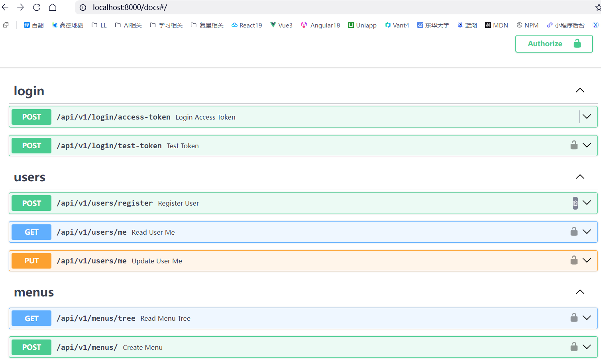

# FastAPI 讲解：Python Web API 的首选

[[toc]]

在 `Python Web` 框架的世界里，如果你问：

> 有没有一个 **性能好、类型安全、文档自动生成、还很好写** 的框架？

答案大概率是 **FastAPI**。

它不是“又一个 `Web` 框架”，而是把 **现代工程实践** 直接塞进了 `Python Web` 开发里。

## 一、FastAPI 是什么？

**FastAPI** 是一个用于构建 API 的现代 `Python Web` 框架，特点只有一句话：

> **快（Fast） + 类型安全（Type Hints） + 自动文档（OpenAPI）**

它基于三大核心技术：

* **Starlette**：高性能 ASGI Web 框架（路由、中间件）
* **Pydantic**：数据校验 & 类型系统
* **Uvicorn**：高性能异步服务器

## 二、为什么 FastAPI 会火？

### 2.1 性能接近 Node / Go

FastAPI 基于 **ASGI + async/await**，官方 benchmark 显示：

* 性能 ≈ Node.js
* 明显快于 Flask / Django（同步模式）

适合：

* AI 服务
* 高并发 API
* 微服务网关

### 2.2 类型即文档，文档即接口

这是 FastAPI **最杀手级的设计**。

```python
from fastapi import FastAPI

app = FastAPI()

@app.get("/users/{user_id}")
def get_user(user_id: int):
    return {"user_id": user_id}
```

你得到了什么？

* `user_id` 自动校验为 `int`
* 错误自动返回 422
* Swagger 文档自动生成
* OpenAPI Schema 自动输出

👉 **写代码 = 写接口文档**

### 2.3 内置 Swagger / ReDoc

启动后直接访问：

* Swagger UI
  👉 [http://127.0.0.1:8000/docs](http://127.0.0.1:8000/docs)



前端同学看到会直接爱上 😄

## 三、一个最小 FastAPI 应用

### 3.1 安装

```bash
pip install fastapi uvicorn
```

### 3.2 创建 `main.py`

```python
from fastapi import FastAPI

app = FastAPI()

@app.get("/")
def read_root():
    return {"hello": "world"}
```

### 3.3 启动服务

```bash
uvicorn main:app --reload
```

* `main`：文件名
* `app`：FastAPI 实例
* `--reload`：热更新（开发必开）

## 四、请求参数详解

### 4.1 路径参数

```python
@app.get("/items/{item_id}")
def read_item(item_id: int):
    return {"item_id": item_id}
```

自动校验：

* `/items/abc` ❌
* `/items/123` ✅

### 4.2 Query 参数

```python
@app.get("/items")
def list_items(page: int = 1, size: int = 10):
    return {"page": page, "size": size}
```

访问：

```
/items?page=2&size=20
```

### 4.3 请求体（Pydantic）

```python
from pydantic import BaseModel

class User(BaseModel):
    name: str
    age: int
    email: str | None = None

@app.post("/users")
def create_user(user: User):
    return user
```

**自动获得：**

* JSON 校验
* 字段提示
* 错误信息
* Swagger 表单

## 五、依赖注入（FastAPI 的隐藏王牌）

FastAPI 的 **Depends** 非常强大。

```python
from fastapi import Depends

def get_token():
    return "token123"

@app.get("/profile")
def profile(token: str = Depends(get_token)):
    return {"token": token}
```

**可以用来做：**

* 登录鉴权
* 数据库连接
* 权限校验
* 请求级缓存

👉 比 Spring 轻，比 Flask 规范。

## 六、异步支持：天生为高并发而生

```python
@app.get("/async")
async def async_api():
    await asyncio.sleep(1)
    return {"msg": "done"}
```

什么时候用 `async`？

* IO 密集型（DB / HTTP / Redis）
* 不适合 CPU 密集型（那得用多进程）

## 七、错误处理与状态码

```python
from fastapi import HTTPException

@app.get("/users/{id}")
def get_user(id: int):
    if id == 0:
        raise HTTPException(status_code=404, detail="User not found")
    return {"id": id}
```

返回格式统一、前端友好。

## 八、中间件 & CORS

```python
from fastapi.middleware.cors import CORSMiddleware

app.add_middleware(
    CORSMiddleware,
    allow_origins=["*"],
    allow_methods=["*"],
    allow_headers=["*"],
)
```

前后端分离必备。

## 九、FastAPI vs Flask vs Django

| 维度   | FastAPI | Flask | Django |
| ---- | ------- | ----- | ------ |
| 性能   | ⭐⭐⭐⭐    | ⭐⭐    | ⭐⭐     |
| 类型安全 | ✅       | ❌     | ❌      |
| 自动文档 | ✅       | ❌     | ❌      |
| 学习成本 | 中       | 低     | 高      |
| 工程化  | ⭐⭐⭐⭐    | ⭐⭐    | ⭐⭐⭐⭐   |

👉 **结论**：

* 小工具 → Flask
* 传统后台 → Django
* 现代 API / AI 服务 → **FastAPI**

## 十、FastAPI 适合哪些场景？

* AI / LLM 推理接口
* 前后端分离 API
* 微服务
* BFF（Backend For Frontend）
* 内部工具 & 中台

如果你做的是 **Next.js + API + AI**，FastAPI 非常搭。

**一个推荐的工程结构**

```text
app/
├── main.py
├── routers/
│   └── user.py
├── models/
│   └── user.py
├── services/
│   └── user_service.py
└── core/
    └── config.py
```
