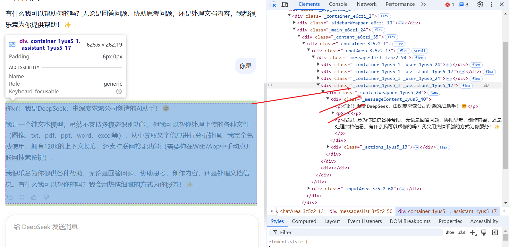
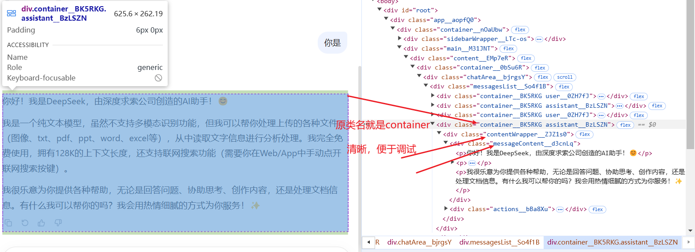

# css modules

[[toc]]

## 一、什么是 css modules

因为 React 没有 Vue 的`Scoped`，但是 React 又是 SPA(单页面应用)，所以需要一种方式来解决 css 的样式冲突问题，也就是把每个组件的样式做成单独的作用域，实现样式隔离，而 css modules 就是一种解决方案，但是我们需要借助一些工具来实现;

比如 webpack，postcss，css-loader，vite 等。

## 二、如何在 Vite 中使用 css modules

`css modules`，可以配合各种 css 预处理去使用，例如 less，sass，stylus 等。

```js
npm install less -D # 安装less 任选其一
npm install sass -D # 安装sass 任选其一
npm install stylus -D # 安装stylus 任选其一
```

> [!TIP] 在` Vite 中 css Modules `是开箱即用的，只需要把文件名设置为 xxx.module.[css|less|sass|stylus]，就可以使用 css modules 了。

src/components/Button/index.module.scss

```scss
.button {
  color: red;
}
```

src/components/Button/index.tsx

```tsx
//使用方法，直接引入即可
import styles from "./index.module.scss";

export default function Button() {
  return <button className={styles.button}>按钮</button>;
}
```

编译结果, 可以看到 button 类名被编译成了 button_pmkzx_6，这就是 css modules 的实现原理，通过在类名前添加一个唯一的哈希值，来实现样式隔离。

```html
<button class="button_pmkzx_6">按钮</button>
```

## 三、解决css modules调试时类名变掉的问题

 在 React 中使用 CSS Modules（`*.module.scss`）时，浏览器 DevTools 中看到的类名会变成类似 `ComponentName_hash__classname` 的格式，这是 CSS Modules 的**作用域隔离机制**导致的，属于正常行为。



### 为什么类名会变？

CSS Modules 通过构建工具（Webpack/Vite 等）在编译时：

1. **添加哈希值**：确保类名全局唯一，防止样式冲突
2. **保持可读性**：通常保留原始类名作为前缀，如 `Button_module_button__3x7a9`

### 调试时的应对方案

#### 1. 配置保留可读类名（推荐开发环境）

**Webpack 配置：**

```javascript
// webpack.config.js
{
  loader: 'css-loader',
  options: {
    modules: {
      localIdentName: '[local]__[hash:base64:6]' // 开发环境
      // 生产环境: '[hash:base64:8]'
    }
  }
}
```

**Vite 配置：**

```javascript
// vite.config.js
export default {
  css: {
    modules: {
      // 自定义生成的类名格式 （原类名+短哈希）
      generateScopedName: '[local]__[hash:base64:6]',
    }
  }
}
```

效果：`button__3x7a91`（原类名+短哈希）

如图所示



#### 2. 使用 Source Map

确保构建工具开启 CSS Source Map：

```javascript
// webpack
devtool: 'source-map' // 或 'eval-source-map'

// vite
css: { devSourcemap: true }
```

这样 DevTools 的 Elements 面板会显示原始类名，Sources 面板可定位到 SCSS 源文件。

#### 3. React DevTools 辅助

安装 **React Developer Tools** 浏览器扩展：

- Components 面板选中组件后，右侧可看到 `className` 的完整计算值
- 配合 "Highlight updates" 功能追踪样式变化

### 最佳实践总结

```javascript
// 推荐配置（开发 vs 生产）
const cssModulesConfig = isDev
  ? '[path][name]__[local]--[hash:base64:5]' // 包含路径，更易定位
  : '[hash:base64:8]'; // 生产环境压缩
```

这样调试时你能看到类似 `src-components-Button__primary--a3f9b` 的类名，既保留了可读性，又有隔离保障。
