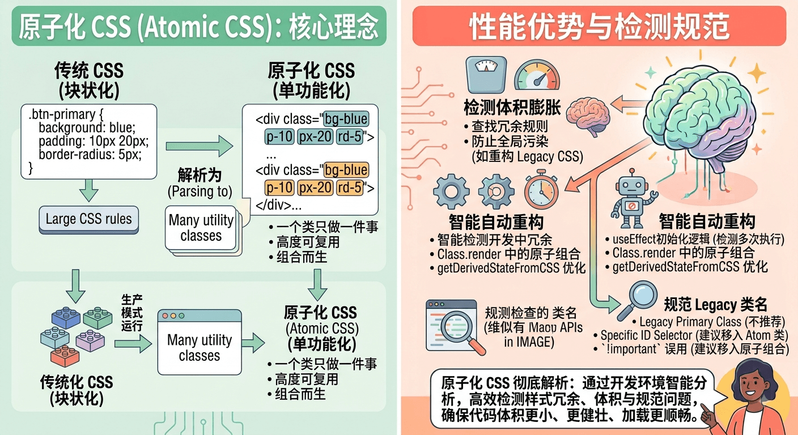

# CSS 原子化

[[toc]]



CSS 原子化`（Atomic CSS / Functional CSS）`是一种前端样式架构范式，其核心思想是：**将样式拆分为单一功能、不可再分的小粒度类名（即“原子类”），并通过在 HTML 中组合这些类名来构建页面 UI。**

最典型的代表是 **Tailwind CSS** 和 **UnoCSS**。


## 一、代码直观对比：传统 CSS vs 原子化 CSS

假设我们要开发一个标准的卡片组件：

### 1. 传统方式（BEM 命名规范 + 独立 CSS）

**HTML:**

```html
<div class="user-card">
  
  <div class="user-card__content">
    <h3 class="user-card__title">张三</h3>
    <p class="user-card__desc">前端高级工程师</p>
  </div>
</div>

```

**CSS:**

```css
.user-card {
  display: flex;
  align-items: center;
  padding: 1.5rem;
  background-color: #ffffff;
  border-radius: 0.5rem;
  box-shadow: 0 4px 6px -1px rgba(0, 0, 0, 0.1);
}
.user-card__avatar {
  width: 3rem;
  height: 3rem;
  border-radius: 50%;
  margin-right: 1rem;
}
.user-card__title {
  font-size: 1.125rem;
  font-weight: 600;
  color: #1f2937;
}
.user-card__desc {
  font-size: 0.875rem;
  color: #6b7280;
}

```

### 2. 原子化 CSS 方式（如 Tailwind CSS）

**HTML (无需写任何额外 CSS 文件)：**

```html
<div class="flex items-center p-6 bg-white rounded-lg shadow-md">
  
  <div>
    <h3 class="text-lg font-semibold text-gray-800">张三</h3>
    <p class="text-sm text-gray-500">前端高级工程师</p>
  </div>
</div>

```


## 二、CSS 范式演进对比

在 CSS 的发展历程中，前端工程师一直在寻找**隔离样式、提高复用率与维护性**的最佳解法：

| 方案 / 范式 | 代表技术 | 核心原理 | 主要优势 | 主要痛点 |
| --- | --- | --- | --- | --- |
| **传统命名规范** | BEM, OOCSS | 靠约定的 class 命名手动规避冲突 | 样式语义化好、HTML 干净 | 类名命名极其痛苦、CSS 体积随项目无限膨胀 |
| **样式隔离** | CSS Modules, Scoped CSS | 编译时自动生成唯一 Hash 类名 | 解决全局命名污染 | 依然需要维护大量的 CSS 文件，存在大量冗余 CSS |
| **CSS-in-JS** | Styled-Components, Emotion | 用 JS 编写 CSS 并按需注入 Style 标签 | 组件与样式高度绑定，支持强动态逻辑 | 运行时存在 performance 开销，增加 JS Bundle 体积 |
| **CSS 原子化** | Tailwind CSS, UnoCSS | 生成超小粒度的单一功能类名 | **体积停滞增长、零命名负担、极速开发** | HTML 显得冗长杂乱（密集恐惧症）、有一定的记忆成本 |


## 三、原子化 CSS 的核心优势

### 1. CSS 包体积的“边际递减效应”

在传统项目里，页面越多，CSS 样式文件就越大。
而在原子化 CSS 中，诸如 `flex`、`p-4`、`text-center` 等原子类是**高度复用**的。项目初期 CSS 体积会增长，但随着项目规模变大，CSS 体积会迅速触及上限并**趋于平缓**（通常整个项目的 CSS 只有几十 KB）。

### 2. 彻底终结“命名焦虑”

开发者不再需要纠结这个节点应该叫 `.user-profile-header-title-inner` 还是 `.user-info-text`。直接组合 `font-bold text-red-500` 即可完成排版。

### 3. 重构极其安全（无死链风险）

在传统 CSS 中，删除一个 HTML 节点时，你往往不敢删对应的 CSS 类，因为担心其他地方也用到了这个类，久而久之积累了大量 CSS 垃圾。
原子化 CSS 中，**样式生命周期与 HTML 节点完全一致**，删掉了 HTML 节点，关联的原子样式自然就不再使用。

### 4. 极致的开发体验 (DX)

无需在 `.tsx` / `.vue` 文件和 `.scss` 文件之间来回切换，无需关注全局变量注入，即写即见。配合编辑器插件（如 Tailwind CSS IntelliSense）可以提供极佳的自动补全提示。


## 四、争议与痛点

虽然原子化 CSS 非常流行，但也有其明显的局限性：

1. **HTML 看起来“脏乱差”**
当一个组件包含复杂响应式、深色模式、伪类状态（`hover`/`focus`）时，类名可能会变得非常长：
```html
<button class="px-4 py-2 bg-blue-500 text-white font-semibold rounded-lg shadow-md hover:bg-blue-700 focus:outline-none focus:ring-2 focus:ring-blue-400 focus:ring-opacity-75 dark:bg-blue-600 dark:hover:bg-blue-800 transition-all duration-200">
  提交
</button>

```


2. **学习成本与记忆负担**
需要记住框架定义的一整套缩写规则（如 `px-4` 代表 `padding-left: 1rem; padding-right: 1rem;`）。
3. **极度动态样式的局限性**
原子化 CSS 依赖**编译时**（JIT）按需提取 HTML 中的字符串生成样式。如果你写 `class="bg-${color}-500"`，打包工具是**无法静态分析出来的**，这类动态场景依然需要内联 `style`。


## 五、主流框架代表：Tailwind CSS vs UnoCSS

### 1. Tailwind CSS（行业标准）

* **原理**：基于 JIT（Just-In-Time）即时编译引擎，在构建时扫描 HTML/JSX/Vue 文件中的字符串，按需生成对应的样式 CSS 文件。
* **特点**：生态极度成熟、插件丰富、设计系统规范一致性高。

### 2. UnoCSS（新一代引擎）

* **原理**：由 Vue 核心团队成员 Anthony Fu 创建的**高性能极简原子化 CSS 引擎**。它不是一个固定库，而是一个引擎。
* **特点**：
* **速度极快**：比 Tailwind 快数十倍。
* **按需按规则生成**：支持自定义正则匹配，如写 `m-10px` 自动生成 `margin: 10px`，无需预设。
* **属性模式 (Attributify Mode)**：解决 HTML 类名长的问题，允许直接写成 `<div bg="blue-500" text="white hover:red"></div>`。

## 六、工程最佳实践建议

为了平衡原子化 CSS 的优雅与维护性，团队通常采用以下约定：

1. **利用组件化进行封装（Component Abstraction）**
不要在每个页面重复写一长串 button 类名，而是利用 React/Vue 组件机制将这些原子类封装成 `<Button/>` 或 `<Card/>` 组件。
2. **谨慎使用 `@apply` 指令**
Tailwind 提供了 `@apply` 允许在 CSS 文件里把原子类拼回传统 CSS，如：
```css
.btn-primary {
  @apply px-4 py-2 bg-blue-500 text-white rounded;
}

```


*注意：过量使用 `@apply` 会让你退回到传统 CSS 维护的困境中，失去了原子化 CSS 包体积不再增长的优势，建议优先使用组件封装。*
