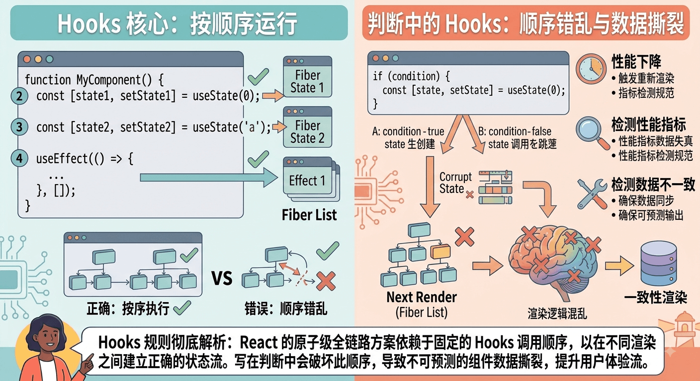

# Hooks为什么不能写到判断里面

[[toc]]


React 规定 **Hook 绝对不能写在条件判断（`if/else`）、循环（`for/while`）或嵌套函数中**，必须始终在 React 函数组件的顶层（Top Level）无条件调用。

这并不是 React 故意设计的限制，而是由 **React 底层链表数据结构** 的存储和查找机制决定的。





## 核心原因：React 依靠“调用顺序”来匹配 Hook

在函数组件中，我们可能会多次调用同一个 Hook（例如多次调用 `useState`）：

```tsx
function MyComponent() {
  const [name, setName] = useState("张三"); // 第 1 个 Hook
  const [age, setAge] = useState(18);     // 第 2 个 Hook
  const [role, setRole] = useState("admin"); // 第 3 个 Hook
  // ...
}

```

注意到没有：我们调用 `useState` 时，**并没有传任何唯一的“Key”或标识符**给 React。

**那么，当组件重新渲染（Re-render）时，React 是怎么知道第 1 个 `useState` 应该对应 `"张三"`，第 2 个对应 `18` 的呢？**

答案就是：**全靠每次渲染时 Hook 的严格调用顺序（Call Order）**。


## 底层机制：单向链表（Linked List）

在 React 底层，每个组件对应的 Fiber 节点内部维护着一条 **Hook 单向链表**：

```text
Fiber.memoizedState ──▶ [ Hook 1 (name) ] ──▶ [ Hook 2 (age) ] ──▶ [ Hook 3 (role) ] ──▶ null

```

### 1. 首次挂载（Mount）

当组件第一次渲染时，每执行到一个 Hook，React 就会创建一个 Hook 节点并**按顺序追加到链表末尾**。

### 2. 重新渲染（Update）

当组件状态更新重新执行函数体时：

* React 不会重新创建链表，而是将内部的游标（`workInProgressHook`）移动到链表头部。
* 顺序每执行到一个 Hook，游标就**向后移动一位 (`hook = hook.next`)**，从中取出上一次保存的状态。


## 如果把 Hook 写进 `if` 会发生什么？

假设我们违反规则，将 Hook 写在了条件语句中：

```tsx
function BadComponent({ isVip }) {
  const [name, setName] = useState("张三"); // Hook 1

  // ❌ 假设 isVip 动态改变！
  if (isVip) {
    const [vipLevel, setVipLevel] = useState(5); // Hook 2 (条件 Hook)
  }

  const [age, setAge] = useState(18); // Hook 3
}

```

### 场景演示：状态错位灾难

#### 第一次渲染（假设 `isVip = true`）：

React 依次按顺序构建链表：

* `Hook 1` ──▶ `name` (`"张三"`)
* `Hook 2` ──▶ `vipLevel` (`5`)
* `Hook 3` ──▶ `age` (`18`)

#### 第二次渲染（假设用户切换状态，`isVip = false`）：

当组件重新执行时：

1. 执行 `useState("张三")`：游标指向 `Hook 1` ──▶ 拿到 `"张三"`。（✅ 正常）
2. `if (isVip)` 为 `false`，**第 2 个 Hook 被跳过！**
3. 接着执行到 `useState(18)`（也就是原本的 `age`）：
* 但此时 React 游标移动到了链表的**下一个节点（`Hook 2`）**！
* React 以为这个 `useState` 对应的是 `Hook 2`，于是把上一次 `vipLevel` 的值 `5` 赋给了 `age`！


4. **结果**：`age` 的值变成了 `5`，后续所有的 Hook 索引全部错位，引起极难排查的 Bug 甚至直接引发应用崩溃！


## 正确的替代方案

如果你需要根据条件来决定是否使用某个逻辑或计算状态，**应该把条件判断写在 Hook 的内部/下方，而不是把 Hook 写在条件判断里**：

### ❌ 错误做法：条件包裹 Hook

```tsx
if (isLoggedIn) {
  useEffect(() => {
    fetchUserData();
  }, []);
}

```

### ✅ 正确做法：Hook 内部进行条件判断

```tsx
useEffect(() => {
  // Hook 依然无条件执行，但内部逻辑根据条件退出
  if (!isLoggedIn) return;

  fetchUserData();
}, [isLoggedIn]);

```


## 总结

1. **本质原因**：React 没有给 Hook 提供唯一标识符（Key），内部通过**单向链表**和调用顺序（Index）来对齐状态。
2. **后果**：如果在 `if/for` 中使用 Hook，条件切换会导致 Hook 的调用次数与链表长度错位，造成状态读取混乱。
3. **保障机制**：React 官方提供的 ESLint 插件 `eslint-plugin-react-hooks` 会在编译期自动检测并禁止这种违规写法（`rules-of-hooks`）。
