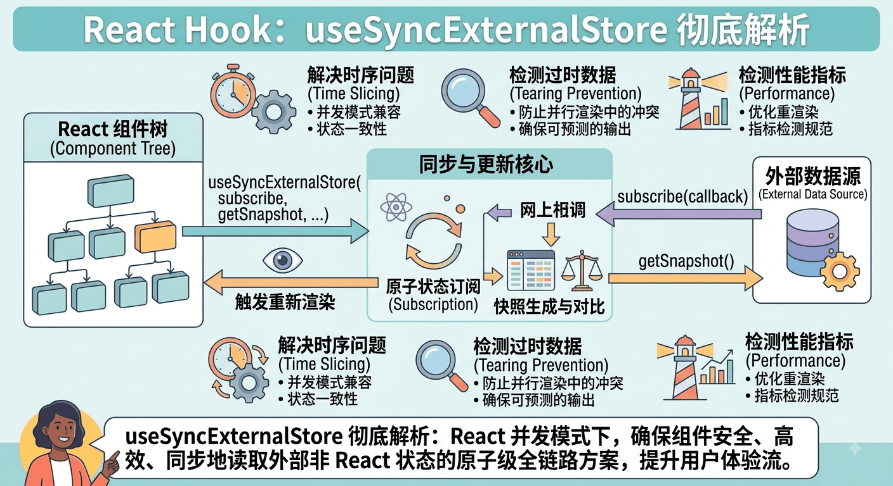

# useSyncExternalStore 使用指南

[[toc]]



`useSyncExternalStore` 是 React 18 引入的一个专门用于订阅外部数据源（External Store）的 Hook。

虽然在日常业务组件开发中它的直接使用频率不如 `useState` 或 `useEffect` 高，但它是**各大状态管理库（如 Redux, Zustand）**以及**自定义 Browser API 订阅 Hook** 的底层核心基石。


## 一、 为什么需要 useSyncExternalStore？

### 1. 解决并发渲染中的“撕裂（Tearing）”现象

在 React 18 之前（同步渲染模式），渲染过程是一气呵成的，不会被中途打断。

而在 React 18 引入 **并发模式（Concurrent React）** 后，渲染任务变成了**可中断、可恢复**的。如果在渲染过程中，React 暂停了当前任务去处理更高优先级的用户交互，而此时**外部数据源（非 React state 管理的数据，如全局 store 或 window 属性）发生了变更**：

```text
[组件 A 渲染] ──> 读取外部值 = 1
     │
     ├─▶ (React 暂停渲染，让出主线程)
     │   💥 外部数据源发生了更新：值变成了 2！
     │
[组件 B 渲染] ──> 读取外部值 = 2

最终 UI：同一张页面上，依赖相同数据的组件 A 和组件 B 展示了不一致的内容！
这就是所谓的“UI 撕裂 (Tearing)”。

```

### 2. 传统 `useEffect` 模式的痛点

在 React 18 之前，我们通常用 `useState` + `useEffect` 订阅外部数据：

```tsx
// ❌ 旧做法：在并发模式下可能导致 UI 撕裂或闪烁
function useOnlineStatusOld() {
  const [isOnline, setIsOnline] = useState(navigator.onLine);

  useEffect(() => {
    const handleStatus = () => setIsOnline(navigator.onLine);
    window.addEventListener('online', handleStatus);
    window.addEventListener('offline', handleStatus);
    return () => {
      window.removeEventListener('online', handleStatus);
      window.removeEventListener('offline', handleStatus);
    };
  }, []);

  return isOnline;
}

```

* **缺陷 1（UI 撕裂）**：并发渲染期间无法保证状态读取的原子性。
* **缺陷 2（额外重绘/闪烁）**：`useEffect` 是在 DOM 挂载**之后**异步执行的，组件首次渲染先拿到旧值，挂载后再触发 `setState` 重新渲染，容易导致 UI 闪烁。

> **`useSyncExternalStore` 的解决机制**：它强制以**同步（Synchronous）**方式读取外部数据快照。如果在渲染过程中外部 store 发生了变动，React 会放弃当前的渲染，立刻重新使用最新的快照再次发起渲染，彻底消除了撕裂与闪烁。


## 二、 API 语法解析

```tsx
const state = useSyncExternalStore(
  subscribe,
  getSnapshot,
  getServerSnapshot?
);

```

| 参数 | 类型 | 作用 |
| --- | --- | --- |
| **`subscribe`** | `(callback) => unsubscribe` | 注册订阅函数。当外部数据发生变化时，调用传入的 `callback` 告诉 React：“数据变了，需要重新渲染！” |
| **`getSnapshot`** | `() => State` | 获取当前外部数据的快照函数。**必须返回不可变数据或同一引用（如果数据没变）**。 |
| **`getServerSnapshot?`** *(可选)* | `() => State` | 专为 SSR 服务端渲染提供的初始快照函数，避免服务端与客户端 Hydration 不匹配。 |


## 三、 实战案例

### 场景 1：优雅地订阅浏览器 API（如网络状态 `navigator.onLine`）

这是 `useSyncExternalStore` 在日常开发中最推荐的用例之一：

```tsx
import { useSyncExternalStore } from 'react';

// 1. 定义订阅逻辑
function subscribeOnline(callback: () => void) {
  window.addEventListener('online', callback);
  window.addEventListener('offline', callback);
  return () => {
    window.removeEventListener('online', callback);
    window.removeEventListener('offline', callback);
  };
}

// 2. 定义快照获取函数
function getOnlineSnapshot() {
  return navigator.onLine;
}

// 3. 封装为自定义 Hook
export function useOnlineStatus() {
  return useSyncExternalStore(
    subscribeOnline,
    getOnlineSnapshot,
    () => true // SSR 场景下的默认兜底值
  );
}

// 4. 在组件中使用
function NetworkStatusBadge() {
  const isOnline = useOnlineStatus();
  return (
    <div className={isOnline ? 'bg-green' : 'bg-red'}>
      {isOnline ? '🌐 网络正常' : '⚠️ 已断网'}
    </div>
  );
}

```


### 场景 2：实现一个简易全局 Store（手写简易版 Zustand）

如果你想实现一个脱离 React 树管理（可以在 React 组件外直接 `store.setState(...)`）的全局状态，`useSyncExternalStore` 是完美工具：

```tsx
import { useSyncExternalStore } from 'react';

// 1. 创建外部 Store
function createStore<T>(initialState: T) {
  let state = initialState;
  const listeners = new Set<() => void>();

  return {
    getState: () => state,
    setState: (fnOrValue: T | ((prev: T) => T)) => {
      state = typeof fnOrValue === 'function'
        ? (fnOrValue as (prev: T) => T)(state)
        : fnOrValue;
      // 触发所有订阅者通知 React 更新
      listeners.forEach(listener => listener());
    },
    subscribe: (listener: () => void) => {
      listeners.add(listener);
      return () => listeners.delete(listener);
    }
  };
}

// 实例化 Store
export const globalCountStore = createStore({ count: 0 });

// 2. 在组件中使用
function CounterApp() {
  // 订阅 Store
  const state = useSyncExternalStore(
    globalCountStore.subscribe,
    globalCountStore.getState
  );

  return (
    <div>
      <h3>Count: {state.count}</h3>
      <button onClick={() => globalCountStore.setState(s => ({ count: s.count + 1 }))}>
        加 1 (可从任意地方触发)
      </button>
    </div>
  );
}

```


## 四、 关键踩坑点：死循环与引用一致性

在写 `getSnapshot` 时，**绝对不能每次都返回一个新创建的对象**！

### ❌ 错误示范：引起无限死循环

```tsx
function BadComponent() {
  const state = useSyncExternalStore(
    store.subscribe,
    // ❌ 错误！每次调用 getSnapshot 都返回一个新的对象引用
    // React 会认为数据时刻在变化，从而引发无限 Re-render 崩溃！
    () => ({ count: store.getState().count })
  );
}

```

### ✅ 正确示范：保持不可变数据引用

```tsx
// ✅ 方式 A：只返回基本数据类型（Primitive Value）
const count = useSyncExternalStore(
  store.subscribe,
  () => store.getState().count // 返回 number 基础类型，天然支持 Object.is 比较
);

// ✅ 方式 B：如果必须返回对象，请确保 Store 内部更新时采用不可变（Immutable）深/浅拷贝
const state = useSyncExternalStore(
  store.subscribe,
  store.getState // getState 保证在未更新时返回完全相同的对象引用
);

```


## 五、 总结与选型指南

| 维度 | `useState` / `useReducer` | `useSyncExternalStore` |
| --- | --- | --- |
| **状态归属** | React 组件树内部（React 状态） | React 外部（如全局 Store, Window API, LocalStorage） |
| **渲染模式** | 异步并发/批处理渲染 | 强制同步读取快照，规避撕裂 |
| **适用场景** | 组件内部 UI 状态（如弹窗开关、表单输入） | 状态库开发、浏览器事件订阅、跨框架全局状态共享 |

> 💡 **核心建议**：普通业务开发中，处理组件自身的 State 依然优先选择 `useState`；只有在需要**订阅 React 框架外部的数据源（如 window resize、media queries、自定义全局事件通知、封装 Redux/Zustand 这类外部 Store）**时，才使用 `useSyncExternalStore`。
