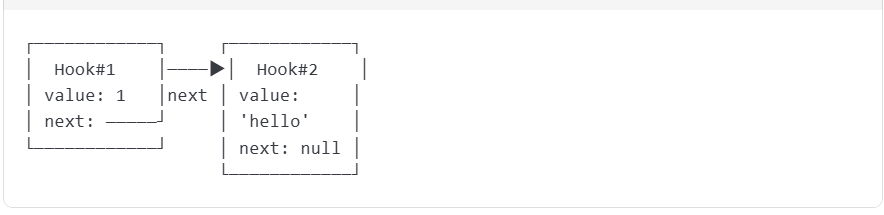

# Hooks 为什么不能写到判断里面

---

::: tip 注意

React 钩子函数（Hooks）有一个重要的规则：**不能在条件语句、循环或嵌套函数中调用钩子**

:::

## 1. 底层原理：Hooks 依赖调用顺序

React 内部通过 **单向链表** 来管理组件的 Hooks。

**每次组件渲染时：**

1. `React` 会按 **Hooks的调用顺序** 依次执行，并将状态存储在对应的链表节点中。
2. 如果 `Hook` 的调用顺序改变（比如条件判断导致某些 Hook 被跳过），链表节点的匹配会错乱，导致状态错位。

**链表结构如下：**



**示例问题代码**

```tsx
function MyComponent() {
  if (condition) {
    const [count, setCount] = useState(0); // 条件性调用 Hook
  }
  const [name, setName] = useState(""); // 无条件 Hook
}
```

1、**第一次渲染**：`condition` 为 `true`，Hook 顺序是 `[useState(0), useState("")]`。<br/> 2、**第二次渲染**：`condition` 为 `false`，Hook 顺序是 `[useState("")]`（第一个 `useState` 被跳过）。<br/> 3、**结果**：React 会误将 `name` 的状态关联到原本 `count` 的链表节点上，导致数据混乱。<br/>

## 2. React 的规则检查

React 通过 **ESLint 插件（`eslint-plugin-react-hooks`）** 在编译时强制检查以下规则：

1. **所有 Hook 必须在函数组件的顶层调用**（不能嵌套在 `if`、`for`、`callback` 中）。
2. **Hook 的调用顺序必须一致**（每次渲染时数量、顺序相同）。

如果违反规则，会抛出类似以下的错误：

```js
React Hook "useState" is called conditionally. React Hooks must be called in the exact same order in every component render.
```

## 3. eslint-plugin-react-hooks 插件实现的原理

### 3.1 静态代码分析

插件通过解析 JavaScript 的 **抽象语法树（AST）** 来检测代码中的 Hook 调用。具体步骤包括：

1、**识别 Hook 函数名**：检查所有以 `use` 开头的函数（如 `useState`、`useEffect`）是否在合法位置调用。<br/> 2、**跟踪调用顺序**：分析 Hook 在组件中的调用顺序是否可能因条件或循环而改变。<br/>

### 3.2 依赖项数组的静态推导

对于 `useEffect`、`useMemo` 等 Hook 的依赖项数组，插件会：

1、**收集函数体内引用的变量**：通过 AST 分析，找出所有在 Hook 回调函数中使用的变量（如 `props`、`state`、上下文等）68。<br/>

2、 **比对依赖项数组**：若变量未包含在依赖项中，则发出警告。例如：<br/>

```tsx
useEffect(() => {
  console.log(props.value); // ⚠️ 警告：缺少依赖项 props.value
}, []);
```

### 3.3 为什么类组件没有这个限制？

类组件的状态（`this.state`）和生命周期方法是 **通过实例属性存储** 的，与调用顺序无关。而函数组件的 Hooks 是 **通过闭包和链表顺序** 实现的，必须保证稳定性。
