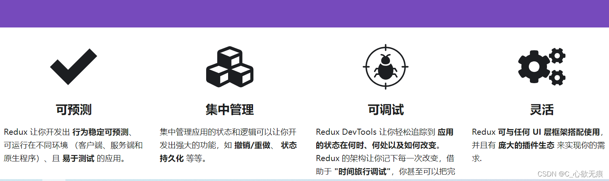
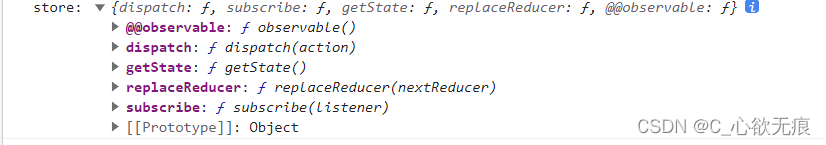
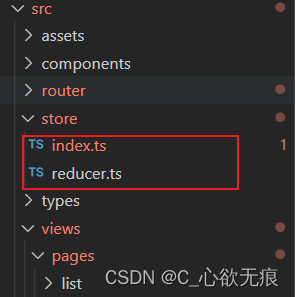
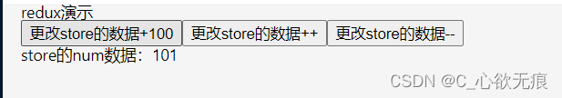

# Redux 在 React 函数式组件中的基本使用



[[toc]]

## 一，简介

Redux 是 JavaScript 应用的状态容器，提供可预测的状态管理。

它主要的几个方法如下：



重要的有方法 有 `dispatch（分发action）`、`getState（获取state）`、`subscribe（监听state的变化）`，下面会介绍到，另外两个可以不用管；

---

::: tip 那什么时候使用 Redux 呢？

当遇到如下问题时，建议开始使用 `Redux`：

1.  你有很多数据随时间而变化
2.  你希望状态有一个唯一确定的来源（single source of truth）
3.  你发现将所有状态放在顶层组件中管理已不可维护

:::

## 二，安装

我这里安装的是 `"redux": "^4.2.1"`版本；

```js
npm install redux --save
```

项目的 src 目录下面新建`store文件夹`和`index.js，reducer.js`；如下：



## 三，三大核心概念 Store、Action、Reducer

### 3.1 Store

Store：存储数据的地方。最好整个应用只有一个 Store。

`createStore()` ：用来生成 Store。接收 Reducer 作为其参数。

index.js

```js
/**
 * 引入createStore 专门创建最为核心的store对象
 * 目前createStore已经弃用，所以我们要引用legacy_createStore
 */

iimport { legacy_createStore } from "redux";
import reducer from './reducer.ts'

// 创建数据仓库 引入reducer函数进行对数据的处理
const store = legacy_createStore(reducer)

export default store
```

### 3.2 Reducer

reduce 的本质就是一个函数 ，作用是初始化状态和加工状态。

reduce 函数里面接收两个参数，第一个参数是 state 的初始值，第二个参数是一个 action 对象，对象里的第一个属性是`type`也就是函数的名称，第二个属性就是传进来的值，用于后续更改 state；

reducer.ts

```js
// 约束类型
interface Eula {
  name: string;
  age: number;
}
// 定义数据
const defaultState: Eula = {
  name: "Eula",
  age: 18
};

// reducer 函数 用于更改数据
let reducer = (preState = defaultState, action: { type: string, data: number }) => {
  // action解构出来
  let { type, data } = action;

  // 第一种写法 每个分支使用return进行返回
  // switch (type) {
  //   case "update_age":
  //     preState.age = data;
  //     return preState;
  //   case "add_age":
  //     preState.age++;
  //     return preState;
  //   case "del_age":
  //     preState.age--;
  //     return preState;
  //   default:
  //     return preState; // 初始化时
  // }

  // 第二种写法 break 与最终的return返回结果
  switch (type) {
    case "update_age":
      preState.age = data;
      break;
    case "add_age":
      preState.age++;
      break;
    case "del_age":
      preState.age--;
      break;
    default:
      preState; // 初始化时
  }
  return preState; // 此处 一定要使用return进行返回最终改变的值
};

export default reducer;
```

**注意：** 初次加载 Store 会自动调用一次 Reducer 进行初始化状态，此时 state 是 undefined，action 对象中的 type 为 `@@redux/INITxxx`。手动调用 `store.dispatch()` 也会触发 Reducer 的自动执行。

### 3.3 Action

Action 就是一个普通的 JS 对象，用于描述要更新的数据类型和内容，其中 type 属性是必须的，表示 Action 的名称，其他属性可以自由设置。

redux.tsx

```js
// 引入store
import store from "../../../store/index";
// 更改数据时调用
store.dispatch({ type: "update_age", data: 100 });
```

`store.dispatch()`：所有数据的变化，必须通过派发（dispatch） Action 来更新。接受一个 Action 对象作为参数，将其发送出去。

## 四，开始函数式组件中使用

redux.tsx

```js
import React, { useState } from "react";
//  1，引入store
import store from "../../../store/index";

// 渲染数据
const myList: [] = [];

const Redux: React.FC = () => {
  let [list, setList] = useState(myList);
  console.log("store:", store);

  // 监听数据的变化
  const unsubscribe = store.subscribe(() => {
    console.log("订阅数据的变化", store.getState());
    // 此处用来触发视图的更新
    setList([]);
  });

  // 改变store中的数据
  const update = () => {
    store.dispatch({ type: "update_age", data: 100 });
  };
  const add = () => {
    store.dispatch({ type: "add_age" });
  };
  const del = () => {
    store.dispatch({ type: "del_age" });
  };

  // 此处才是真正渲染的页面
  return (
    <div className="redux">
      <h3>redux演示</h3>
      <button onClick={update}>更改store的数据+100</button>
      <button onClick={add}>更改store的数据++</button>
      <button onClick={del}>更改store的数据--</button>
      <p>store的num数据：{store.getState().age}</p>
    </div>
  );
};
export default Redux;
```

效果图：



上面的组件是一个简单的案例演示，定义了三个点击事件，点击第一个按钮`state.age+100`，点击第二个按钮每次`state.age+1`，点击第三个按钮 age 每次减一；下面会详细介绍几个重点内容：

### 4.1，引入 store

先引进来，这个没什么好说的；

```js
import store from "../../../store/index";
```

### 4.1，store.getState()方法

`getState()`方法是 redux 实例下的方法之一，上面的第一张截图已经通过 store 实例打印出来了；

`getState()`的作用是获取当前状态下运行在 redux 中的 state；也就是说获取 store 中最新的数据；

```js
<p>store的num数据：{store.getState().age}</p>
```

### 4.3，store.dispatch()方法

`dispatch()` 是唯一能够修改 state 数据的行为。通过分发`action `（其实就是一个对象），配合 dispatch 函数传入的 action 及其 payload 计算得到新的 state，并更新到闭包数据中，这样就实现了 state 的更新；

如下： reducer.tsx

```javascript
// 改变store中的数据
const update = () => {
  store.dispatch({ type: "update_age", data: 100 });
};
const add = () => {
  store.dispatch({ type: "add_age" });
};
const del = () => {
  store.dispatch({ type: "del_age" });
};
```

上面的代码会和下面的 `switch case` 表达式所判断的`type`要一 一对应，用于更新 state;

reducer.ts

```javascript
let reducer = (preState = defaultState, action: { type: string, data: number }) => {
  let { type, data } = action;

  // 第一种写法 每个分支使用return进行返回
  // switch (type) {
  //   case "update_age":
  //     preState.age = data;
  //     return preState;
  //   case "add_age":
  //     preState.age++;
  //     return preState;
  //   case "del_age":
  //     preState.age--;
  //     return preState;
  //   default:
  //     return preState; // 初始化时
  // }

  // 第二种写法 break 与最终的return返回结果
  switch (type) {
    case "update_age":
      preState.age = data;
      break;
    case "add_age":
      preState.age++;
      break;
    case "del_age":
      preState.age--;
      break;
    default:
      preState; // 初始化时
  }
  return preState; // 此处 一定要使用return进行返回最终改变的值
};
```

上面的两种写法是一样的；对比一下；

### 4.4，store.subscribe()方法

`subscribe`函数只要 store 中的 state 数据变化了，就会触发`subscribe`方法，相当注册了一个监听器；监听 store 中的数据变化；

> 从 react 层面来说，redux 的 store 是隔离开的，我们需要一个桥梁，使得数据层出现更新的同时更新 UI 层逻辑，这时 store 中的最后一个方法，subscribe 方法就派上用场了。

注意： `setList([])`：是为了主动触发 react 视图更新的方法，否则 store 中数据改变了，视图却没有重新渲染。

```javascript
import React, { useState } from "react";
const Redux: React.FC = () => {
  let [list, setList] = useState(myList);
  // 监听数据的变化
  const unsubscribe = store.subscribe(() => {
    console.log("订阅数据的变化", store.getState());
    // 此处用来触发视图的更新
    setList([]);
  });
};
```

`subscribe`也同时返回了一个 unsubscribe 函数。当我们不在希望订阅这个监听器时，调用 `unsubscribe()`，对应的函数就会从监听器队列中被移除。

```javascript
unsubscrib(); // 不再监听
```

## 五，Redux 的三大原则

1. **单一数据源**：整个应用程序的 State 被存储在一棵 object tree 中，并且这棵 object tree 只存储在一个 Store 中。单一数据源可以让整个应用程序的 State 变得方便维护、修改、追踪。
2. **State 是只读的**：唯一修改 State 的方法就是触发 Action，不要试图在其他地方通过任何的方式来修改 State。这样可以保证所有的修改都被集中化处理，并且按照严格的顺序来执行。
3. **使用纯函数来执行修改**：通过 Reducer 将旧的 State 和 Action 联系在一起，返回一个新的 State。所有的 Reducer 都应该是纯函数，不能产生任何的副作用。

---

**[redux 中文网]**： [https://cn.redux.js.org/](https://cn.redux.js.org/)
