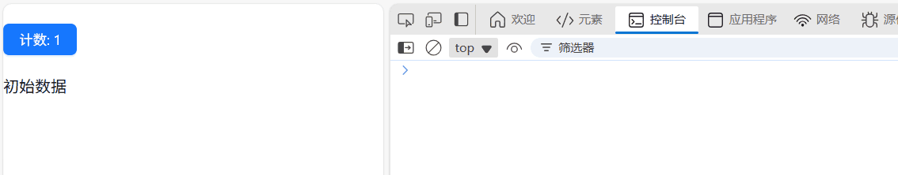

# 父组件变化导致子组件重新渲染

---

[[toc]]

## 问题描述

在 `React` 中，父组件状态变化默认会导致所有子组件重新渲染。虽然这符合 `React` 的设计理念，但有时会导致不必要的性能问题。

**案例代码：**

```tsx
"use client";
import React from "react";
import { Button } from "antd";
// 子组件
const ChildComponent = ({ data }) => {
  console.log("子组件渲染");
  return <div>{data}</div>;
};

// 父组件
const ParentComponent = () => {
  const [count, setCount] = React.useState(0);
  const [data, setData] = React.useState("初始数据");

  return (
    <div>
      <Button style={{ margin: "20px 0" }} type="primary" onClick={() => setCount(count + 1)}>
        计数: {count}
      </Button>
      <ChildComponent data={data} />
    </div>
  );
};

export default ParentComponent;
```

**案例效果：**

点击按钮，计数会增加，但是子组件也会重新渲染。



## 使用 React.memo() 进行组件记忆

`React.memo()` 是一个高阶组件，它可以对函数组件进行包装，只有在 props 发生变化时才重新渲染。可以解决父组件状态变化导致子组件重新渲染的问题。

上面案例代码改动如下：

```tsx
"use client";
import React from "react";
import { Button } from "antd";

// 子组件 使用 React.memo 优化
const ChildComponent = React.memo(({ data }: { data: string }) => {
  console.log("子组件渲染");
  return <div>{data}</div>;
});

// 父组件
const ParentComponent = () => {
  const [count, setCount] = React.useState(0);
  const [data, setData] = React.useState("初始数据");

  return (
    <div>
      <Button style={{ margin: "20px 0" }} type="primary" onClick={() => setCount(count + 1)}>
        计数: {count}
      </Button>
      <ChildComponent data={data} />
    </div>
  );
};

export default ParentComponent;
```

## 使用 useMemo() 记忆值

`useMemo()` 可以缓存计算结果，避免重复计算。当传递复杂对象或数组作为 `props` 时，使用`useMemo()`可以避免在每次渲染时创建新的引用。

```tsx
import React, { useMemo } from "react";

const ParentComponent = () => {
  const [count, setCount] = React.useState(0);
  const [items, setItems] = React.useState([]);

  // 使用 useMemo 记忆复杂对象
  const memoizedData = useMemo(() => {
    return {
      items,
      timestamp: Date.now()
    };
  }, [items]); // 仅在 items 变化时重新计算

  return (
    <div>
      <button onClick={() => setCount(count + 1)}>计数: {count}</button>
      <ChildComponent data={memoizedData} />
    </div>
  );
};
```

## 使用 useCallback() 记忆函数

当传递函数作为 `props` 时，使用 `useCallback()` 可以避免在每次渲染时创建新的函数引用。

```tsx
import React, { useCallback } from "react";

const ParentComponent = () => {
  const [count, setCount] = React.useState(0);
  const [data, setData] = React.useState("");

  // 使用 useCallback 记忆函数
  const handleDataChange = useCallback((newData) => {
    setData(newData);
  }, []); // 依赖数组为空，函数不会重新创建

  return (
    <div>
      <button onClick={() => setCount(count + 1)}>计数: {count}</button>
      <ChildComponent onDataChange={handleDataChange} data={data} />
    </div>
  );
};
```
