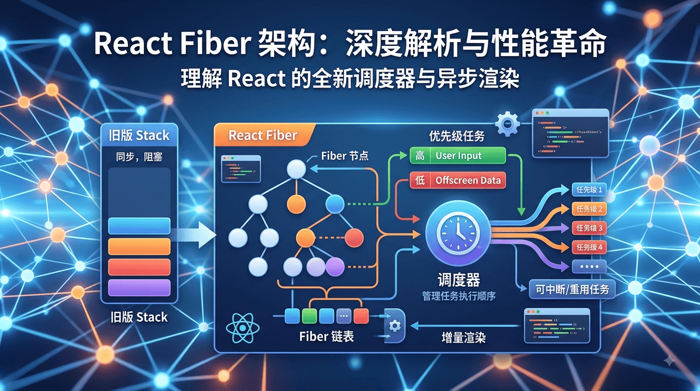

# 从 useState 到 React Fiber：一文彻底搞懂 Fiber 架构与链表设计

[[toc]]



## 一、引言：useState 的状态丢失谜题

在 React 函数组件中，**每次组件重新渲染，组件函数都会从头到尾重新执行一次**。但为什么通过 `useState` 定义的状态（State）却能在多次渲染之间持久保存更新后的值，而不会被重复初始化呢？

其背后的底层机制涉及 **闭包（Closure）** 与 **React Fiber 架构** 的紧密协作。

### 1.1 闭包（Closure）的作用与陷阱

`useState` 返回的状态值（如 `count`）和更新函数（如 `setCount`）通过闭包捕获了**当前渲染周期**的状态快照。

```tsx
function Counter() {
  const [count, setCount] = useState(0); // 闭包捕获当前渲染周期的 count 值

  const handleClick = () => {
    // 提交更新，闭包中的 count 是当前渲染周期的值（例如 0）
    setCount(count + 1);
  };

  return <button onClick={handleClick}>{count}</button>;
}

```

#### ⚠️ 闭包陷阱与批处理机制

看下面这个常见场景：

```tsx
function Counter() {
  const [count, setCount] = useState(0);

  const handleClick = () => {
    setCount(count + 1); // 第一次更新：基于当前闭包 count = 0
    setCount(count + 1); // 第二次更新：仍基于当前闭包 count = 0
  };

  // 点击后 count 只会变为 1，而不是 2
  return <button onClick={handleClick}>{count}</button>;
}

```

* **原因一（闭包）**：在同一次事件回调中，两次 `count` 拿到的都是旧快照 `0`。
* **原因二（批处理与计算）**：传入的是具体数值 `setCount(1)`，React 在下一轮合并更新时，会将旧值覆盖。
* **解决方案**：如果需要依赖最新状态，需改用**函数式更新** `setCount(prev => prev + 1)`，React 会将更新函数放入队列，依次计算出最终状态。

### 1.2 Fiber 节点的状态存储机制

闭包负责在单次渲染中提供状态快照，而**真正跨渲染周期存储状态的地方是 React 的 Fiber 节点**。

每个函数组件在 React 内部都对应一个 Fiber 节点，其状态链表存储在 Fiber 节点的 `memoizedState` 属性中。

组件重新渲染时，`useState` 不会重新初始化状态，而是直接从 Fiber 节点的 `memoizedState` 中读取最新计算好的状态值。

```ts
// Fiber 节点存储 Hook 状态的结构示意
{
  memoizedState: {
    memoizedState: 42, // 当前 Hook 的状态值
    queue: { ... },    // 待处理的 setState 更新队列
    next: { ... }      // 指向下一个 Hook
  }
}

```

## 二、React Fiber 架构深度剖析

在 React 16 之前（Stack Reconciler），渲染过程通过原生的递归函数调用栈完成，一旦开始就无法中断，容易导致主线程卡顿。

引入 **Fiber 架构** 后，React 将树形结构改造成了**指针链表**，从而实现了可中断、可恢复的增量渲染。

### 2.1 Fiber 节点的核心数据结构

每一个 Fiber 节点都是一个 JavaScript 对象，包含了组件类型、状态、DOM 节点以及调度所需的链表指针：

```ts
interface Fiber {
  // 1. 标识组件/节点类型
  tag: WorkTag;                         // 如 FunctionComponent, ClassComponent, HostComponent
  type: any;                            // 对于函数组件，type 是组件函数本身；对于 DOM 节点，是 'div' 等字符串

  // 2. 状态与副作用存储
  memoizedState: any;                   // 状态存储（函数组件的 Hooks 单向链表保存在这里）
  stateNode: any;                       // 对应的真实 DOM 节点或类组件实例
  updateQueue: UpdateQueue<any> | null; // 状态更新队列
  flags: Flags;                         // 副作用标记（如 Placement 插入、Update 更新、Deletion 删除）

  // 3. 核心指针链表（构成 Fiber 树的关键）
  child: Fiber | null;                  // 指向“第一个子节点”
  sibling: Fiber | null;                // 指向“下一个兄弟节点”
  return: Fiber | null;                 // 指向“父节点”

  // 4. 双缓存机制指针
  alternate: Fiber | null;              // 指向另一棵树（current <-> workInProgress）对应的 Fiber 节点
}

```

### 2.2 Fiber 节点的组织形式（真正的链表树）

以如下组件结构为例：

```tsx
function App() {
  return (
    <div>
      <Header />
      <Content />
    </div>
  );
}

```

传统树形结构是用数组包含子节点，而 **Fiber 树本质上是一棵通过指针串联起来的单链表架构**：

```text
       App Fiber
           | (child)
       div Fiber
           | (child)
    Header Fiber ----(sibling)----> Content Fiber
       | (return)                       | (return)
       +--------------------------------+---> div Fiber

```

> **重点**：
> * 父节点的 `child` 仅仅指向**第一个子节点**（`Header`）。
> * 子节点通过 `sibling` 链表指向下一个**兄弟节点**（`Content`）。
> * 所有子节点通过 `return` 指向其**父节点**（`div`）。
>
>

### 2.3 Hooks 在 Fiber 中的单向链表排布

函数组件内的多个 Hook（如 `useState`, `useEffect`）按调用顺序存在于 Fiber 的 `memoizedState` 中，以**单向链表**的形式组织：

```tsx
function Example() {
  const [count, setCount] = useState(0); // Hook 1
  const [name, setName] = useState("");  // Hook 2
  useEffect(() => {}, []);              // Hook 3
}

```

对应的 Hook 内存链表：

```text
Fiber.memoizedState
       |
    Hook1 (count) ----next----> Hook2 (name) ----next----> Hook3 (effect) ----> null
       |                           |                          |
 memoizedState: 0            memoizedState: ""          memoizedState: { ... }

```

> **为什么 React 规定 Hook 不能写在条件语句或循环中？**
> 因为 React 内部依靠**单向链表的游标指针**，按 Hook 执行顺序逐个读取节点。如果条件分支导致某个 Hook 被跳过，链表结点的匹配就会全部错位！


### 2.4 为什么 React 选用链表而不是数组？

1. **可中断与恢复（最核心原因）**：
原生的递归调用栈无法暂停。而使用**链表指针**模拟调用栈后，React 可以将当前工作节点记录在一个全局指针（如 `workInProgress`）中。当浏览器帧率不足（通过 `Scheduler` 调度）时，React 随时可以**中断（Pause）** 渲染，让出主线程；下一帧再从记录的指针处**恢复（Resume）** 遍历。
2. **高效的结构变更**：
在树的 DOM 节点插入、删除、移动时，链表只需要修改指针（如 `child` 或 `sibling`），操作的时间复杂度为 $O(1)$，效率极高。
3. **保证 Hook 调用的顺序确定性**：
单向链表天生具备严格的前后依赖关系，能以极低的开销保障 Hook 调用的固定顺序。


### 2.5 双缓存机制（Double Buffering）

在 2.1 节提到了 `alternate` 属性，这是 React 优化 DOM 渲染的核心思想——**双缓存机制**：

* **`current` 树**：代表当前在屏幕上显示的真实 DOM 对应的 Fiber 树。
* **`workInProgress` 树**：代表正在内存中构建/更新的 Fiber 树。

当触发更新时，React 会在后台基于 `current` 树构建全新的 `workInProgress` 树。所有 Diff 比较与副作用标记都在后台完成后，React 只需要**将指针切换一次**，直接把 `workInProgress` 替换为 `current`，即可无缝完成界面更新，避免中间状态导致的页面闪烁。


### 2.6 Fiber 树的 DFS 遍历过程与伪代码

React 遍历 Fiber 树采用的是**深度优先遍历（DFS）**，整个过程被称为 `WorkLoop`（工作循环）：

```javascript
// 模拟 Fiber 树单次单元工作的伪代码
function performUnitOfWork(fiber) {
  // 1. 执行当前 Fiber 节点的 reconcile/更新逻辑 ...

  // 2. 如果有子节点，优先深入向下遍历 child
  if (fiber.child) {
    return fiber.child;
  }

  // 3. 如果没有子节点，说明到了叶子节点，查找兄弟节点或向父节点回溯
  let nextFiber = fiber;
  while (nextFiber) {
    // 完成当前节点的“归（complete Work）”逻辑 ...

    // 如果有兄弟节点，走 sibling 指针
    if (nextFiber.sibling) {
      return nextFiber.sibling;
    }
    // 否则回溯给父节点 return 指针，继续向上查找
    nextFiber = nextFiber.return;
  }

  return null; // 回溯到 Root 节点，遍历结束
}

```


## 三、链表数据结构基础与 JS 实现

为了更好地理解 Fiber 的设计，我们回顾一下数据结构中的**单链表**原理。

### 3.1 什么是单链表？

链表（Linked List）是一种线性数据结构，由一系列节点（Node）组成。节点在内存中无需连续存储，每个节点包含：

1. **数据域**（存储节点的值/状态）
2. **指针域**（指向下一个节点的引用）


### 3.2 单链表的 JavaScript 实现

```ts
// 1. 定义链表节点结构
class ListNode<T> {
  value: T;
  next: ListNode<T> | null;

  constructor(value: T) {
    this.value = value;
    this.next = null;
  }
}

// 2. 创建单链表: 1 -> 2 -> 3
const node1 = new ListNode(1);
const node2 = new ListNode(2);
const node3 = new ListNode(3);

node1.next = node2;
node2.next = node3;

// 3. 遍历单链表
let current: ListNode<number> | null = node1;
while (current !== null) {
  console.log(current.value); // 依次输出: 1, 2, 3
  current = current.next;
}

```


### 3.3 链表 vs 数组 性能对比

| 特性 | 数组 (Array) | 链表 (Linked List) |
| --- | --- | --- |
| **内存分配** | 连续内存空间 | 动态随机分配（内存非连续） |
| **随机访问 (Index)** | 快，时间复杂度 $O(1)$ | 慢，需要沿指针遍历，时间复杂度 $O(n)$ |
| **头部/中间插入与删除** | 慢，需要移动后续所有元素 $O(n)$ | 快，只需改变对应指针指向 $O(1)$ |
| **适用场景** | 需要快速检索/遍历元素的场景 | 元素频繁变动、大小不固定、需要随时中断/中断恢复的场景 |


## 四、总结

React 将复杂的 UI 界面更新拆解为高效率的计算调度，其核心贯穿逻辑如下：

1. **`useState` 的存储**：依赖组件对应的 **Fiber 节点**，其内部以 **单向链表** 的形式在 `memoizedState` 中保存每个 Hook 的状态。
2. **闭包与快照**：组件函数每次渲染通过闭包获取当次渲染的状态快照；修改状态时使用函数式更新可以避免闭包拿旧值的问题。
3. **Fiber 的链表拓扑**：Fiber 节点通过 `child`（子）、`sibling`（兄）、`return`（父）三条指针将组件树串联为链表结构。
4. **可中断渲染的基石**：正是基于这种显示的**指针链表**结构，React 才能脱离原生 JS 递归栈的限制，实现无卡顿的**增量渲染（Incremental Rendering）** 与 **双缓存机制**。
