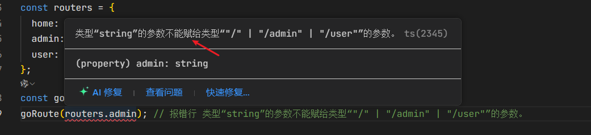

# TypeScript 类型问题：为什么 `goRoute(routers.admin)` 会报错？

## 问题描述

在 `TypeScript` 中，我们经常会遇到类似以下的代码和错误：

```typescript
const routers = {
  home: "/",
  admin: "/admin",
  user: "/user"
};

const goRoute = (r: "/" | "/admin" | "/user") => {};

goRoute(routers.admin); // 报错行: 类型"string"的参数不能赋给类型'"/" | "/admin" | "/user"'的参数。
```

报错如下图：



## 为什么会出现这个错误？

### 1. 类型推断机制

`TypeScript` 会对 `routers` 具体的字符串字面量类 会将对象字面量的属性类型推断为**最宽泛的类型**，即 `string` 类型。

所以 `routers` 的实际类型被推断为：

```typescript
{
  home: string;
  admin: string;
  user: string;
}
```

### 2. 函数参数要求具体字面量类型

`goRoute` 函数要求参数必须是三个具体的字符串字面量类型之一：`'/' | '/admin' | '/user'`。

### 3. 类型不匹配

当我们尝试传递 `routers.admin`（类型为 `string`）给 `goRoute`（需要 `'/' | '/admin' | '/user'`）时，TypeScript 会报错，**因为 `string` 比具体的字符串字面量类型更宽泛。**

## 解决方案

### 方案 1：使用类型断言

```typescript
goRoute(routers.admin as "/admin");
```

这种方法简单直接，但不够安全，因为如果 `routers.admin` 的值后来被修改，类型断言可能会掩盖真正的错误。

### 方案 2：声明 routers 为常量

```typescript
const routers = {
  home: "/",
  admin: "/admin",
  user: "/user"
} as const;
```

`as const` 是 TypeScript 的常量断言，它会告诉 TypeScript 将所有属性值视为字面量类型，而不是 `string` 类型。

此时 `routers` 的类型变为：

```typescript
{
  readonly home: '/';
  readonly admin: '/admin';
  readonly user: '/user';
}
```

### 方案 3：显式类型注解

```typescript
interface Routes {
  home: "/";
  admin: "/admin";
  user: "/user";
}

const routers: Routes = {
  home: "/",
  admin: "/admin",
  user: "/user"
};
```

这种方法更显式地定义了类型，适合更复杂的场景。

### 方案 4：使用类型提取

```typescript
const routers = {
  home: "/",
  admin: "/admin",
  user: "/user"
};

type RouterValues = (typeof routers)[keyof typeof routers];

const goRoute = (r: RouterValues) => {};
```

这种方法动态地从 `routers` 对象中提取所有值的类型作为联合类型。

## 最佳实践

对于路由配置这种通常不会改变的结构，推荐使用 `as const` 方案：

```typescript
const routers = {
  home: "/",
  admin: "/admin",
  user: "/user"
} as const;
const goRoute = (r: "/" | "/admin" | "/user") => {};
goRoute(routers.admin);
```

这种方式的优点：

1. 保持代码简洁
2. 类型安全
3. 易于维护（添加新路由时类型会自动更新）
4. 避免硬编码类型
