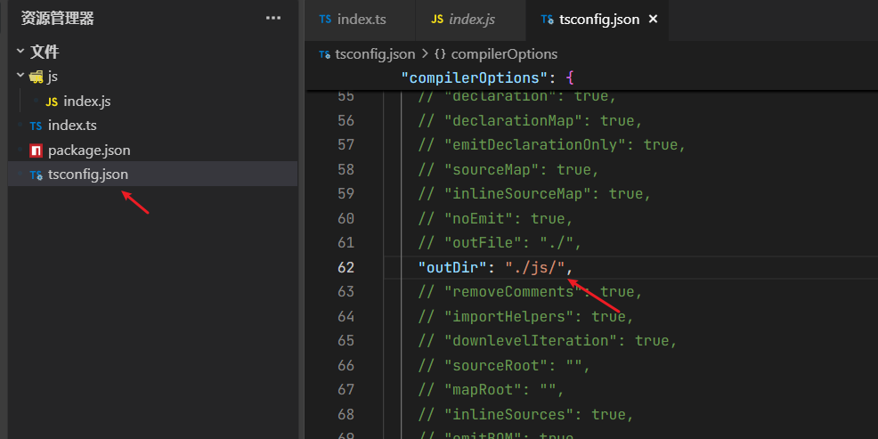

# TypeScript 的介绍

`TypeScript` 是一种在编译时进行类型检查和转换的编程语言。具体来说，TypeScript 代码在运行之前需要先通过 `TypeScript` 编译器（`tsc`）编译成 `JavaScript` 代码。这个编译过程主要完成以下任务：

```js
1. 类型检查：编译器会根据 `TypeScript` 的类型系统检查代码中的类型错误，如类型不匹配、未定义的变量等。
如果发现错误，编译器会报错并阻止代码编译通过。
2. 类型擦除：编译器会将 `TypeScript` 代码中的类型注解、接口、类型别名等类型信息擦除，生成纯 `JavaScript` 代码。
生成的 `JavaScript` 代码中不包含任何类型信息。
3. 语法转换：编译器会将 `TypeScript` 代码中的高级语法（如类、模块、装饰器等）转换成兼容目标 `JavaScript` 版本的代码。
例如，可以将 ES6 的类语法转换成 ES5 的函数构造器。
```

**使用 TS 的优势：**

1、类型约束 和 类型检查 （提前进行预警后面可能发生的错误）  
2、可以缩小定位代码问题  
3、代码提示 （减少看文档，敲代码的时间，避免多次输入不一致）  
4、后续修改代码时，可以爆红提醒所依赖的其他代码也需要改动

**安装全局 typescript**

```bash
# 全局安装
npm install -g typescript

# 检查是否安装成功
tsc -v
```


`tsc` 作用：负责将 ts 代码 转为 浏览器 和 nodejs 识别的 js 代码。

**自动编译**

设置 `VSCode` 自动编译，省去敲命令编译文件，由工具自动完成，提高效率。

1、运行 `tsc --init`，创建 `tsconfig.json` 文件；  
2、修改 `tsconfig.json` 文件，设置编译后的 js 文件夹。快速查找 `outDir`，输出路径修改为："outDir": "./js/"；  
3、设置 `vscode` 监视任务，之后修改项目中的 ts 代码时，会自动生成对应 js；  
4、（或运行 `tsc -w` 命令监听）

**如下图：**



## 一、类型系统：代码安全的基石

### 1. 静态类型检查

```typescript
// 编译时就能发现类型错误
let count: number = 5;
count = "hello"; // Error: Type 'string' is not assignable to type 'number'
```

### 2. 类型推断

```typescript
let name = "Alice"; // 自动推断为string类型
name = 123; // Error
```

### 3. 丰富的高级类型

```typescript
// 联合类型
type ID = number | string;

// 交叉类型
interface Named {
  name: string;
}
interface Aged {
  age: number;
}
type Person = Named & Aged;

// 条件类型
type IsString<T> = T extends string ? true : false;
```

## 二、开发效率提升

### 1. 智能代码补全

```typescript
interface User {
  id: number;
  name: string;
  email: string;
}

const user: User = {
  // 输入时会自动提示可用属性
  id: 1,
  name: "Alice",
  email: "alice@example.com"
};
```

### 2. 代码导航与重构

- 精确的**定义跳转**（Go to Definition）
- 安全的**重命名重构**
- 可靠的**引用查找**（Find All References）

## 三、面向对象编程增强

### 1. 完整的类支持

```typescript
class Animal {
  constructor(public name: string) {}

  move(distance: number = 0) {
    console.log(`${this.name} moved ${distance}m`);
  }
}

class Dog extends Animal {
  bark() {
    console.log("Woof! Woof!");
  }
}
```

### 2. 接口与抽象类

```typescript
interface Shape {
  area(): number;
}

abstract class Polygon implements Shape {
  abstract area(): number;

  protected logArea() {
    console.log(`Area: ${this.area()}`);
  }
}
```

## 四、现代化工具链支持

### 1. 配置灵活性

```json
// tsconfig.json 示例
{
  "compilerOptions": {
    "target": "ES2020",
    "module": "ESNext",
    "strict": true,
    "outDir": "./dist"
  }
}
```

### 2. 声明文件支持

```typescript
// 为第三方JS库提供类型支持
declare module "some-js-library" {
  export function doSomething(): void;
}
```

## 五、渐进式采用策略

### 1. 与 JS 兼容

```typescript
// 可以直接重命名.js文件为.ts开始迁移
// 通过any类型逐步添加类型
let something: any = getSomeJSValue();
```

### 2. 类型严格度可调

```json
// 可以逐步开启更严格的检查
{
  "compilerOptions": {
    "noImplicitAny": true,
    "strictNullChecks": true
  }
}
```

## 六、大型项目维护优势

### 1. 模块系统

```typescript
// 清晰的模块边界
import { Component } from "react";
export default class App extends Component {}
```

### 2. 命名空间

```typescript
namespace Validation {
  export interface StringValidator {
    isAcceptable(s: string): boolean;
  }
}
```

## 七、ECMAScript 超前支持

### 1. 装饰器（实验性）

```typescript
@sealed
class Greeter {
  greeting: string;

  constructor(message: string) {
    this.greeting = message;
  }
}
```

### 2. 可选链与空值合并

```typescript
// 编译为兼容代码
const name = user?.profile?.name ?? "Default";
```

## 八、社区与生态优势

### 1. DefinitelyTyped

- 为几乎所有主流 JS 库提供类型定义
- 通过`@types`包轻松安装

```bash
npm install --save-dev @types/react
```

### 2. 框架级支持

- Angular：完全基于 TS 构建
- React/Vue：官方提供 TS 支持
- NestJS：企业级 TS 框架

## 九、代码质量保障

### 1. 编译时错误捕获

```typescript
function add(a: number, b: number): number {
  return a + b;
}

add(1, "2"); // 编译时报错
```

### 2. 自文档化代码

```typescript
/**
 * 计算用户年龄
 * @param birthYear 出生年份
 * @returns 年龄
 */
function calculateAge(birthYear: number): number {
  return new Date().getFullYear() - birthYear;
}
```
