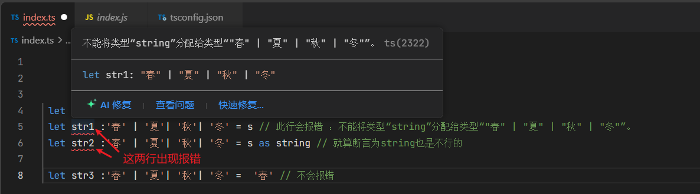

# TypeScript 字面量类型赋值问题解析

## 问题分析

问题代码如下:

`str1` 和 `str2` 当场就报错，str3 正确,报错警告如下：



```typescript
let s = "春";
let str1: "春" | "夏" | "秋" | "冬" = s; // 报错
let str2: "春" | "夏" | "秋" | "冬" = s as string; // 仍然报错
let str3: "春" | "夏" | "秋" | "冬" = "春"; // 正确
```

## 为什么会出现这种情况？

### 1. 类型推断差异

- `s = '春'`：TypeScript 默认将 `s` 推断为 `string` 类型，而不是 `'春'` 字面量类型
- `str3 = '春'`：直接赋值字面量，TypeScript 知道这是确切的 `'春'` 类型

### 2. 类型安全性

TypeScript 不允许将更宽泛的类型（`string`）赋值给更具体的字面量联合类型，因为：

- `s` 作为 `string` 类型，运行时可能被修改为任何字符串
- 你的字面量联合类型只允许四个特定值

## 解决方案

### 方案 1：声明 s 为字面量类型

```typescript
let s: "春" = "春"; // 显式声明为字面量类型
let str1: "春" | "夏" | "秋" | "冬" = s; // 现在可以工作
```

### 方案 2：使用类型断言（更安全的版本）

```typescript
let s = "春";
let str1: "春" | "夏" | "秋" | "冬" = s as "春"; // 明确断言为特定字面量
```

### 方案 3：使用 const 断言

```typescript
let s = "春" as const; // 被推断为字面量类型 '春'
let str1: "春" | "夏" | "秋" | "冬" = s; // 现在可以工作
```

### 方案 4：类型保护函数

```typescript
function isSeason(str: string): str is "春" | "夏" | "秋" | "冬" {
  return ["春", "夏", "秋", "冬"].includes(str);
}

let s = "春";
if (isSeason(s)) {
  let str1: "春" | "夏" | "秋" | "冬" = s; // 在条件块内可以工作
}
```

## 为什么 `as string` 不行？

当你使用 `as string` 断言时：

1、你告诉 `TypeScript` 将 `s` 视为 `string` 类型  
2、但目标类型是更具体的字面量联合类型  
3、`TypeScript` 仍然不允许从宽泛类型到具体类型的直接赋值

## 最佳实践建议

1. **优先使用 const 断言**：当你需要保留字面量类型时

   ```typescript
   const season = "春" as const;
   ```

2. **合理使用类型收窄**：通过条件检查确保类型安全

3. **避免过度使用类型断言**：除非你完全确定运行时值的可能性

4. **考虑使用枚举**：如果这类值在代码中频繁使用
   ```typescript
   enum Season {
     Spring = "春",
     Summer = "夏",
     Autumn = "秋",
     Winter = "冬"
   }
   let s = Season.Spring; // 类型明确
   ```
