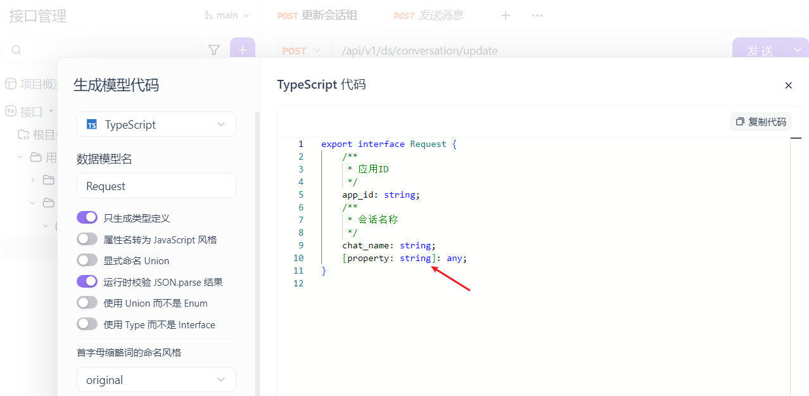
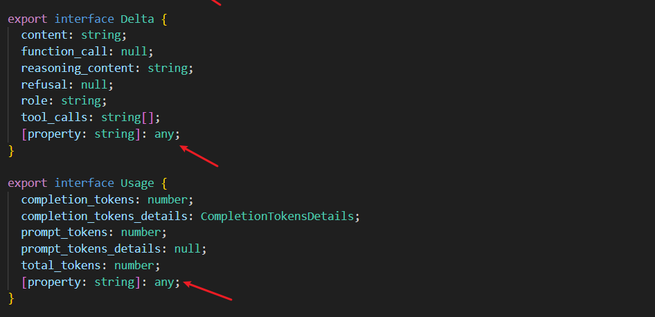

# TypeScript 中的索引签名（Index Signatures）

[[toc]]

在 `TypeScript` 中，索引签名用于描述对象中动态键的类型，允许我们定义具有不确定键名的对象。索引签名提供了一种灵活的方式来表示对象的结构，尤其当对象的属性键是动态生成或未知时，索引签名非常有用。

### 1. 基本语法

索引签名的基本语法如下：

```typescript
interface SomeObject {
  [key: string]: string;
}
```

在上面的例子中，`[key: string]` 表示这个对象可以有任意数量的字符串类型的键，而每个键对应的值都是 `string` 类型。

在使用`apiFox`对接接口时，经常会自动生成类型：如图



**项目中的一些场景：**
{width=80%}

### 2. 使用索引签名

#### 2.1 定义一个对象类型，允许使用字符串键名

```typescript
interface Dictionary {
  [key: string]: number;
}

const dict: Dictionary = {
  age: 30,
  height: 175
};

console.log(dict["age"]); // 输出: 30
console.log(dict["height"]); // 输出: 175
```

在这个例子中，`Dictionary` 类型允许我们使用任意的字符串作为键，并且每个键对应的值都是 `number` 类型。

#### 2.2 字符串或数字作为索引类型

你可以指定索引的键可以是 **字符串** 或 **数字**，但你不能同时指定这两种类型。如果你同时使用字符串和数字，TypeScript 会做一定的类型推导。

```typescript
interface MixedDictionary {
  [key: string]: number;
  [index: number]: number; // 字符串索引与数字索引共享相同的值类型
}

const dict: MixedDictionary = {
  age: 25,
  100: 500,
  height: 175
};

console.log(dict["age"]); // 输出: 25
console.log(dict[100]); // 输出: 500
```

### 3. 限制键的类型

你可以使用 **字面量类型** 限制对象的索引签名的键类型。例如，限制对象的键为 `'a'`、`'b'` 或 `'c'`：

```typescript
interface MyObject {
  [key: "a" | "b" | "c"]: number;
}

const obj: MyObject = {
  a: 1,
  b: 2,
  c: 3
};

console.log(obj.a); // 输出: 1
```

在这个例子中，`MyObject` 只允许 `a`、`b` 和 `c` 作为键。键名之外的任何值都会导致编译错误。

### 4. 只读索引签名

有时你可能希望对象的键是不可变的，可以使用 `readonly` 来限制对象的属性是只读的。这对确保数据的不可变性非常有用。

```typescript
interface ReadOnlyDict {
  readonly [key: string]: number;
}

const readOnlyDict: ReadOnlyDict = {
  age: 30,
  height: 175
};

console.log(readOnlyDict["age"]); // 输出: 30
// readOnlyDict["age"] = 35;  // Error: Cannot assign to 'age' because it is a read-only property.
```

在这个例子中，`readOnlyDict` 的属性值是只读的，意味着你不能更改这些值。

### 5. 使用类与索引签名

索引签名不仅适用于接口，还可以应用于类。当类具有索引签名时，类的实例可以使用任意的字符串作为键。

```typescript
class MyClass {
  [key: string]: string;

  constructor() {
    this["name"] = "John";
  }
}

const obj = new MyClass();
obj["age"] = "30"; // 可以动态添加新的属性
console.log(obj.name); // 输出: John
console.log(obj.age); // 输出: 30
```

在这个例子中，`MyClass` 类允许通过字符串键访问和修改属性。

### 6. 限制索引签名值的类型

你可以使用联合类型来限制索引签名的值类型。例如：

```typescript
interface EventDetails {
  [key: string]: "start" | "end"; // 值只能是 "start" 或 "end"
}

const event: EventDetails = {
  event1: "start",
  event2: "end"
};

console.log(event["event1"]); // 输出: start
```

在这个例子中，`EventDetails` 类型的所有值只能是 `"start"` 或 `"end"`。

### 7. 结合其他类型使用索引签名

索引签名也可以与其他类型结合使用，提供更加灵活的类型设计。例如，在组合不同接口时，你可能会同时使用索引签名和其他属性。

```typescript
interface Car {
  make: string;
  model: string;
  [key: string]: string | number; // 支持字符串或数字类型的任意额外属性
}

const car: Car = {
  make: "Toyota",
  model: "Corolla",
  year: 2020, // 额外的属性
  color: "Red"
};

console.log(car);
```

在这个例子中，`Car` 类型具有 `make` 和 `model` 两个具体属性，并且可以通过索引签名动态添加其他的字符串或数字类型的属性。

### 8. 动态属性和字面量类型

通过使用索引签名，你可以让对象的键动态地决定类型，并在开发中提高灵活性。

```typescript
type DynamicProperties = {
  [key: string]: string;
};

const dynamicObject: DynamicProperties = {
  name: "Alice",
  age: "25",
  occupation: "Engineer"
};

console.log(dynamicObject);
```

### 9. 类型推导与索引签名

TypeScript 会根据你为索引签名指定的类型自动推导出对象的属性类型。例如：

```typescript
interface DynamicObject {
  [key: string]: string | number;
}

const obj: DynamicObject = {
  name: "Alice",
  age: 30
};

console.log(obj["name"]); // 输出: Alice
console.log(obj["age"]); // 输出: 30
```

### 10. 使用索引签名进行合并

索引签名也可以与其他对象类型合并，通过 `&` 进行交叉组合。比如：

```typescript
interface Name {
  name: string;
}

interface Address {
  address: string;
}

type Person = Name &
  Address & {
    [key: string]: string; // 任意的额外属性
  };

const person: Person = {
  name: "John",
  address: "123 Main St",
  phone: "123-456-7890"
};

console.log(person);
```

### 11. 小结

- **索引签名（Index Signatures）** 用于定义允许具有动态属性名的对象。
- 使用 `key: string` 或 `key: number` 作为键类型来表示对象的属性键。
- 可以结合其他类型使用索引签名，灵活地定义对象结构。
- 通过 `readonly` 限制对象的键为只读。
- **索引签名与类**：类的实例也可以使用索引签名来动态访问和修改属性。
- **索引签名与联合类型**：可以为索引签名指定值的类型限制。
