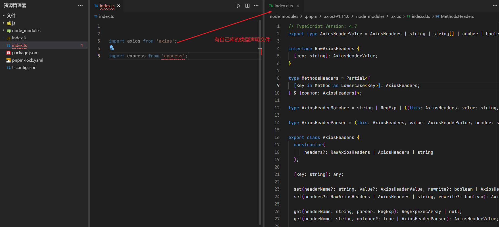
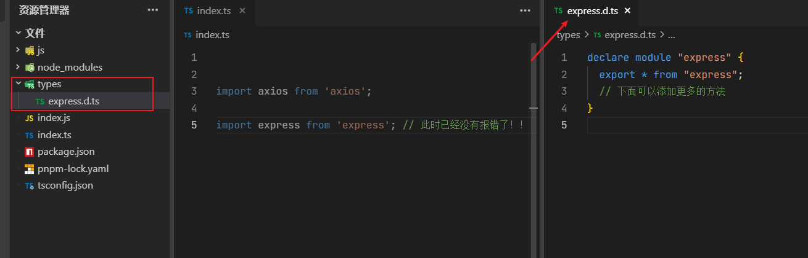

# TypeScript 声明文件（.d.ts）讲解

声明文件是 `TypeScript` 类型系统的核心组成部分，用于为 `JavaScript` 代码提供类型信息。


## 常用场景

下面 `asiox` 这个第三方库有类型声明文件，直接在 ts 中引入不会报错，但是 `express` 库却没有声明文件，所以直接报错了，

**如图：**



**解决方式**

方式一：尝试使用 `npm i --save-dev @types/express` (如果存在)  
方式二：或者添加一个包含 `declare module 'express';` 的新声明(.d.ts)文件

**我们使用方式二解决：**

我们需要在项目根目录下创建一个 `types` 文件夹，然后在 `types` 文件夹下创建一个 `express.d.ts` 文件，文件内容如下：

```typescript
declare module "express" {
  export * from "express";
  // 下面可以添加更多的方法声明
}
```

**如图已解决：**



## 一、声明文件基础

### 1. 文件类型

- **.ts**：包含实现和类型的 TypeScript 文件
- **.d.ts**：纯类型声明文件（不包含实现）

### 2. 文件作用

- 为现有 JavaScript 代码添加类型支持
- 描述第三方库的类型
- 共享项目内的类型定义

## 二、声明语法

### 1. 变量声明

```typescript
declare const version: string;
```

### 2. 函数声明

```typescript
declare function greet(name: string): void;
```

### 3. 类声明

```typescript
declare class Person {
  constructor(name: string);
  getName(): string;
}
```

### 4. 接口声明

```typescript
declare interface User {
  id: number;
  name: string;
}
```

### 5. 类型别名

```typescript
declare type ID = string | number;
```

## 三、模块声明

### 1. 普通模块声明

```typescript
declare module "module-name" {
  export const version: string;
  export function doSomething(): void;
}
```

### 2. 全局扩展

```typescript
declare global {
  interface Window {
    myCustomProp: number;
  }
}
```

### 3. 第三方库类型

```typescript
declare module "some-library" {
  export = someLibrary; // 整个模块导出
}
```

## 四、常见使用场景

### 1. 为第三方库添加类型

```typescript
// jquery.d.ts
declare const $: {
  (selector: string): JQuery;
  ajax(url: string): Promise<any>;
};

interface JQuery {
  text(content?: string): this;
  on(event: string, handler: Function): this;
}
```

### 2. 扩展现有类型

```typescript
// 扩展Express的Request类型
declare namespace Express {
  interface Request {
    user?: {
      id: string;
      name: string;
    };
  }
}
```

### 3. 快速声明

```typescript
// 为没有类型的JS文件快速声明
declare module "*.svg" {
  const content: string;
  export default content;
}
```

## 五、声明文件位置

### 1. 项目内声明

- `src/types/` 目录
- `@types/` 目录
- 与实现文件同名的 `.d.ts` 文件

### 2. 全局声明

- `global.d.ts`（自动包含在项目中）
- `types` 字段在 `tsconfig.json` 中指定

## 六、最佳实践

1. **优先使用 `interface` 而非 `type`**（便于扩展）
2. **避免使用 `any`**（失去类型检查意义）
3. **保持声明最小化**（只声明必要的部分）
4. **合理使用 `declare`**（仅用于声明环境类型）
5. **模块导出保持一致**（与实现保持一致）

## 七、自动生成声明

通过 `tsc` 编译器自动生成：

```bash
tsc --declaration --emitDeclarationOnly
```

或在 `tsconfig.json` 中配置：

```json
{
  "compilerOptions": {
    "declaration": true,
    "emitDeclarationOnly": true
  }
}
```

## 八、常见问题解决

### 1. 模块找不到声明

```typescript
// 临时解决方案
declare module "some-untyped-module";
```

### 2. 类型冲突

```typescript
// 使用类型断言
const element = document.getElementById("foo") as HTMLElement;
```

### 3. 全局污染

```typescript
// 使用模块导出替代全局声明
export declare const globalVar: string;
```

声明文件是 TypeScript 生态系统的关键部分，良好的类型声明可以显著提升代码质量和开发体验。
