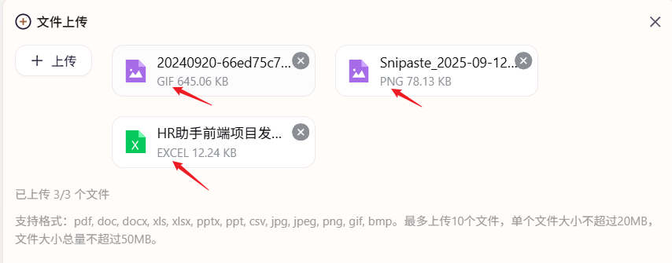

# TypeScript 中的 `Record` 类型详解

[[toc]]

`Record` 是 TypeScript 提供的一个非常实用的工具类型，用于构建一个对象类型，其中的 **键** 是一种特定的类型，而 **值** 则是另一种特定的类型。它可以让你快速创建一个映射类型，并确保每个键值对符合预期的类型。

### 1. **基本语法**

```typescript
Record<Keys, Type>;
```

- **`Keys`**：对象的键的类型（通常是一个联合类型）。这可以是任何基本类型、字符串、数字或符号，甚至是一个具体的字面量类型。
- **`Type`**：对象每个键对应的值的类型。

::: info 这是一个通过 `MIME` **文件类型映射**成所需要的字符串的示例：

**例如：**  
把 `application/vnd.openxmlformats-officedocument.spreadsheetml.sheet` 映射成 `EXCEL`  
把`application/vnd.openxmlformats-officedocument.presentationml.presentation` 映射成 `PPT`

```typescript
const MIME_MAP: Record<string, string> = {
  "application/vnd.openxmlformats-officedocument.spreadsheetml.sheet": "EXCEL",
  "application/vnd.ms-excel": "EXCEL",
  "application/vnd.openxmlformats-officedocument.wordprocessingml.document": "WORD",
  "application/vnd.ms-word": "WORD",
  "application/vnd.openxmlformats-officedocument.presentationml.presentation": "PPT",
  "application/vnd.ms-powerpoint": "PPT",
  "application/pdf": "PDF",
  "image/png": "PNG",
  "image/jpeg": "JPG",
  "image/jpg": "JPG",
  "image/gif": "GIF",
  "image/svg+xml": "SVG",
  "text/plain": "TXT",
  "text/csv": "CSV",
  "application/zip": "ZIP",
  "application/json": "JSON"
};

/**
 * 友好型 MIME → 短名称
 * @param mime MIME 类型
 * @param fallback 找不到时回退为文件后缀（不含点）
 * @returns 大写短格式，如 EXCEL / PDF / PNG
 */
export function mimeToShort(mime: string, fallback: string = "UNKNOWN"): string {
  return MIME_MAP[mime.toLowerCase()] ?? fallback.toUpperCase();
}

/* 测试 */
console.log(mimeToShort("application/vnd.openxmlformats-officedocument.spreadsheetml.sheet")); // EXCEL
console.log(mimeToShort("image/png")); // PNG
console.log(mimeToShort("application/octet-stream", "bin")); // BIN
```

**效果如图所示：**

{width=500}

:::

### 2. **示例**

#### 2.1 创建一个对象类型的映射

例如，如果你需要创建一个对象，键是 `string` 类型，而值是 `number` 类型：

```typescript
type StringToNumber = Record<string, number>;

const example: StringToNumber = {
  a: 1,
  b: 2,
  c: 3
};

console.log(example);
```

在这个例子中，`Record<string, number>` 使得我们创建的对象 `example` 的键必须是 `string` 类型，且每个键对应的值必须是 `number` 类型。

#### 2.2 使用字面量类型作为键

你还可以使用字面量类型作为键。例如，我们可以定义一个对象，其键是固定的字符串（比如 `"name"` 和 `"age"`），值的类型是 `string` 和 `number`。

```typescript
type Person = Record<"name" | "age", string | number>;

const person: Person = {
  name: "Alice",
  age: 30
};

console.log(person);
```

在这个例子中，`Record<"name" | "age", string | number>` 表示一个对象，其键只能是 `"name"` 或 `"age"`，对应的值可以是 `string` 或 `number`。

#### 2.3 键为枚举类型

你还可以使用枚举类型作为 `Keys`，这样能够让键的类型更加明确和可控。

```typescript
enum Role {
  Admin = "admin",
  User = "user"
}

type RolePermissions = Record<Role, boolean>;

const permissions: RolePermissions = {
  [Role.Admin]: true,
  [Role.User]: false
};

console.log(permissions);
```

在这个例子中，`Record<Role, boolean>` 确保了 `permissions` 对象的键只能是 `Role.Admin` 或 `Role.User`，且它们的值是 `boolean` 类型。

### 3. **常见用法**

#### 3.1 将多个属性值映射到单一类型

`Record` 很适合用来将多个属性的键映射到相同的类型。比如我们需要创建一个对象，里面的所有属性都是 `boolean` 类型：

```typescript
type Flags = Record<"isAdmin" | "isActive" | "isVerified", boolean>;

const userFlags: Flags = {
  isAdmin: true,
  isActive: true,
  isVerified: false
};
```

在这个例子中，`Flags` 类型将 `"isAdmin"`、`"isActive"`、`"isVerified"` 这些固定的字符串键映射为 `boolean` 类型的值。

#### 3.2 动态生成对象类型

如果你有一组动态的键，并且希望为每个键设置一个统一的类型，可以使用 `Record` 来快速生成对象类型：

```typescript
const keys = ["name", "age", "email"] as const;
type UserKeys = (typeof keys)[number]; // "name" | "age" | "email"

type User = Record<UserKeys, string>;

const user: User = {
  name: "Alice",
  age: "30", // age 是字符串类型
  email: "alice@example.com"
};
```

在这个例子中，我们通过 `keys` 数组的类型推导得到了一个联合类型 `"name" | "age" | "email"`，然后用 `Record<UserKeys, string>` 创建了一个对象类型，其中键是 `"name"`、`"age"` 和 `"email"`，值是 `string` 类型。

### 4. **与其他工具类型结合使用**

`Record` 类型可以与其他 TypeScript 工具类型（如 `Partial`、`Pick`、`Omit` 等）结合使用，增强其灵活性。

#### 4.1 `Partial<Record<...>>`

使用 `Partial` 可以让 `Record` 中的所有值变为可选：

```typescript
type Flags = Record<"isAdmin" | "isActive", boolean>;

const partialFlags: Partial<Flags> = {
  isAdmin: true // "isActive" 不需要提供
};
```

在这里，`Partial<Record<...>>` 使得 `Flags` 中的所有属性变成了可选。

#### 4.2 `Pick<Record<...>>`

使用 `Pick` 可以从 `Record` 中挑选某些键：

```typescript
type Flags = Record<"isAdmin" | "isActive" | "isVerified", boolean>;

type ActiveFlags = Pick<Flags, "isActive" | "isVerified">;

const activeFlags: ActiveFlags = {
  isActive: true,
  isVerified: false
};
```

这里，`Pick<Flags, "isActive" | "isVerified">` 从 `Flags` 中选取了 `"isActive"` 和 `"isVerified"` 这两个键。

#### 4.3 `Omit<Record<...>>`

使用 `Omit` 可以从 `Record` 中排除某些键：

```typescript
type Flags = Record<"isAdmin" | "isActive" | "isVerified", boolean>;

type OmittedFlags = Omit<Flags, "isAdmin">;

const omittedFlags: OmittedFlags = {
  isActive: true,
  isVerified: false
};
```

这里，`Omit<Flags, "isAdmin">` 从 `Flags` 中排除了 `"isAdmin"` 键，结果是只保留了 `"isActive"` 和 `"isVerified"`。
