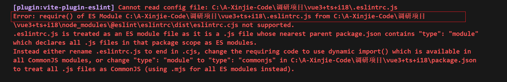
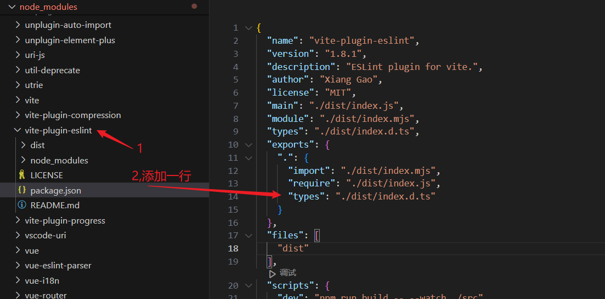

# vite 中使用 eslint 插件

[[toc]]
## 1、前言

但是稍微看过一点开源项目的源码，或者你的公司前端技术和氛围很不错的话，可以看到每个工程都有 `eslint`，虽然它并不能从根源上杜绝屎山代码，但是能帮助开发者减少犯错的可能。

作为前端，扪心自问，自己是否具备高级的审美，对代码的排版及格式具备一定的审美能力？写代码时，是否养成了缩进、换行的良好习惯？

`vite-plugin-eslint` 是一个 Vite 插件，它允许你在开发过程中集成 ESLint，以便在保存文件时自动检查代码风格和潜在的错误。

## 2、安装依赖

```bash
# npm
npm i -D eslint vite-plugin-eslint @typescript-eslint/parser @typescript-eslint/eslint-plugin

# yarn
yarn add -D eslint vite-plugin-eslint @typescript-eslint/parser @typescript-eslint/eslint-plugin
```

## 3、创建配置文件eslintrc.cjs

在项目根目录下创建`.eslintrc.js`文件，并添加如下内容：

```json
// @ts-check
const { defineConfig } = require("eslint-define-config");
module.exports = defineConfig({
  root: true,
  env: {
    browser: true,
    node: true,
    es6: true
  },
  parser: "vue-eslint-parser",
  parserOptions: {
    // 指定使用的解析器
    parser: "@typescript-eslint/parser",

    // 指定 ECMAScript 的版本
    ecmaVersion: 2020,

    // 指定源代码的类型
    sourceType: "module",

    // 指定 JSX 语法中的 pragma（默认是 React）
    jsxPragma: "React",

    // 启用额外的 ECMAScript 特性
    ecmaFeatures: {
      // 启用 JSX 语法支持
      jsx: true
    }
  },
  // "prettier", "plugin:prettier/recommended" - 暂不使用
  extends: ["plugin:vue/vue3-recommended", "plugin:@typescript-eslint/recommended"],
  rules: {
    // 允许在 <script setup> 中解构 props
    "vue/no-setup-props-destructure": "off",

    // 确保在 <script setup> 中使用的变量已声明
    "vue/script-setup-uses-vars": "error",

    // 允许使用保留的组件名称
    "vue/no-reserved-component-names": "off",

    // 允许使用 @ts-ignore 注释
    "@typescript-eslint/ban-ts-ignore": "off",

    // 不强制要求显式地指定函数返回类型
    "@typescript-eslint/explicit-function-return-type": "off",

    // 允许使用 any 类型
    "@typescript-eslint/no-explicit-any": "off",

    // 允许使用 require() 语法
    "@typescript-eslint/no-var-requires": "off",

    // 允许空函数
    "@typescript-eslint/no-empty-function": "off",

    // 允许自定义事件名称大小写不一致
    "vue/custom-event-name-casing": "off",

    // 允许在定义之前使用变量
    "no-use-before-define": "off",
    "@typescript-eslint/no-use-before-define": "off",

    // 允许使用 @ts-ignore 注释
    "@typescript-eslint/ban-ts-comment": "off",

    // 允许使用某些被禁止的类型（如 Object）
    "@typescript-eslint/ban-types": "off",

    // 允许使用非空断言操作符 (!!)
    "@typescript-eslint/no-non-null-assertion": "off",

    // 不强制要求模块导出的函数和类有显式的类型注解
    "@typescript-eslint/explicit-module-boundary-types": "off",

    // 允许未使用的变量
    "@typescript-eslint/no-unused-vars": "off",
    "no-unused-vars": "off",

    // 不强制要求函数前有空格
    "space-before-function-paren": "off",

    // 允许属性顺序不一致
    "vue/attributes-order": "off",

    // 允许一个文件中包含多个组件
    "vue/one-component-per-file": "off",

    // 允许 HTML 标签闭合标签换行
    "vue/html-closing-bracket-newline": "off",

    // 不限制每行的最大属性数量
    "vue/max-attributes-per-line": "off",

    // 不强制要求多行 HTML 元素内容换行
    "vue/multiline-html-element-content-newline": "off",

    // 不强制要求单行 HTML 元素内容换行
    "vue/singleline-html-element-content-newline": "off",

    // 允许属性名称不使用连字符
    "vue/attribute-hyphenation": "off",

    // 不强制要求默认 prop
    "vue/require-default-prop": "off",

    // 不强制要求显式声明 emits
    "vue/require-explicit-emits": "off",

    // 不强制要求在 transition 内部使用 v-if 或 v-show
    "vue/require-toggle-inside-transition": "off",

    // 允许使用 self-closing 标签，并配置特定规则
    "vue/html-self-closing": [
      "error",
      {
        html: {
          void: "any", // 自闭合标签可以是任意格式
          normal: "any", // 普通标签可以是任意格式
          component: "any" // 组件标签可以是任意格式
        },
        svg: "always", // SVG 标签必须是自闭合的
        math: "always" // MathML 标签必须是自闭合的
      }
    ],

    // 允许使用单个单词的组件名称
    "vue/multi-word-component-names": "off",

    // 允许使用 v-html 指令
    "vue/no-v-html": "off"

    // 默认关闭 prettier 的 ESLint 校验，因为我们使用的是 IDE 的 Prettier 插件
    // "prettier/prettier": "off",

    // 禁用 unocss 【css】顺序的提示，因为暂时不需要这么严格，警告也有点繁琐
    // "@unocss/order": "off",

    // 禁用 unocss 【属性】顺序的提示，因为暂时不需要这么严格，警告也有点繁琐
    // "@unocss/order-attributify": "off"
  }
});

```

**可能会出现这个报错：Error: require() of ES Module** 

::: warning 报错
Error: require() of ES Module
:::


**解决方法：**

把上一步新建的.eslintrc.js 文件改为 `.eslintrc.cjs ` 后缀改为cjs(原因见下方)，


如果没有新建.eslintrc.js 文件，会报以下错误：



vite.config.ts配置如下：


## 4、vite.config.ts配置


```ts
import { defineConfig } from 'vite';
import vue from '@vitejs/plugin-vue';
import EslintPlugin from 'vite-plugin-eslint';

export default defineConfig({
  plugins: [
    vue(),
    EslintPlugin({
      // 是否在控制台输出 ESLint 的结果
      include: ['src/**/*.vue', 'src/**/*.ts', 'src/**/*.tsx'], // 指定要检查的文件
      exclude: ['**/node_modules/**', '**/__tests__/**'], // 排除不需要检查的文件
      cache: false, // 是否启用缓存
      fix: true, // 是否自动修复部分问题
      failOnError: false, // 是否在检测到错误时终止构建
      failOnWarning: false, // 是否在检测到警告时终止构建
      formatter: 'stylish', // 使用哪种格式化器来显示 ESLint 结果
    }),
  ],
});
```

**解释配置项**

- **include**: 指定要进行 ESLint 检查的文件路径模式。
- **exclude**: 指定要排除的文件路径模式。
- **cache**: 是否启用缓存以提高性能。
- **fix**: 是否自动修复部分可以自动修复的问题。
- **failOnError**: 是否在检测到错误时终止构建。
- **failOnWarning**: 是否在检测到警告时终止构建。
- **formatter**: 使用哪种格式化器来显示 ESLint 结果，常见的格式化器有 `stylish`, `compact`, `json` 等

**引入时遇到问题：** 


::: warning
ts报错无法找到模块“vite-plugin-eslint”的声明文件
:::

**原因：**

但是由于 TypeScript 的变更，导致新版本的 typescript 与依赖包中 package.json 指明 TS 声明文件位置的 types 配置项不匹配，最终导致新版本的 TypeScript 找不到 vite-plugin-eslint 插件中的 TS 声明文件。

解决方案： 在 node_modules文件找到vite-plugin-eslint/package.json  安装以下写法即可：

```
  "exports": {
    ".": {
      "import": "./dist/index.mjs",
      "require": "./dist/index.js",
      "types": "./dist/index.d.ts"
    }
  },
```

添加types, 让新版的 TypeScript 在使用 import 导入时能够找到 vite-plugin-eslint 插件中的 TS 声明文

如下图：



## 5、文件格式


**ESLint 支持几种格式的配置文件：**

JavaScript - 使用 `.eslintrc.js` 并导出包括配置的对象。 

1, JavaScript (ESM) - 当在 JavaScript 包中运行 ESLint 时，且其 `package.json` 中指定 `"type":"module"` 时，使用 `.eslintrc.cjs`。请注意 ESLint 目前不支持 ESM 配置。 

2, YAML - 使用 `.eslintrc.yaml` 或 `.eslintrc.yml` 来定义配置结构。 

3, JSON - 使用 `.eslintrc.json` 来定义配置结构。ESLint JSON 文件中也可以使用 JavaScript 风格注释。

4, package.json - 在 `package.json` 文件中创建 `eslintConfig` 属性并在那里定义你的配置。

如果在同一目录下存在多个配置文件，ESLint 将按照以下优先顺序以此使用其一：

1. `.eslintrc.js`
2. `.eslintrc.cjs`
3. `.eslintrc.yaml`
4. `.eslintrc.yml`
5. `.eslintrc.json`
6. `package.json`

官网链接：https://zh-hans.eslint.org/docs/latest/use/configure/rules