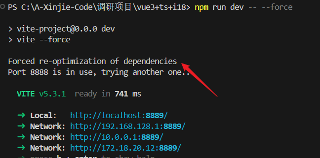

# vite 的依赖预构建讲解

[[toc]]

## 一、依赖预构建过程

简单来说，所谓依赖预构建指的是在 DevServer 启动之前，Vite 会扫描使用到的依赖从而进行构建，之后在代码中每次导入(import)时会动态地加载构建过的依赖这一过程。

Vite 在一开始将应用中的模块区分为 `依赖` 和 `源码` 两类：

**1, 依赖部分**

更多指的是代码中使用到的第三方模块，比如` vue、lodash、react` 等。 Vite 将会使用 esbuild 在应用启动时对于依赖部分进行预构建依赖。

**2, 源码部分**

比如说平常我们书写的一个一个 `js、jsx、vue `等文件，这部分代码会在运行时被编译，并不会进行任何打包。

Vite 以 原生 ESM 方式提供源码。这实际上是让浏览器接管了打包程序的部分工作。Vite 只需要在浏览器请求源码时进行转换并按需提供源码。根据情景动态导入代码，即只在当前屏幕上实际使用时才会被处理。

## 二、什么是预构建

我们在使用 vite 启动项目时，node_modules 目录下会额外增加一个` /node_modules/.vite/deps/`的目录：


这个目录就是 vite 在开发环境下预编译的产物。

项目中的依赖部分： vue、element-plus、axios 等部分会被预编译成为一个一个 `.js` 文件。

同时，.vite/deps 目录下还会存在一个 `_metadata.json`： 

`_metadata.json `文件是 Vite 在开发模式下生成的一个重要元数据文件，用于优化模块解析、转换和热更新的性能。它存储了项目依赖模块的元数据信息，帮助 Vite 更高效地处理模块依赖关系。

依赖预构建的过程简单来说就是生成 `/node_modules/.vite/deps/` 等依赖文件。

## 三、为什么要预构建依赖？

### 1、第一点：模块兼容性- 都转为 ESM 模块

我们都清楚 Vite 是基于浏览器 [Esmodule](https://developer.mozilla.org/en-US/docs/Web/JavaScript/Guide/Modules) 进行模块加载的方式。

在组件中直接使用 `require` 引入第三方库，此时浏览器中会直接报错；如下：

```js
<script setup>const _ = require('lodash');</script>
```


那么，对于一些非 ESM 模块规范的第三方库，比如 loadsh.js。在开发阶段，vite 的预构建会直接把 lodash-es 转换为 esm 模块。从而在浏览器中进行 import 这部分模块时也可以正确识别。

下面是一个引入 loadsh.js 的例子：


从图中可以看出，当浏览器去请求 loadsh.js 时，此时 loadsh.js 的来源是从`/node_modules/.vite/deps/`目录里面加载进来的。

说明预构建阶段已经把 Commonjs 模块转换为 ESM 模块并放入到`/node_modules/.vite/deps/`里面了。

最终通过`export default ` 把 `lodash` 导出(见下图)。


这样，我们就能在组件中正确 `import` lodash 库了。

```js
<script setup>
import { defaultsDeep } from 'lodash'; /**按需引入*/
console.log("defaultsDeep:",defaultsDeep);//  成功打印了 defaultsDeep 函数
</script>
```


### 2、第二点：性能- 减少 HTTP 请求次数

同样是由于 Vite 是基于 Esmodule 这一特性。在浏览器中每一次 import 都会发送一次请求，部分第三方依赖包中可能会存在许多个文件的拆分从而导致发起多次 import 请求。

比如 lodash-es 中存在超过 600 个内置模块，当我们执行 import { debounce } from 'lodash' 时，如果不进行预构建浏览器会同时发出 600 多个 HTTP 请求，这无疑会让页面加载变得明显缓慢。

正式通过依赖预构建，将 lodash-es 预构建成为单个模块后仅需要一个 HTTP 请求就可以解决上述的问题。

**总结**

基于上述两点，Vite 中正是为了`模块兼容性`以及`性能`这两方面大的原因，所以需要进行依赖预构建。

## 四、依赖缓存机制

**1. 文件系统缓存**

Vite 会将预构建的依赖缓存到 node_modules/.vite。它根据几个源来决定是否需要重新运行预构建步骤:

1.package.json 中的 dependencies 列表

2.包管理器的 lockfile，例如 package-lock.json, yarn.lock，或者 pnpm-lock.yaml

3.可能在 vite.config.js 相关字段中配置过的

只有在上述其中一项发生更改时，vite会自动重新运行预构建。

**举例：**

我现在使用的 element-plus 2.70版本库，我重新 `npm i  element-plus@2.8.4`了,把element-plus更新了一个版本。

此时，不需要重新启动项目，Vite 会自动重新构建依赖。如下图所示：


::: tip 强制 Vite 重新构建依赖
如果出于某些原因，你想要强制 Vite 重新构建依赖，你可以用 --force 命令行选项启动开发服务器，或者手动删除 node_modules/.vite 目录。

--force命令
```js
npm run dev -- --force
```

:::


**2. 浏览器缓存**

解析后的依赖请求会以 HTTP 头` max-age=31536000,immutable` 强缓存，以提高在开发时的页面重载性能。一旦被缓存，这些请求将永远不会再到达开发服务器。 

::: tip 强缓存说明
Cache-Control: max-age=31536000, immutable 是一个 HTTP 头部字段，用于控制缓存行为。具体含义如下：

max-age=31536000：指定了资源的最大缓存时间为 31,536,000 秒（即 1 年）。在这个时间段内，客户端可以直接使用缓存的副本，而不需要向服务器发起请求。

immutable：指示资源在指定的缓存时间内不会改变。这意味着，如果客户端在缓存的有效期内请求该资源，即使服务器的内容更新，客户端也应该使用缓存的版本，而不是重新请求。这有助于提高性能，减少不必要的网络请求。
:::

如下图所示，浏览器会直接从缓存中获取依赖文件：


----

如果想通过本地编辑来调试依赖项，可以:

(1) 通过浏览器调试工具的 `Network` 选项卡暂时禁用缓存；


(2) 重启 `Vite dev server`，并添加 `--force `命令以重新构建依赖；



```js
npm run dev -- --force
```

3.重新载入页面。

## 五、自定义一些库是否进行预构建

默认的依赖项发现为启发式可能并不总是可取的。在你想要显式地从列表中包含/排除依赖项的情况下, 使用 [optimizeDeps 配置项](https://www.vitejs.net/config/#dep-optimization-options)。

在 vite.config.js 中配置 optimizeDeps 字段，可以自定义哪些库不需要进行预构建：

假设你有一个项目，其中有两个库 lodash 和 axios，不希望它们被预构建。可以这样配置 vite.config.js

```js
import { defineConfig } from "vite";
import vue from "@vitejs/plugin-vue";

export default defineConfig({
  plugins: [vue()],
  optimizeDeps: {
    exclude: ["lodash", "axios"]
  }
  // 其他配置项
});
```
