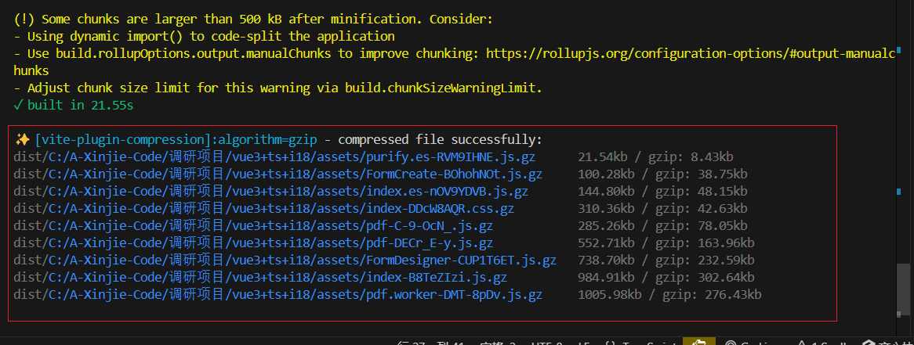
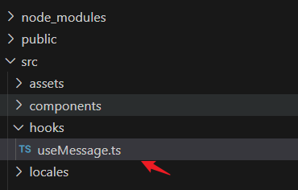
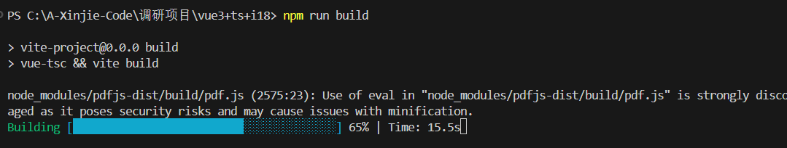

# vite 项目好用的优化插件


[[toc]]

::: info 介绍
前端项目性能优化和开发体验优化是无法避免的一个话题，在之前使用 webpack 做应用构建的时候，我们有许多手段和插件来做优化。

当我们使用 vite 构建应用时也有许多插件来做优化。 
:::

## 一、打包性能优化

### 1、vite-plugin-compression 压缩

`vite-plugin-compression`是一个基于 Vite 的插件,通过 Gzip 或更高效的 Brotli 算法对静态资源进行压缩，减少页面的加载时间和网络带宽，提高用户访问速度和体验。

#### 1.1 安装

```
npm i vite-plugin-compression -D
或者
yarn add vite-plugin-compression -D
```

#### 1.2 使用

vite.config.js 配置 (注意在 plugins 选项里面添加以下代码)

```js
import viteCompression from "vite-plugin-compression";

export default defineConfig({
  plugins: [
    viteCompression({
      verbose: true, // 是否在控制台输出压缩结果
      disable: false, // 是否禁用
      threshold: 10240, // 体积大于 threshold 才会被压缩,单位 b
      algorithm: "gzip", // 压缩算法,可选 [ 'gzip' , 'brotliCompress' ,'deflate' , 'deflateRaw']
      ext: ".gz", // 生成的压缩包后缀
      deleteOriginFile: false //压缩后是否删除源文件
    })
  ]
});
```

#### 1.3 优化结果

截图如下： 

## 二、开发体验优化

### 1、unplugin-auto-import 自动导入

`unplugin-auto-import/vite` 是一个 Vite 插件，它能够自动导入你在项目中频繁使用的模块和函数。过自动导入常用的 API 和组件，你可以避免在每个文件的顶部手动写入大量的 `import` 语句。可以代码更加简洁，专注于业务逻辑而不是依赖管理。

#### 1.1 安装

```
npm install unplugin-auto-import --save-dev
或者
yarn add unplugin-auto-import --dev
```

#### 1.2 使用

vite.config.js 配置(注意在 plugins 选项里面添加以下代码)

```js
import AutoImport from "unplugin-auto-import/vite";

export default defineConfig({
  plugins: [
    AutoImport({
      // 你可以指定要自动导入的库
      imports: ["vue", "vue-router"],
      // 你可以指定要排除的导入
      eslint: {
        // 如果你正在使用 ESLint，这个选项将生成相应的 ESLint 规则
        inheritEnv: true
        // 如果你想禁用 ESLint 规则，可以设置为 false
        // disabled: true,
      }
    })
  ]
});
```

上面代码引入了 vue 和 vue-router 的话，就可以直接使用`ref,reactive,生命周期钩子函数` 和 `useRouter`等 hoohs，而不必每次都手动导入它们。

```js
const router = useRouter(); // 路由对象
const success = ref("123456");
```

#### 1.3 对其他库进行自动导入

`AutoImport`还可以对其他库进行自动导入，下面是对 element-plus 的 Message 组件自动引入的示例。

不用每次 import { ElMessage } from "element-plus";

**1，先添加一行**

`"@/hooks/useMessage": ["useMessage"] `

```js
 imports: [
        'vue',
        'vue-router',
        // 其他库
         {
          "@/hooks/useMessage": ["useMessage"]
        }
      ],
```

**2，在 src 新建 hooks 文件-然后新建 useMessage.ts**



useMessage.ts

```js
import { ElMessage, ElMessageBox, ElNotification } from "element-plus";
import { useI18n } from "vue-i18n";

export const useMessage = () => {
  const { t } = useI18n();
  return {
    // 消息提示
    info(content: string) {
      ElMessage.info(content);
    },
    // 错误消息
    error(content: string) {
      ElMessage.error(content);
    },
    // 成功消息
    success(content: string) {
      ElMessage.success(content);
    },
    // 警告消息
    warning(content: string) {
      ElMessage.warning(content);
    },
    // 弹出提示
    alert(content: string) {
      ElMessageBox.alert(content, t("common.confirmTitle"));
    },
    // 错误提示
    alertError(content: string) {
      ElMessageBox.alert(content, t("common.confirmTitle"), { type: "error" });
    },
    // 成功提示
    alertSuccess(content: string) {
      ElMessageBox.alert(content, t("common.confirmTitle"), { type: "success" });
    },
    // 警告提示
    alertWarning(content: string) {
      ElMessageBox.alert(content, t("common.confirmTitle"), { type: "warning" });
    },
    // 通知提示
    notify(content: string) {
      ElNotification.info(content);
    },
    // 错误通知
    notifyError(content: string) {
      ElNotification.error(content);
    },
    // 成功通知
    notifySuccess(content: string) {
      ElNotification.success(content);
    },
    // 警告通知
    notifyWarning(content: string) {
      ElNotification.warning(content);
    },
    // 确认窗体
    confirm(content: string, tip?: string) {
      return ElMessageBox.confirm(content, tip ? tip : t("common.confirmTitle"), {
        confirmButtonText: t("common.ok"),
        cancelButtonText: t("common.cancel"),
        type: "warning"
      });
    },
    // 删除窗体
    delConfirm(content?: string, tip?: string) {
      return ElMessageBox.confirm(content ? content : t("common.delMessage"), tip ? tip : t("common.confirmTitle"), {
        confirmButtonText: t("common.ok"),
        cancelButtonText: t("common.cancel"),
        type: "warning"
      });
    },
    // 导出窗体
    exportConfirm(content?: string, tip?: string) {
      return ElMessageBox.confirm(content ? content : t("common.exportMessage"), tip ? tip : t("common.confirmTitle"), {
        confirmButtonText: t("common.ok"),
        cancelButtonText: t("common.cancel"),
        type: "warning"
      });
    },
    // 提交内容
    prompt(content: string, tip: string) {
      return ElMessageBox.prompt(content, tip, {
        confirmButtonText: t("common.ok"),
        cancelButtonText: t("common.cancel"),
        type: "warning"
      });
    }
  };
};
```

**3，使用**

再页面中可以直接 `useMessage`,无需再引入其他;

```js
const message = useMessage();
message.info("提示信息");
```

### 2、vite-plugin-progress 线上打包进度条

`vite-plugin-progress`插件是一个在打包时展示进度条的插件

#### 2.1 安装

```js
 # npm
 npm i vite-plugin-progress -D

 # yarn
 yarn add vite-plugin-progress -D

 # pnpm
 pnpm i vite-plugin-progress -D

```

#### 2.2 使用

在 vite.config.ts 中配置

```js
import Progress from "vite-plugin-progress"; // 打包进度条插件
export default defineConfig({
  plugins: [Progress()]
});
```

#### 2.3 效果



### 3、unplugin-element-plus 按需导入组件

`unplugin-element-plus` 按需导入 element-plus 优势在于其灵活性和兼容性。减少代码冗余和提高构建效率。

此外，插件的自动转换功能可以确保在不同构建工具中保持一致的导入方式，大大简化了配置过程。

#### 2.1 安装

```js
 # npm
 npm i unplugin-element-plus -D

 # yarn
 yarn add unplugin-element-plus -D

 # pnpm
 pnpm i unplugin-element-plus -D

```

#### 2.2 使用

在 vite.config.ts 中配置

```js
import ElementPlus from "unplugin-element-plus/vite"; // 按需引入element-plus

export default defineConfig({
  plugins: [ElementPlus({})]
});
```

### 4、vite-plugin-eslint 代码检查

[点击跳转到vite中使用eslint插件](/column/Vue/Vite相关/常用优化插件.html) 
