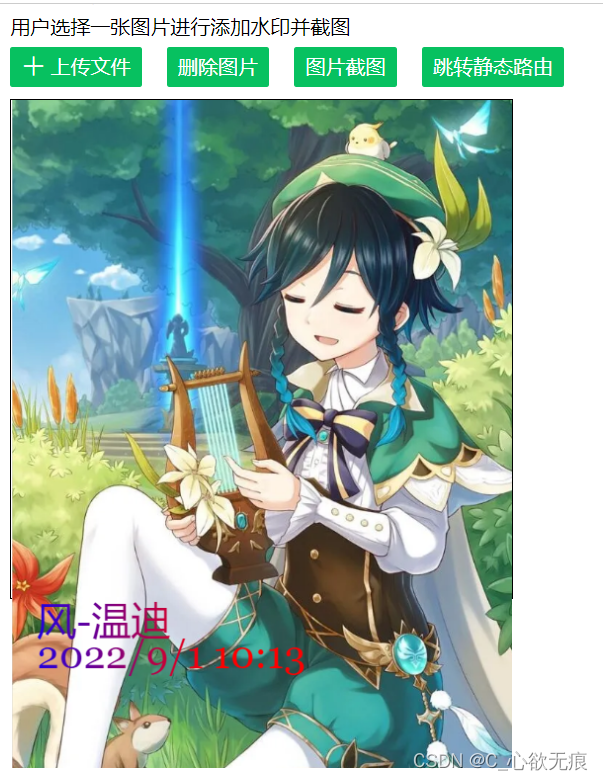
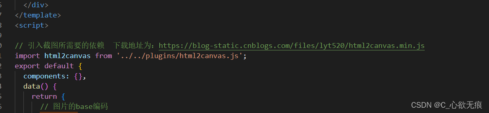

# vue中图片添加水印和截图

[[toc]]
## 1，添加水印

选择上传一张图片，使用cavans对其添加水印；
我这里使用的是`vantUI的uploader`组件上传图片，当然也可以使用原生的`input type='file'`来上传图片，然后拿到资源句柄；

**效果图如下：** 

水印是在左下角




**代码讲解：**

大家主要看`afterRead(file)` 方法即可，其中需要注意的是：

1，形参file是拿到的图片的base64格式和其他的一些信息；

2，添加水印主要使用this.base64AddWaterMaker()这个方法进行操作，返回的是一个`promise`可以使用`await`进行接收也可以直接在`then`里面拿到返回的base64图片文件；

3，canvas.getContext('2d')创建了一个2d的画布，而ctx.drawImage()像是一个画笔，开始绘制图像；

4，img.onload()方法是一个异步加载的方法；

5，toDataURL()方法把图形转变成base64编码格式的png；

**代码如下：**
```vue
<template>
  <div>
    <p>用户选择一张图片进行添加水印并截图</p>
    <!--  <van-uploader :after-read="afterRead" />-->
    <van-uploader :after-read="afterRead"> <van-button icon="plus" type="primary" size="small">上传文件</van-button></van-uploader>
    <van-button type="primary" size="small" class="del" @click="delImg">删除图片</van-button>
    <van-button type="primary" size="small" class="del" @click="screenShot">图片截图</van-button>
    <van-button type="primary" size="small" class="del" @click="jumpTo">跳转静态路由</van-button>

    <div class="preview" v-if="true">
      <div class="perview-box">
        
      </div>
    </div>
  </div>
</template>
<script>

// 引入截图所需要的依赖  下载地址为：https://blog-static.cnblogs.com/files/lyt520/html2canvas.min.js
import html2canvas from '../../plugins/html2canvas.js';
export default {
  components: {},
  data() {
    return {
      // 图片的base编码
      imgBase64: '',
      // 水印配置项
      waterMakeConfig: {
        font: 'microsoft yahei', //字体
        //水印文本内容
        textArray: ['风-温迪', '2022/9/1 10:13'], 
      },
    };
  },
  // 计算属性
  computed: {},
  // 监听属性
  watch: {},
  created() {},
  mounted() {},
  methods: {

    // 图片上传完成的操作
    afterRead(file) {
      // 下面是给图片添加水印
      try {
        this.base64AddWaterMaker(file.content, this.waterMakeConfig).then((res) => {
          这里可以把添加水印后的文件传给后端，我这里只是举例并没有做
          console.log("res",res);
        });
      } catch (error) {
        console.log('error:', error);
      }
    },

     // 给图片添加水印
    base64AddWaterMaker(base64Img, waterMakeConfig) {
      // 保留this指向 后面会用到的
      let _this = this;
      return new Promise((resolve, reject) => {
        const canvas = document.createElement('canvas');
        const ctx = canvas.getContext('2d');
        const img = new Image();
        img.crossOrigin = 'Anonymous'; // 图片加载的过程中允许出现跨域
        // 先有src属性才会触发 onload函数
        img.src = base64Img;
        // 异步加载
        img.onload = function () {
          // 注意img.onload方法是异步的
          canvas.width = img.width;
          canvas.height = img.height;
          ctx.font = `40px Georgia`;
          
          // 给文字添加颜色
          // ctx.fillStyle = 'red';
          // 添加渐变颜色的水印
          var gradient = ctx.createLinearGradient(0, 0, 200, 0);
          gradient.addColorStop(0, 'blue');
          gradient.addColorStop(1, 'red');
          ctx.fillStyle = gradient;

          // 以左上角为坐标原点 开始绘制图像
          ctx.drawImage(img, 0, 0, img.width, img.height);
          ctx.fillText(waterMakeConfig.textArray[0], img.width * 0.05, img.height * 0.8); //在图片上添加字体
          ctx.fillText(waterMakeConfig.textArray[1], img.width * 0.05, img.height * 0.85);
        
          let resultBase64 = canvas.toDataURL('image/png'); // 返回的图片文件也是base64格式的
          if (!resultBase64) {
            reject();
          } else {
            _this.imgBase64 = resultBase64;
            resolve(resultBase64);
          }
        };
      });
    },
    
    // 删除图片
    delImg() {
      this.imgBase64 = null;
    },
    // 测试动态路由 点击跳转动态路由页面 并传参
    jumpTo() {
      this.$router.push({ path: '/routers/123' });
    },
     // 图片截图 使用了html2canvas插件
    screenShot() {
      if(!this.imgBase64){
        return alert("请先上传一张图片！")
      }
      // 获取截取的元素 这里直接获取img
      const imgEl = document.getElementById('img');
      html2canvas(imgEl, {
        scale: window.devicePixelRat, //设备像素比
        backgroundColor: null, //设置截图的背景色
        allowTaint: false, //允许跨域（图片跨域相关）
        useCORS: true, // 如果截图的内容里有图片,可能会有跨域的情况,加上这个参数,解决文件跨域问题
        taintTest: true, //是否在渲染前测试图片
      }).then((canvas) => {
        // 导出图像
        let url = canvas.toDataURL('image/png', 1.0);
        var saveLink = document.createElement('a'); // 创建a链接
        saveLink.href = url;
        saveLink.download = 'downLoad.png'; // 下载的图片名称
        saveLink.click();
      });
    },
  },
};
</script>

<style lang="scss" src="./cavans.scss" scoped></style>

```
## 2，图片截图


1， 图片截图功能需要引入一个插件，插件下载地址为：

[https://blog-static.cnblogs.com/files/lyt520/html2canvas.min.js](https://blog-static.cnblogs.com/files/lyt520/html2canvas.min.js)

2，下载完成后放到一个指定的位置 然后引入：



3， 然后在 methods里面 新增一个`screenShot()`方法即可完成截图功能 

代码如下：

```javascript
 // 图片截图 使用了html2canvas插件
    screenShot() {
      if(!this.imgBase64){
        return alert("请先上传一张图片！")
      }
      // 获取截取的元素 这里直接获取img
      const imgEl = document.getElementById('img');
      html2canvas(imgEl, {
        scale: window.devicePixelRat, //设备像素比
        backgroundColor: null, //设置截图的背景色
        allowTaint: false, //允许跨域（图片跨域相关）
        useCORS: true, // 如果截图的内容里有图片,可能会有跨域的情况,加上这个参数,解决文件跨域问题
        taintTest: true, //是否在渲染前测试图片
      }).then((canvas) => {
        // 导出图像
        let url = canvas.toDataURL('image/png', 1.0);
        var saveLink = document.createElement('a'); // 创建a链接
        saveLink.href = url;
        saveLink.download = 'downLoad.png'; // 下载的图片名称
        saveLink.click();
      });
    },
```

## 3，上传多个图片同时并添加上水印
如果你的业务需求是上传多个图片，同时要求添加水印；可以预览；我们也可以使用vant的uploader组件的 `v-model="fileList"`属性进行操作；

实现效果如下：


实现代码如下：

**`注意`**：
一个`afterReadImg(`)方法就可以实现了，原理主要是监听（`this.$watch`）fileList的长度变化，如果新增了一张或多张，那就同步的把每一张都添加水印，并添加一个新的属性 `watermark: true`, //水印标识；

这是判断是否添加水印的标识，新增的图片肯定没有此属性，就可以添加水印了；


在循环的最后面要调用`unWatch()`方法解除监听，否则会引起无限监听循环；因为我们`this.fileList = templateList`改变了响应式属性fileList；


```vue
<template>
  <div>
    <p>请选择图片</p>
    <van-uploader v-model="fileList" :after-read="afterReadImg" multiple />
  </div>
</template>
<script>
export default {
  components: {},
  data() {
    return {
      // 水印配置项
      waterMakeConfig: {
        font: "microsoft yahei", //字体
        //水印文本内容
        textArray: ["风-温迪", "2022/9/1 10:13"],
      },
      // 图片列表
      fileList: [],
    };
  },

  methods: {
    // 上传多个文件
    async afterReadImg(files) {
      // 开始启动监听
      let unWatch = this.$watch(
        () => this.fileList,
        async (newValue, oldValue) => {
          if (newValue.length == 0) {
            return;
          }
          let templateList = []; //存储临时文件列表

          for (let index = 0; index < newValue.length; index++) {
            // 说明没有添加水印
            if (!newValue[index].watermark) {
              // 开始加水印
              let base64 = await this.base64AddWaterMaker(
                newValue[index].content,
                this.waterMakeConfig
              );
              // 把base64转为文件类型 用于后续上传到后端
              let file = this.convertBase64UrlToBlob(base64); 
              templateList.push({
                file,
                url: base64, // 图片的base64
                watermark: true, //水印标识
              });
            } else {
              // 已经添加水印的会自动排在最前面
              templateList.push(newValue[index]);
              console.log("已经添加过水印");
            }
          }
          unWatch(); // 此处一点要解除监听  否则会引起无线循环监听
          this.fileList = templateList; // 重新赋值
        },
        { immediate: true }
      );
    },

    // 给图片添加水印
    base64AddWaterMaker(base64Img, waterMakeConfig) {
      // 保留this指向 后面会用到的
      let _this = this;
      return new Promise((resolve, reject) => {
        const canvas = document.createElement("canvas");
        const ctx = canvas.getContext("2d");
        const img = new Image();
        img.crossOrigin = "Anonymous"; // 图片加载的过程中允许出现跨域
        // 先有src属性才会触发 onload函数
        img.src = base64Img;
        // 异步加载
        img.onload = function () {
          // 注意img.onload方法是异步的
          canvas.width = img.width;
          canvas.height = img.height;
          ctx.font = `40px Georgia`;

          // 给文字添加颜色
          // ctx.fillStyle = 'red';
          // 添加渐变颜色的水印
          var gradient = ctx.createLinearGradient(0, 0, 200, 0);
          gradient.addColorStop(0, "blue");
          gradient.addColorStop(1, "red");
          ctx.fillStyle = gradient;

          // 以左上角为坐标原点 开始绘制图像
          ctx.drawImage(img, 0, 0, img.width, img.height);
          ctx.fillText(
            waterMakeConfig.textArray[0],
            img.width * 0.05,
            img.height * 0.8
          ); //在图片上添加字体
          ctx.fillText(
            waterMakeConfig.textArray[1],
            img.width * 0.05,
            img.height * 0.85
          );

          let resultBase64 = canvas.toDataURL("image/png"); // 返回的图片文件也是base64格式的
          if (!resultBase64) {
            reject();
          } else {
            // _this.imgBase64 = resultBase64;
            resolve(resultBase64);
          }
        };
      });
    },

    /**
     * 将以base64的图片url数据转换为Blob  并进行上传
     * @param urlData 用url方式表示的base64图片数据
     */
    convertBase64UrlToBlob(urlData, filename) {
      console.log(222);
      if (urlData == "" || !urlData) {
        return console.warn("base64的图片不存在");
      }
      // 以base64的图片url数据转换为Blob
      var arr = urlData.split(","),
        mime = arr[0].match(/:(.*?);/)[1],
        bstr = atob(arr[1]),
        n = bstr.length,
        u8arr = new Uint8Array(n);
      while (n--) {
        u8arr[n] = bstr.charCodeAt(n);
      }
      let bold = new Blob([u8arr], { type: mime });
      return bold;
    },
  },
};
</script>

<style lang="scss" src="./cavans.scss" scoped></style>

```

**css代码如下：**

```css

.container{
    width: 402px;
    height: 300px;
    background:#ccc;
    border: 1px solid red;  
    margin: 0 auto;     
}
// 预览的盒子
.perview-box{
    width: 402px;
    height: 400px;
    border: 1px solid;
    margin-top: 10px;
    #img{
        display: inline-block;
        width: 400px;
        
    }
}
.del{
    margin-left: 20px;
}
```
