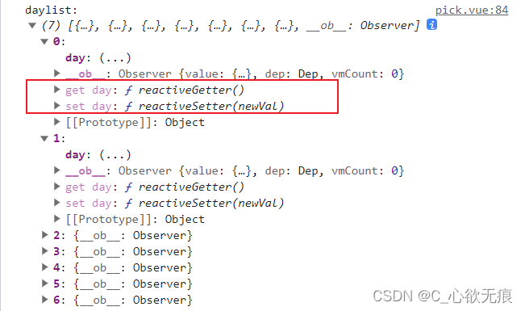
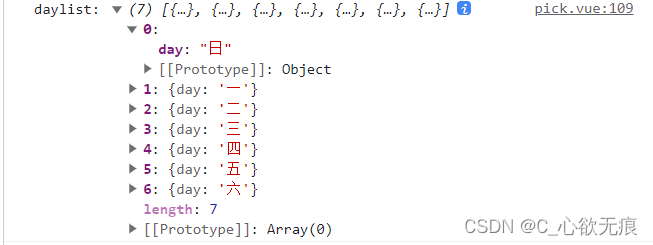

# vue 使用中常见的性能优化

[[toc]]

---

### 1， v-for 遍历避免同时使用 v-if

在 Vue2 中 `v-for` 优先级更高，所以编译过程中会把列表元素全部遍历生成虚拟 DOM，再来通过 v-if 判断符合条件的才渲染，就会有多余的逻辑判断和造成性能的浪费，因为我们希望的是不符合条件的虚拟 DOM 都不要生成；

1，为了过滤一个列表中的项目 (`比如 v-for="user in users" v-if="user.isActive"`)。在这种情形下，可以将 users 替换为一个计算属性或者方法 (比如 activeUsers)，让其返回过滤后的列表；

```js
<ul>
  <li
    v-for="user in activeUsers"
    :key="user.id"
  >
    {{ user.name }}
  </li>
</ul>

methods:{
	// 方法
	activeUsers(){
		//在这里面处理需要显示的数据  然后返回筛选过的列表
	}
}
```

2，为了避免渲染本应该被隐藏的列表 (`比如 v-for="user in users" v-if="shouldShowUsers"`)。这种情形下，请将 v-if 移动至容器元素上 (比如 ul、ol)。

```js
<ul v-if="shouldShowUsers">
  <li
    v-for="user in users"
    :key="user.id"
  >
    {{ user.name }}
  </li>
</ul>
```

在 Vue3 中 `v-if` 的优先级更高，就意味着当判断条件是 v-for 遍历的列表中的属性的话，v-if 是拿不到的；

**`注意`**：永远不要把 v-if 和 v-for 同时用在同一个元素上。

### 2， 如果需要使用 v-for 给每项元素绑定事件时 可以使用事件代理\*\*

事件代理的本质就是利用事件冒泡到父元素的特性。这样就可以不用在循环的节点上每一个都加事件了；如下：

在父元素 ul 上面添加点击事件，如过需要传参的话 只需要添加自定义属性即可，比如下面的 id 属性

```js
  <!--  使用事件委托进行处理和传参 添加自定义属性id -->
    <ul class="weekdays" @click="debounce($event)">
      <li v-for="(item, index) in dayList" :key="index" :id="index" >{{ item.day }}</li>
    </ul>

```

```js
	// 事件委托处理
    debounce(event) {
      if (event.target && event.target.nodeName == "LI") {
        // 现在就可以拿到当前的节点 所以就能拿到里面的属性和数据
          console.log("我点击的是：", event.target);
      }
    },
```

**事件代理好处有 2 个** 1，将事件处理程序代理到父节点，减少内存占用率； 2，动态生成子节点时能自动绑定事件处理程序到父节点；

### 3， 一些数据不做响应式

一些数据不做响应式 比如会员列表、商品列表之类的，只是纯粹的数据展示，不会有任何动态改变的场景下，就不需要对数据做响应化处理，可以大大提升渲染速度;

可以使用 `Object.freeze()` 方法冻结一个对象，该方法冻结的对象不能被修改；即不能向这个对象添加新属性，不能删除已有属性，不能修改该对象已有属性的可枚举性、可配置性、可写性，以及不能修改已有属性的值，以及该对象的原型也不能被修改；

```js
export default {
  data: () => ({
    userList: []
  }),
  async created() {
    const users = await axios.get("/api/users");
    this.userList = Object.freeze(users);
  }
};
```

Vue2 的响应式源码地址：`src/core/observer/index.js - 144行` 是这样的:

```js
export function defineReactive (...){
	// getOwnPropertyDescriptor 返回指定对象上一个自有属性对应的属性描述符
	// 也就是直接赋予该对象的属性，不需要从原型链上进行查找的属性
    const property = Object.getOwnPropertyDescriptor(obj, key)

	判断configurable` 为 `false`不做处理
    if (property && property.configurable === false) {
        return
    }
    ...
}
```

可以看到一开始就判断 `configurable` 为 `false` 的直接返回不做响应式处理；

```js
configurable` 为 `false` 表示这个属性是不能被修改的，而冻结的对象的 `configurable` 就是为 `false
```

这是 vue 正常定义在 data 里面的数据，会自动把下面的所有属性都添加 get 和 set 属性，有多少就添加多少：



**开始冻结对象：**

freList 是请求后端的列表数据；

```js
  created() {
    this.dayList = Object.freeze(freList)
    console.log("daylist:",this.dayList);
  },
```

可以看出已经没有 get 和 set 属性了，但同时这些数据也不具备响应式了；



### 4，一些页面采用`keep-alive`缓存组件

比如在表单输入页面进入下一步后，再返回上一步到表单页时要保留表单输入的内容、比如在`列表页>详情页>列表页`，这样来回跳转的场景等；

基础使用：

```js
	如果需要缓存整个项目，则如下设置(直接包裹根router-view即可)：
	<keep-alive>
    	<router-view> </router-view>
	</keep-alive>

	缓存部分页面或者组件，使用route.meta属性
	<keep-alive>
    	<router-view v-if="$route.meta.keepAlive"></router-view>
	</keep-alive>
    	<router-view v-if="!$route.meta.keepAlive"></router-view>


	注：<keep-alive> 包裹动态组件时，会缓存不活动的组件实例，而不是销毁它们。
	<keep-alive>
    	<component :is="view"></component>
	</keep-alive>
```

**注意：** 配置了 keepAlive 的页面，在再次进入时不会重新渲染（第一次进来时会触发所有钩子函数），该页面内的组件同理不会再次渲染。

而这可能会导致该组件内的相关操作（那些每次都需要重新渲染页面的操作：如父子组件间的传值）不再生效。 这一点可能会导致一些莫名其妙而又无从查证的 bug；

**vue2.1.0 新增了 include，exclude 俩个属性，允许组件有条件的缓存。二者都可以用逗号分隔字符串、正则表达式或一个数组来表示。**

```js
    <!-- 逗号分隔字符串 -->
    <keep-alive include="a,b">
        <component :is="view"></component>
    </keep-alive>

    <!-- 正则表达式 (需要 `v-bind`绑定) -->
	<keep-alive :include="/a|b/">
    	<component :is="view"></component>
	</keep-alive>

    <!-- 数组 (需要 `v-bind`绑定) -->
	<keep-alive :include="['a', 'b']">
    	<component :is="view"></component>
	</keep-alive>
```

注：匹配首先检查组件自身的 name 选项，如果 name 选项不可用，则匹配它的局部注册名称 (父组件 components 选项的键值)。匿名组件不能被匹配。

**动态判断，使用 v-bind:include**

```js
<keep-alive :include="includedComponents">
    <router-view></router-view>
</keep-alive>

includedComponents动态设置即可
```

**使用 beforeRouteLeave 或者 afterEach 中进行拦截处理**

```js
如在项目在Category组件中的设置：
beforeRouteLeave(to,from,next){
    if(to.name=='DemoIndex'){
        if(!from.meta.keepAlive){
            from.meta.keepAlive=true
        }
        next()
    }else{
        from.meta.keepAlive=false
        to.meta.keepAlive=false
        next()
    }
},
在beforeRouteLeave中to.name根据具体的路由进行动态缓存设置
```

::: tip 使用 keepAlive 后生命周期变化（重要） **首次**进入缓存页面：beforeRouteEnter --> created --> mounted --> activated --> deactivated

**再次**进入缓存页面：beforeRouteEnter --> activated --> deactivated

:::

**注：**

1. 这里的 activated 非常有用，因为页面被缓存时，created,mounted 等生命周期均失效，你若想进行一些操作，那么可以在 activated 内完成(下面会举个栗子：列表页回到上次浏览位置)
2. activated keep-alive 组件激活时调用，该钩子在服务器端渲染期间不被调用。
3. deactivated keep-alive 组件停用时调用，该钩子在服务端渲染期间不被调用。

### 5，第三方 UI 库按需导入

比如 vantUi， element-ui 库的按需引入；[见这篇文章](https://blog.csdn.net/qq_43886365/article/details/123030691?ops_request_misc=&request_id=35ac2f32642a40caa066a2720453605e&biz_id=&utm_medium=distribute.pc_search_result.none-task-blog-2~blog~koosearch~default-1-123030691-null-null.268%5Ev1%5Econtrol&utm_term=%E6%8C%89%E9%9C%80%E5%BC%95%E5%85%A5&spm=1018.2226.3001.4450)

### 6，列表数据的懒加载 上滑加载分页数据

列表数据的懒加载滚动条上划到底时开始请求下一页的数据，尽量配合防抖函数使用，防止一瞬间请求的次数太多。

`如下代码`：

这边我用的是 vue3 写的，vue2 只是获取节点的方式不一样，其他都一样的；

```js
onMounted(() => {
  // 获取滚动容器的节点
  let containerEle = showContentEl.value;
  if (!containerEle) return;

  // 监听滚动条
  containerEle.addEventListener("scroll", function () {
    const clientHeight = containerEle.clientHeight;
    const scrollTop = parseInt(containerEle.scrollTop);
    const scrollHeight = containerEle.scrollHeight;
    // 判断是否滚动条是否滚动到底  （-1是为了控制误差）
    if (clientHeight + scrollTop >= scrollHeight - 1) {
      // 开始防抖请求数据
      debounceLoadMaterialList();
    }
  });
});

<template>
  <div class="container">
    <div class="list">展示的列表数据</div>
  </div>
</template>;
```

设置接口防抖：

```js
import * as _ from "lodash";
// 设置接口防抖
const debounceLoadMaterialList = _.debounce(loadMaterialList, 500);
```

### 7，变量本地化

简单说就是把会多次引用的变量保存起来，因为每次访问 `this.xx` 的时候，由于是响应式对象，所以每次都会触发 `getter`，然后执行依赖收集的相关代码，如果使用变量次数越多，性能自然就越差;

从需求上说在一个函数里一个变量执行一次依赖收集就够了，可是很多人习惯性的在项目中大量写 `this.xx`，而忽略了 `this.xx` 背后做的事，就会导致性能问题了;

`比如下面vue2的例子`：

```js
<template>
  <div :style="{ opacity: number / 100 }"> {{ result }}</div>
</template>
<script>
import { someThing } from '@/utils'
export default {
  props: ['number'],
  computed: {
    base () { return 100 },
    result () {

      let base = this.base, number = this.number // 保存起来  -- 变量本地化
      for (let i = 0; i < 1000; i++) {
        number += someThing(base) // 避免频繁引用 this.xx
      }
      return number
    }
  }
}
</script>
```

### 8，事件的销毁

Vue 组件销毁时，会自动解绑它的全部指令及事件监听器，但是仅限于组件本身的事件;

而对于`定时器`、 `addEventListener` 注册的监听器等，就需要在组件销毁的生命周期钩子中手动销毁或解绑，以避免内存泄露；

```js
<script>
export default {
    created() {
      this.timer = setInterval(this.refresh, 2000)
      addEventListener('touchmove', this.touchmove, false)
    },
    beforeDestroy() {
      clearInterval(this.timer)
      this.timer = null
      removeEventListener('touchmove', this.touchmove, false)
    }
}
</script>
```
