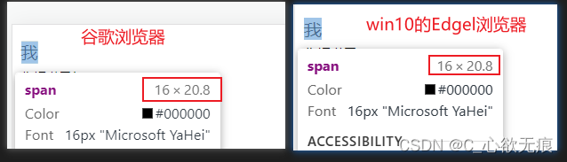

# 常见的移动端 rem 适配方案

[[toc]]

::: tip rem 有以下几种方案

1. rem + 媒体查询（@media）
2. js + rem（查询屏幕宽度）
3. VW + rem（不需要查询屏幕宽度） 
:::

这几种方式最终 css 写的单位是 rem;

## 1.rem 适配原理

rem 是一个相对单位。是相对于根元素 html 的 font-size 宽度值。大多数浏览器默认字体宽度是 16px(如果没有设置过)，也就是 1rem = 16px;

如下图所示： 

既然 rem 相对于根据 html 的 font-size 来的，那再不同的屏幕宽度时改变 html 的字体宽度值，那么 rem 的值也会相应的改变；这也就是为什么要频繁的改变 html 下面 font-size 值的原因；

## 方案 1：rem+媒体查询

---

**计算公式**：`当前屏幕宽度下的html字体值 = 当前屏幕宽度*预设字体值/psd设计稿的宽度(750px)`

预设字体值可以随意设，计算方便我通常设置为 100;

**媒体查询适配模板**

以下 font-size 的字体值是根据预设字体值 100;

common.css

```css
/* 媒体查询适配模板 预设值为 100 	*/
@media screen and (min-width: 320px) {
  html {
    font-size: 42.667px;
  }
}

@media screen and (min-width: 375px) {
  html {
    font-size: 50px;
  }
}

@media screen and (min-width: 414px) {
  html {
    font-size: 55.2px;
  }
}

@media screen and (min-width: 540px) {
  html {
    font-size: 72px;
  }
}

@media screen and (min-width: 750px) {
  html {
    font-size: 100px;
  }
}
```

**在 main.js 引入**

main.js

```javascript
import Vue from "vue";
import App from "./App.vue";
// 引入适配css
import "@/assets/common.scss";

Vue.config.productionTip = false;

new Vue({
  render: (h) => h(App)
}).$mount("#app");
```

**使用**：如果量得设计图其中一个元素的宽度是 235px,那么在 css 代码中需要写成 :`先除以预设值 再加上rem即可`；如下：

```css
.div {
  width: 2.35rem; // 235/100=2.35+rem
}
```

## 方案 2：js+rem

---

这种方案也是阿里早期开源的一个[移动端适配]解决方案（`flexible.js`）；

原理是需要查询屏幕的宽度，只不过这种需要通过监听屏幕的尺寸变化 ，实时调用 clientWidth 方法获取屏幕宽度来更改 html 的字体值；


::: info 分析如下：
```javascript
350：当前屏幕宽度（设备宽度） curScreenWidth

750：psd设计稿宽度  psdWidth

100：预设字体基础值  1rem = 100px  preFontSize

x： 当前屏幕宽度字体的基础值（html的font-size的值）curFontSize

320     x
———— = ————
640    100

x = (320*100)/640  公式如下：

curFontSize=(curScreenWidth*100)/psdWidth`
```


**牢记公式** 当前屏幕宽度下的 html 字体值 = 当前屏幕宽度\*预设字体值/psd 设计稿的宽度(750px)

:::

**1，开始封装**

autoSize.js

```javascript
// 封装 rem + js 移动端适配方案
export function autoSize() {
  //设计稿的宽度
  var psdWidth = 750;

  //预设字体值
  var preFontSize = 100;

  //当前屏幕宽度
  var curScreenWidth = document.documentElement.clientWidth;
  //当前屏幕对应的html字体值
  var curFontSize = (curScreenWidth * preFontSize) / psdWidth;

  //设备宽度在750px
  if (curScreenWidth > 750) {
    curScreenWidth = 750;
  }
  //把计算下来的当前屏幕html字体值 赋值给html元素 documentElement属性会获取到html根元素 然后为之设置字体值
  document.documentElement.style.fontSize = curFontSize + "px";
}
```

**2，vue 中使用 （resize 方法监听窗口变化，实时计算 html 下面的 font-size 值）**

App.vue

```javascript
<template>
  <div id="app">
  </div>
</template>

<script>
import { autoSize } from "@/assets/auto";
export default {
  name: "App",
 // 监听resize事件
  mounted() {
    window.addEventListener("resize", () => {
      autoSize();
    });
  }
};
</script>
```

这种方法实际写入到 css 代码中还是：测量宽度/100 + rem；

## 方案 3：vw+rem（不用查询屏幕宽度）

---

使用视口单位布局 (纯 css) 实现动态改变 font-size 属性值，不需要引用 js 文件，但需要在 meta 标签添加`viewport` 属性；vue 项目会自动添加；

**Viewport 介绍：**

<kbd>vw</kbd>：是 css3 规范中宽度视口单位，将视口宽度平均分成 100 份；

<kbd>vh</kbd>：将视口高度平均分成 100 份；

```javascript

<meta name="viewport" content="width=device-width, initial-scale=1.0, maximum-scale=1.0, minimum-scale=1.0, user-scalable=no" />

属性说明：
width：控制 viewport 的大小，可以指定的一个值，如 device-width为设备的宽度（单位为缩放为 100% 时的 CSS 的像素）
height：和 width 相对应，指定高度
initial-scale：初始缩放比例，也即是当页面第一次 load 的时候缩放比例
maximum-scale：允许用户缩放到的最大比例  float_value
minimum-scale：允许用户缩放到的最小比例  float_value
user-scalable：用户是否可以手动缩放 no表示不可以  yes为可以
```

**`视口布局原理`**：确定基准值以常见的 750 像素宽度的设计稿为例，根据 vw 单位可知：

750px = 100vw ； 1px = 0.133333vw;

100px = 13.33333vw = 1rem;

px 和 rem 关系还是 100 倍 ; 那么实际写入如到 css 代码中还是：测量宽度 / 100 + rem;

```javascript
html {
    font-size:13.33333vw; //100px=1rem = 13.33333vw
}
```

- 优点：页面元素随着页面宽度变化
- 缺点：
  - 兼容性没有 rem 好 ,得大量计算， 不是很精确
  - 转换后的长度单位不够直观修改维护困难
