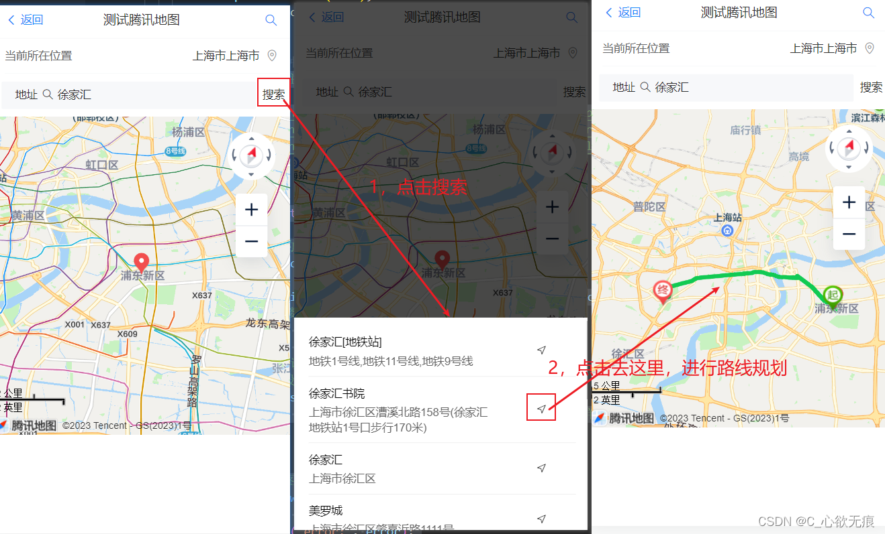

# 使用腾讯 api 进行定位获取，绘制地图、标点、搜索、路线规划

[[toc]]

## 1，前言

首本文主要记录一下在 Vue 项目里面使用腾讯地图 api 实现的一些功能。如：引入腾讯地图 SDK、定位获取当前经纬度和详细地址、地图 marker 的使用、关键字搜索功能和路线规划。

**我这边实现的效果图如下：**



## 2，准备

首先要成为腾讯位置服务开发者或者使用公司提供的`key`值；才可以使用腾讯地图 api，我这里使用的是公司提供的`key`值；

`详细介绍见官网`：[https://lbs.qq.com/webApi/javascriptGL/glGuide/glBasic](https://lbs.qq.com/webApi/javascriptGL/glGuide/glBasic)

## 3，开始引入 api

在 vue 项目中的根路径下 public 文件夹的`index.html`中引入一些 api；如下：

public/`idnex.html`

```javascript

<!DOCTYPE html>
<html lang="">
  <head>
    <meta charset="utf-8">
    <meta http-equiv="X-UA-Compatible" content="IE=edge">
    <meta name="viewport" content="width=device-width,initial-scale=1.0,maximum-scale=1, minimum-scale=1">
    <link rel="icon" href="<%= BASE_URL %>favicon.ico">
    <title>微视频后台管理</title>

    这三个文件是新引入的腾讯地图的api 注意：key值是必须要填的 是一串字符串
    <script type="text/javascript" src="https://mapapi.qq.com/web/mapComponents/geoLocation/v/geolocation.min.js"></script>
    <script type="text/javascript" src="https://map.qq.com/api/gljs?v=1.exp&libraries=service&key=这里是您的key值"></script>
    <script type="text/javascript" src="https://map.qq.com/api/gljs?v=1.exp&key=这里是您的key值"></script>

  </head>
  <body>
    <noscript>
      <strong>We're sorry but <%= htmlWebpackPlugin.options.title %> doesn't work properly without JavaScript enabled. Please enable it to continue.</strong>
    </noscript>
    <div id="app"></div>
  </body>
</html>

```

## 4，获取定位

先在 mounted 生命周期初始化`Geolocation`定位组件这个类；`showPosition`是获取成功的回调；里面存放着当前地址的经纬度和详细地址信息；

```javascript

  mounted() {
    // 1，初始化腾讯地图
    this.geolocation = new qq.maps.Geolocation('你的key值', 'myapp');
    // 2，并且开始定位
    this.getMyLocation();
  },

  methods:{
     // 获取当前位置
    getMyLocation() {
      this.geolocation.getLocation(this.showPosition, this.errorPosition); //开启定位
    },
    // 定位成功
    showPosition(position) {
      console.log('定位成功');
      this.longitude = position.lng;
      this.latitude = position.lat;
      this.queryParams.address = position.city + position.province + position.addr;
      // 定位成功后开始绘制地图
      this.setMap();
    },
    // 定位失败 继续尝试定位
    errorPosition(e) {
      console.log('定位失败，再次进行定位');
      // 此判断是防止多次绘制地图
      if(!this.map){
        this.getMyLocation();
      }
    },
  }
```

## 5，绘制地图和标点

上一步获取定位成功后我这边直接调用`setMap`方法进行了绘制地图的操作；并以当前为中心点进行标点；如下：注意：绘制地图需要有一个容器（Dom 节点）；

```javascript
/*
     *  setMap 此方法主要是绘制地图和地图标点
     *  绘制地图
     *  绘制地图演示：https://lbs.qq.com/webDemoCenter/glAPI/glMap/createMap
     *  地图标点演示：https://lbs.qq.com/webDemoCenter/glAPI/glMarker/glImagetext
     *  路线规划演示：https://lbs.qq.com/webDemoCenter/glAPI/glPolyline/polylineRoutePlan
     */
    setMap() {
      // 防止重复绘制地图
      if(this.map) {
        return;
      };

      // 获取存放地图的容器
      this.mapEl = document.getElementById('mapItem');
      //设置地图中心点
      this.startPosition = new TMap.LatLng(this.latitude, this.longitude);
      //定义工厂模式函数
      var myOptions = {
        rotation: 20, //设置地图旋转角度
        pitch: 30, //设置俯仰角度（0~45）
        zoom: 12, //设置地图缩放级别
        center: this.startPosition, //设置地图中心点坐标
        // mapTypeId:  window.TMap.MapTypeId.ROADMAP, //设置地图样式详情参见MapType
      };
      try {
        // 开始生成地图
        this.map = new TMap.Map(this.mapEl, myOptions);
      } catch (error) {
        console.error('error:', error);
      }
      // 地图标点官方演示请见：https://lbs.qq.com/webDemoCenter/glAPI/glMarker/glImagetext
      new TMap.MultiMarker({
        map: this.map, //指定地图容器
        styles: {
          // 点标记样式
          marker1: new TMap.MarkerStyle({
            width: 20, // 样式宽
            height: 30, // 样式高
            anchor: { x: 10, y: 30 }, // 描点位置
          }),
        },
        // 点标记数据数组
        geometries: [
          {
            id: 'demo',
            styleId: 'marker1', // 和上面styles里面的marker1 向对应
            position: new TMap.LatLng(this.latitude, this.longitude), // 标点的位置
            properties: {
              title: 'marker',
            },
          },
        ],
      });
    },
```

## 6，关键字搜索功能

输入地址然后点击搜索按钮进行搜索；如下图：注意：搜索到的地址列表（`searchList` ）然后使用抽屉组件并通过列表显示出来；点击每一项可以获取它的详细地址和经纬度信息；

```javascript
   /* 点击搜索 搜索地址列表
     * 官方演示地址为：https://lbs.qq.com/webDemoCenter/glAPI/glServiceLib/suggestion
     */
    onSearch() {
      this.searchItem = new TMap.service.Search({ pageSize: 10 });
      // 搜索类
      this.suggest = new TMap.service.Suggestion({
        pageSize: 10, // 返回结果每页条目数
        region: this.city, // 限制城市范围
        regionFix: true, // 搜索无结果时是否固定在当前城市
      });
      if (this.onSearchValue) {
        // 请求腾讯地图接口
        this.suggest.getSuggestions({ keyword: this.onSearchValue, location: this.map.getCenter() }).then((result) => {
          this.searchList = result.data;
          if (typeof this.searchList == 'object') {
            this.souShow = true;
          }
        });
      } else {
        Toast('请输入地点再进行搜索!');
      }
    },
```


## 7，驾车线路规划

线路规划需要有起点和终点的经纬度；起点就是当前定位的经纬度，终点就是用户选择的地址的经纬度；方法如下：

```javascript
    /* 路线规划方法
    * 参数：前两个参数是起点的经纬度  后两个参数是终点的经纬度
    */
    goToThere(startLat,startLng,endLat,endLng) {
      let startPosition = new TMap.LatLng(startLat, startLng); // 路线规划起点
      let endPosition = new TMap.LatLng(endLat, endLng); // 路线规划起点
      // 然后开始规划路线
      this.destination.marker = new TMap.MultiMarker({
        // 创造MultiMarker创建起点和终点的标点样式
        id: 'marker-layer',
        map: this.map,// 使用之前已经绘制好的地图 进行起点和终点的标点
        styles: {
          start: new TMap.MarkerStyle({
            width: 25,
            height: 35,
            anchor: { x: 16, y: 32 },
            src: 'https://mapapi.qq.com/web/lbs/javascriptGL/demo/img/start.png',
          }),
          end: new TMap.MarkerStyle({
            width: 25,
            height: 35,
            anchor: { x: 16, y: 32 },
            src: 'https://mapapi.qq.com/web/lbs/javascriptGL/demo/img/end.png',
          }),
        },
         //点标记数据数组
        geometries: [
          {
            id: 'start',
            styleId: 'start',
            position:startPosition,
          },
          {
            id: 'end',
            styleId: 'end',
            position: endPosition,
          },
        ],
      });

      /*
      驾车路线规划链接：https://lbs.qq.com/webDemoCenter/glAPI/glServiceLib/driving
      路线规划演示：https://lbs.qq.com/webDemoCenter/glAPI/glPolyline/polylineRoutePlan
      */
      //新建一个驾车路线规划类
      this.destination.driving = new TMap.service.Driving({
        mp: false, // 是否返回多方案
        policy: 'PICKUP,NAV_POINT_FIRST', // 规划策略
      });

      this.destination.driving.search({ from: startPosition, to: endPosition }).then((result) => {
        // 搜索路径 案例这边展示的是第一个中情况
        // result.result.routes[0].steps.forEach((step, index) => {
        //   document.getElementById('instruction').innerHTML += `<p>${index + 1}. ${step.instruction}</p>`;
        // });

        // 展示路线引导  有可能是多条路线的展示
        this.queryParams.routesList = JSON.stringify(result.result.routes);
        result.result.routes.map((item, index) => {
          this.displayPolyline(item.polyline, index);
        });
        // 关闭抽屉
        this.souShow = false;
      });
    },

    // 绘制路径折线样式
    displayPolyline(pl, num) {
      // 第一次进来这个判断是不成立的
      if (this.polylineLayer) {
        // updateGeometries 这个方法是更新图层
        this.polylineLayer.updateGeometries([
          {
            id: `p_${num}`,
            styleId: `style_${num}`, //和下面的styleID一一对应
            paths: pl,
          },
        ]);
      } else {
        // TMap.MultiPolyline  此方法用来构建折线 （地图线路规划）
        this.polylineLayer = new TMap.MultiPolyline({
          id: 'polyline-layer',
          map: this.map,
          styles: {
            style_0: new TMap.PolylineStyle({
              color: '#11CA53', //线填充色
              width: 6, //折线宽度
              borderWidth: 0, //边线宽度
              borderColor: '#11CA53', //边线颜色
              lineCap: 'round', //线端头方式
            }),
            style_1: new TMap.PolylineStyle({
              color: '#3777FF',
              width: 6,
              borderWidth: 0,
              borderColor: '#3777FF',
              lineCap: 'round',
            }),
            style_2: new TMap.PolylineStyle({
              color: '#CC0000', //线填充色
              width: 6, //折线宽度
              borderWidth: 0, //边线宽度
              borderColor: '#CC0000', //边线颜色
              lineCap: 'round', //线端头方式
            }),
          },
          geometries: [
            {
              id: `p_0`,
              styleId: `style_0`,
              paths: pl,
            },
          ],
        });
      }
    },
```

## 8，两点经纬度的直线距离计算

首先要引入一个 js 库，还是在 public 文件夹下的 index.html 中：key=“输入您的 key 值”

```javascript
<script charset="utf-8" src="https://map.qq.com/api/gljs?v=1.exp&key=OB4BZ-D4W3U-B7VVO-4PJWW-6TKDJ-WPB77&libraries=geometry"></script>
```

```javascript
  // 调用腾讯地图的距离计算api
  computeDistance() {

      try {
        // 起始点的经纬度
        let start = new TMap.LatLng(this.latitude, this.longitude);
        // 终点的经纬度
        let end = new TMap.LatLng(this.toLatitude, this.toLongitude);
        let path = [start, end];
        let distance = TMap.geometry.computeDistance(path); // 调用腾讯api
         console.log("腾讯地图api计算的距离：", distance.toFixed(2) + "米");
        //保留两位小数  返回的单位是米
        return distance.toFixed(2);

      } catch (error) {
        console.log("error:", error);
      }
    },
```

---

## 9，使用过程中的一些常见问题

**1，`Cannot read properties of null (reading id)`**

没有正确获取到 Dom 元素，也就是地图的容器(document.getElementById("mapEl")):如下图：


**原因**：因为我这边是使用 vantUi 的 popup 弹出层组件，当点击某个事件才弹出，其中 popup 组件默认是惰性加载的(不弹出不加载)；也就是页面第一次进来没有加载节点;

而我在 mounted()函数中又直接渲染地图了：`new TMap.Map(document.getElementById("mapEl"), options)`所以会报这个错误；

**解决：** 在 popup 弹出层组件上添加 `:lazy-render="false"`属性，不让惰性加载


**2，`far < = 0` `且地图没有渲染出来的是空白`**

 这个问题和第一个问题比较像，虽然拿到了 dom 节点，但是没有渲染出来；

**原因：** 我把挂载地图的容器 设置 `display:none`了（或放在 popup 组件直接加载了 即使设置了惰性加载为 false 也不管用），然后在 popup 弹出时才设置 `display:block` 这样做虽然容器节点获取到了，但腾讯地图渲染又有问题了；

**解决：** 不要直接放在 popup 弹出层里面，先把挂载地图的容器放在最外面，让其正常加载，使用 css 属性`visibility: hidden`来进行隐藏元素（占文档流高度）;

```javascript
    <!--防止地图没有渲染 -->
    <div class="mapElContainer">
      <div id="mapEl"></div>
    </div>
// 样式这样设置
.mapElContainer {
  #mapEl {
    width: 100%;
    height: 4.8rem;
    visibility: hidden;
  }
}
```

然后在 popup 组件弹出的时候，动态 appendChild 添加节点,并在样式上去掉 visibility 属性；如下：

```javascript
// 弹出的时候
 showPopup() {
        // 这个mapContainerEl 节点是popup里面的父组件
      let mapContainerEl = document.getElementsByClassName("mapContainer")[0];
      let mapEl = document.getElementById("mapEl");
      // 动态添加地图渲染节点
      if (mapContainerEl) {
        mapContainerEl.appendChild(mapEl);
      }
    },
 // popup组件里面节点的样式
.mapContainer {
  overflow: hidden;
  // 此处要去掉visibility属性  否则还是不可见
  #mapEl {
    width: 100%;
    height: 5rem;
  }
}
```

最终效果图如下： 

## 10，组件源码

**tenxunMap.vue**

```javascript
<template>
  <div class="app">
    <div class="content">
      <!-- 导航栏 -->
      <van-nav-bar title="测试腾讯地图" left-text="返回" left-arrow>
        <template #right>
          <van-icon name="search" size="18" />
        </template>
      </van-nav-bar>

      <!-- 获取当前所在位置 -->
      <van-field v-model="queryParams.address" rows="1" autosize clearable readonly right-icon="location-o" type="textarea" label="当前所在位置" placeholder="" input-align="right" />
      <!-- 搜索地址 -->
      <van-search v-model="onSearchValue" show-action label="地址" placeholder="请输入搜索关键词">
        <template #action>
          <div @click="onSearch">搜索</div>
        </template>
      </van-search>
      <!-- 展示地图用的 -->
      <div id="mapItem"></div>
    </div>

    <!-- 下方展示地图列表的抽屉 -->
    <van-popup v-model="souShow" position="bottom" :style="{ height: '40%' }">
      <div class="list-main">
        <div class="list-one" v-for="(item,index) in searchList" :key="index" @click="currentItem(item)">
          <div class="one-left">
            <div class="title">{{ item.title }}</div>
            <div class="text">{{ item.address }}</div>
          </div>
          <div class="one-right">
            <van-icon name="guide-o" />
          </div>
        </div>
      </div>
    </van-popup>

    <canvas id="canvasCamera" :height="Height"></canvas>
  </div>
</template>

<script>
import { Toast } from 'vant';

export default {
  directives: {},
  components: {},
  data() {
    return {
      queryParams: {
        address: '', //当前所在位置
      },
      geolocation: null, // 地图对象
      onSearchValue: '徐家汇', // 你到达的位置 也就是搜索框输入的地点
      //这两个是经纬度坐标
      longitude: null, // 121.548752
      latitude: null, // 31.227493
      //地图绘制对象
      map: null,
      // 当前城市
      city: '上海',
      // 地图的中心点
      startPosition: null,
      // 存放地图的容器对象
      mapEl: null,
      // 搜素地图的列表
      searchList: null,
      // 控制抽屉的显示于隐藏
      souShow: false,

      // 地图折线
      polylineLayer: null,
      suggest: null,

      // 路线规划相关信息
      destination: {
        marker: null, //地图规划
        driving: null, //驾车规划
      },
      Height:400,
    };
  },
  // 计算属性
  computed: {
    // 是否显示拍照打卡功能
    isShowPhoto() {
      return this.polylineLayer;
    },
  },

  // 监听属性
  watch: {},

  created() {},

  mounted() {
    // 1，初始化腾讯地图 您的key值如： V6VBZ-KD2OW-ATORL-RRKFW-QICF2-UUUU
    this.geolocation = new qq.maps.Geolocation('您的key值', 'myapp');
    console.log("qq:",qq);
    // 2，并且开始定位
    this.getMyLocation();
  },

  methods: {
    // 获取当前位置
    getMyLocation() {
      this.geolocation.getLocation(this.showPosition, this.errorPosition); //开启定位
    },
    // 定位成功
    showPosition(position) {
      console.log('定位成功');
      this.longitude = position.lng;
      this.latitude = position.lat;
      this.queryParams.address = position.city + position.province + position.addr;
      // 定位成功后开始绘制地图
      this.setMap();
    },
    // 定位失败 继续尝试定位
    errorPosition(e) {
      console.log('定位失败，再次进行定位');
      // 此判断是防止多次绘制地图
      if(!this.map){
        this.getMyLocation();
      }
    },

    /* 点击搜索中的其中一项 item的location对象里面有 此项的经纬度 */
    currentItem(item) {
      // 前两个参数是起点的经纬度  后两个参数是终点的经纬度
      this.goToThere(this.latitude,this.longitude,item.location.lat,item.location.lng)
    },

    /* 点击搜索 搜索地址列表
     * 官方演示地址为：https://lbs.qq.com/webDemoCenter/glAPI/glServiceLib/suggestion
     */
    onSearch() {
      this.searchItem = new TMap.service.Search({ pageSize: 10 });
      // 搜索类
      this.suggest = new TMap.service.Suggestion({
        pageSize: 10, // 返回结果每页条目数
        region: this.city, // 限制城市范围
        regionFix: true, // 搜索无结果时是否固定在当前城市
      });
      if (this.onSearchValue) {
        // 请求腾讯地图接口
        this.suggest.getSuggestions({ keyword: this.onSearchValue, location: this.map.getCenter() }).then((result) => {
          this.searchList = result.data;
          if (typeof this.searchList == 'object') {
            this.souShow = true;
          }
        });
      } else {
        Toast('请输入地点再进行搜索!');
      }
    },

    // 这两个是展示模式
    change2D() {
      this.map.setViewMode('2D');
    },
    change3D() {
      this.map.setViewMode('3D');
      this.map.setPitch(70);
    },

    /*
     *  setMap 此方法主要是绘制地图和地图标点
     *  绘制地图
     *  绘制地图演示：https://lbs.qq.com/webDemoCenter/glAPI/glMap/createMap
     *  地图标点演示：https://lbs.qq.com/webDemoCenter/glAPI/glMarker/glImagetext
     *  路线规划演示：https://lbs.qq.com/webDemoCenter/glAPI/glPolyline/polylineRoutePlan
     */
    setMap() {

      if(this.map) return; // 防止重复绘制地图

      // 获取存放地图的容器
      this.mapEl = document.getElementById('mapItem');
      //设置地图中心点
      this.startPosition = new TMap.LatLng(this.latitude, this.longitude);
      //定义工厂模式函数
      var myOptions = {
        rotation: 20, //设置地图旋转角度
        pitch: 30, //设置俯仰角度（0~45）
        zoom: 12, //设置地图缩放级别
        center: this.startPosition, //设置地图中心点坐标
        // mapTypeId:  window.TMap.MapTypeId.ROADMAP, //设置地图样式详情参见MapType
      };

      try {
        // 开始生成地图
        this.map = new TMap.Map(this.mapEl, myOptions);
      } catch (error) {
        console.error('error:', error);
      }

      // 地图标点官方演示请见：https://lbs.qq.com/webDemoCenter/glAPI/glMarker/glImagetext
      new TMap.MultiMarker({
        map: this.map, //指定地图容器
        styles: {
          // 点标记样式
          marker1: new TMap.MarkerStyle({
            width: 20, // 样式宽
            height: 30, // 样式高
            anchor: { x: 10, y: 30 }, // 描点位置
          }),
        },
        // 点标记数据数组
        geometries: [
          {
            id: 'demo',
            styleId: 'marker1', // 和上面styles里面的marker1 向对应
            position: new TMap.LatLng(this.latitude, this.longitude), // 标点的位置
            properties: {
              title: 'marker',
            },
          },
        ],
      });
    },

    /* 路线规划方法
    * 参数：前两个参数是起点的经纬度  后两个参数是终点的经纬度
    */
    goToThere(startLat,startLng,endLat,endLng) {
      let startPosition = new TMap.LatLng(startLat, startLng); // 路线规划起点
      let endPosition = new TMap.LatLng(endLat, endLng); // 路线规划起点
      // 然后开始规划路线
      this.destination.marker = new TMap.MultiMarker({
        // 创造MultiMarker创建起点和终点的标点样式
        id: 'marker-layer',
        map: this.map,// 使用之前已经绘制好的地图 进行起点和终点的标点
        styles: {
          start: new TMap.MarkerStyle({
            width: 25,
            height: 35,
            anchor: { x: 16, y: 32 },
            src: 'https://mapapi.qq.com/web/lbs/javascriptGL/demo/img/start.png',
          }),
          end: new TMap.MarkerStyle({
            width: 25,
            height: 35,
            anchor: { x: 16, y: 32 },
            src: 'https://mapapi.qq.com/web/lbs/javascriptGL/demo/img/end.png',
          }),
        },
         //点标记数据数组
        geometries: [
          {
            id: 'start',
            styleId: 'start',
            position:startPosition,
          },
          {
            id: 'end',
            styleId: 'end',
            position: endPosition,
          },
        ],
      });

      /*
      驾车路线规划链接：https://lbs.qq.com/webDemoCenter/glAPI/glServiceLib/driving
      路线规划演示：https://lbs.qq.com/webDemoCenter/glAPI/glPolyline/polylineRoutePlan
      */
      //新建一个驾车路线规划类
      this.destination.driving = new TMap.service.Driving({
        mp: false, // 是否返回多方案
        policy: 'PICKUP,NAV_POINT_FIRST', // 规划策略
      });

      this.destination.driving.search({ from: startPosition, to: endPosition }).then((result) => {
        // 搜索路径 案例这边展示的是第一个中情况
        // result.result.routes[0].steps.forEach((step, index) => {
        //   document.getElementById('instruction').innerHTML += `<p>${index + 1}. ${step.instruction}</p>`;
        // });

        // 展示路线引导  有可能是多条路线的展示
        this.queryParams.routesList = JSON.stringify(result.result.routes);
        result.result.routes.map((item, index) => {
          this.displayPolyline(item.polyline, index);
        });
        // 关闭抽屉
        this.souShow = false;
      });
    },

    // 绘制路径折线
    displayPolyline(pl, num) {
      // 第一次进来这个判断是不成立的
      if (this.polylineLayer) {
        // updateGeometries 这个方法是更新图层
        this.polylineLayer.updateGeometries([
          {
            id: `p_${num}`,
            styleId: `style_${num}`, //和下面的styleID一一对应
            paths: pl,
          },
        ]);
      } else {
        // TMap.MultiPolyline  此方法用来构建折线 （地图线路规划）
        this.polylineLayer = new TMap.MultiPolyline({
          id: 'polyline-layer',
          map: this.map,
          styles: {
            style_0: new TMap.PolylineStyle({
              color: '#11CA53', //线填充色
              width: 6, //折线宽度
              borderWidth: 0, //边线宽度
              borderColor: '#11CA53', //边线颜色
              lineCap: 'round', //线端头方式
            }),
            style_1: new TMap.PolylineStyle({
              color: '#3777FF',
              width: 6,
              borderWidth: 0,
              borderColor: '#3777FF',
              lineCap: 'round',
            }),
            style_2: new TMap.PolylineStyle({
              color: '#CC0000', //线填充色
              width: 6, //折线宽度
              borderWidth: 0, //边线宽度
              borderColor: '#CC0000', //边线颜色
              lineCap: 'round', //线端头方式
            }),
          },
          geometries: [
            {
              id: `p_0`,
              styleId: `style_0`,
              paths: pl,
            },
          ],
        });
      }
    },
  },
};
</script>

<style lang="scss" scoped>
#mapItem {
  /*地图(容器)显示大小*/
  width: 100%;
  height: 400px;
}

// 搜索列表的样式
.list-main {
  box-sizing: border-box;
  padding: 10px 20px;
  width: 100%;
  height: 100%;
  overflow-y: auto;
  .list-one {
    width: 100%;
    padding: 10px 0;
    display: flex;
    flex-wrap: wrap;
    justify-content: space-between;
    align-items: center;
    font-size: 14px;
    border-bottom: 1px solid #eee;
    .one-left {
      max-width: 70%;
      display: flex;
      flex-direction: column;
      align-items: flex-start;
      .title {
        color: #000;
      }
      .text {
        color: #666;
        margin-top: 5px;
      }
    }
    .one-right {
      width: 50px;
    }
  }
}

</style>

```

## 11，参考链接

[1]绘制地图演示: [https://lbs.qq.com/webDemoCenter/glAPI/glMap/createMap](https://lbs.qq.com/webDemoCenter/glAPI/glMap/createMap)

[2]地图标点演示: [https://lbs.qq.com/webDemoCenter/glAPI/glMarker/glImagetext](https://lbs.qq.com/webDemoCenter/glAPI/glMarker/glImagetext)

[3]路线规划演示: [https://lbs.qq.com/webDemoCenter/glAPI/glPolyline/polylineRoutePlan](https://lbs.qq.com/webDemoCenter/glAPI/glPolyline/polylineRoutePlan)

[4]驾车路线规划链接: [https://lbs.qq.com/webDemoCenter/glAPI/glServiceLib/driving](https://lbs.qq.com/webDemoCenter/glAPI/glServiceLib/driving)
