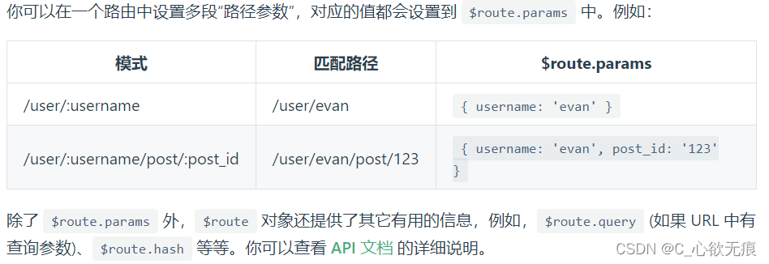

# vueRouter(v3.x)路由传参的三种方式详解

[[toc]]

## 前言

> **vue** 路由传参的使用场景一般都是应用在父路由跳转到子路由时，携带参数跳转。
> 
> 传参方式可划分为params传参和query传参，而params传参又可分为在 url 中`显示`参数和`不显示`参数两种方式，这就是vue路由传参的三种方式。


::: tip 注意
这三种传参方式只是针对[vue Router V3](https://v3.router.vuejs.org/zh/)版本的，V4版本的路由传参会有些不同；

V3版本经常与vue2相配合使用；而V4版本则多和vue3配合使用；
:::


### 一，params传参（显示参数）

这种方式vue router官网也叫 [动态路由匹配](https://v3.router.vuejs.org/zh/guide/essentials/dynamic-matching.html#%E5%93%8D%E5%BA%94%E8%B7%AF%E7%94%B1%E5%8F%82%E6%95%B0%E7%9A%84%E5%8F%98%E5%8C%96)；

1，首先需要在路由表中配置 冒号+参数（`/user/:id`）

```javascript
  	// 这是动态路由 加上：/:id
      {
        path: "/routers/:id",
        name: "Routers",
        meta: { title: "动态路由" },
        component: () => import("../views/routers/routers.vue")
      },
```
2，开始跳转并传参

```javascript
jumpTo() {
      this.$router.push({ path: "/routers/123" });
    }
```
3，获取动态路由参数

```javascript
created(){
	console.log('获取', this.$route.params); //{id: '123'}
}
```

当然，你也可以传多个参数，只不过需要在路由表中配置多个，如下：




::: warning  响应路由参数的变化
当使用路由参数时，例如从 /user/foo 导航到 /user/bar，原来的组件实例会被复用。因为两个路由都渲染同个组件，比起销毁再创建，复用则显得更加高效。不过，这也意味着组件的生命周期钩子不会再被调用。

复用组件时，想对路由参数的变化作出响应的话，你可以简单地 watch (监测变化) $route 对象：

:::


```javascript
const User = {
  template: '...',
  watch: {
    $route(to, from) {
      // 对路由变化作出响应...
    }
  }
}
```

或者使用 2.2 中引入的 beforeRouteUpdate 导航守卫：

```javascript
const User = {
  template: '...',
  beforeRouteUpdate(to, from, next) {
    // react to route changes...
    // don't forget to call next()
  }
}
```

### 二，params传参（不显示参数）

1，使用不显示参数的方式，则不需要在进行配置路由表：

```javascript
  	{
        path: "routers",
        name: "Routers",
        component: () => import("../views/routers/routers.vue")
      },
```

2，开始跳转并传参

注意：需要指定路由表中的 name与之相对应；

```javascript
jumpTo() {
      this.$router.push({ name: "Routers", params:{ id:123 } });
    }
```

3，获取参数

```javascript
this.$route.params.id
```

 **`注意`**：上述这种利用 params 不显示 url 传参的方式会导致在刷新页面的时候，传递的值会丢失；需要谨慎使用。

### 三，query传参（显示参数）

这种传参方式会把你的参数以问号拼接到路由上面；刷新页面且路由不会丢失。

1，这种也不需要进行配置路由表：

```javascript
  	{
        path: "routers",
        name: "Routers",
        component: () => import("../views/routers/routers.vue")
      },
```

2，开始跳转并传参

注意：需要与路由表中的 path属性 与之相对应；
```javascript
this.$router.push({ path:'/routers',  query:{	id:123 } })
```
3，获取参数

```javascript
this.$route.query.id
```