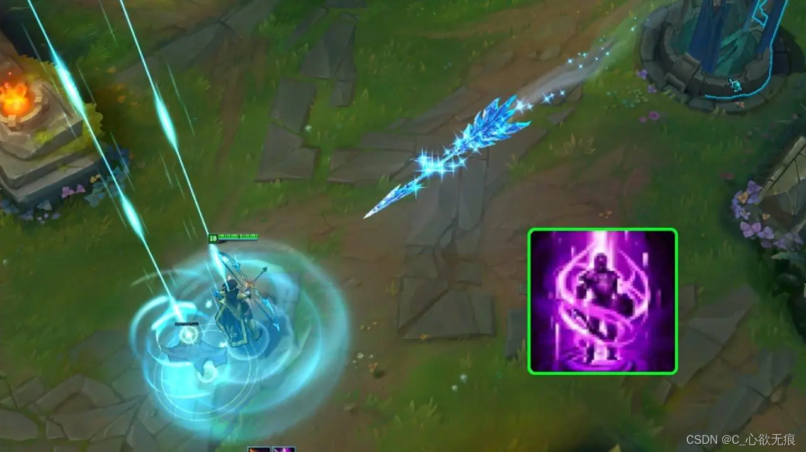

# 内置组件 Teleport 的使用

{width="80%"}

[[toc]]

::: tip 注意

`<Teleport>` 是一个内置组件，它可以将一个组件内部的一部分模板“传送”到该组件的 DOM 结构外层的位置去。

:::

## 1，使用场景：

一个组件模板的一部分在逻辑上从属于该组件，但从整个应用视图的角度来看，它在 DOM 中应该被渲染在整个 Vue 应用外部的其他地方；

也就是说我有一个全屏的弹出框（模态框）或 Toast 轻提示 组件，可能会在多个组件中使用到，但是由于节点嵌套的太深，我想把它的 dom 元素放在最外层的容器上面；通过组件传参控制它的显示于隐藏；

`这样做的好处是`：处理嵌套组件的定位、z-index 和样式就会变得简单；不会造成样式污染；

而且管理起来反而会方便容易很多；

## 2，搭配组件使用

`<Teleport>` 只改变了渲染的 DOM 结构，它不会影响组件间的逻辑关系。也就是说，如果 `<Teleport>` 包含了一个组件，那么该组件始终和这个使用了 `<teleport>` 的组件保持逻辑上的父子关系。传入的 props 和触发的事件也会照常工作。

这也意味着来自父组件的注入也会按预期工作，子组件将在 Vue Devtools 中嵌套在父级组件下面，而不是放在实际内容移动到的地方。

**效果图如下：**

点击按钮弹出模态框，点击 OK 关闭模态框，且渲染的节点位置是在 body（或任意节点）下面的；


**实现如下**

父组件：

```dart
<script setup>
import { reactive, ref, watch, onMounted } from "vue";
// 引入模态框组件
import Modal from "../../components/component/Modal.vue";
let isShow = ref(false);

// 显示模态框
const showModel = () => {
  isShow.value = true;
};
</script>

<template>
 <div class="container">
    <!-- 预留Teleport组件的位置 可以放到这里 to=".container" -->
  </div>
  <div id="container">
    <!-- 预留Teleport组件的位置 可以放到这里 to="#container -->
  </div>

  <div class="teleport">
    <h4>teleport组件演示</h4>
    <button @click="showModel">点击弹出模态框</button>

   <!-------------------------------------Teleport使用 ------------------------------------>
    <Teleport to="body">
      <!-- 使用这个 modal 组件，传入 prop -->
      <modal :show="isShow" @close="isShow = false">
        <template #header>
          <h3>custom header</h3>
        </template>
      </modal>
    </Teleport>

  </div>
</template>

<style scoped></style>

```

子组件 Modal.vue：

```dart
<script setup>
const props = defineProps({
  show: Boolean,
});
</script>

<template>
  <Transition name="modal">
    <div v-if="show" class="modal-mask">
      <div class="modal-container">
        <div class="modal-header">
          <slot name="header">default header</slot>
        </div>

        <div class="modal-body">
          <slot name="body">default body</slot>
        </div>

        <div class="modal-footer">
          <slot name="footer">
            default footer
            <button class="modal-default-button" @click="$emit('close')">
              OK
            </button>
          </slot>
        </div>
      </div>
    </div>
  </Transition>
</template>

<style>
.modal-mask {
  position: fixed;
  z-index: 9998;
  top: 0;
  left: 0;
  width: 100%;
  height: 100%;
  background-color: rgba(0, 0, 0, 0.5);
  display: flex;
  transition: opacity 0.3s ease;
}

.modal-container {
  width: 300px;
  margin: auto;
  padding: 20px 30px;
  background-color: #fff;
  border-radius: 2px;
  box-shadow: 0 2px 8px rgba(0, 0, 0, 0.33);
  transition: all 0.3s ease;
}

.modal-header h3 {
  margin-top: 0;
  color: #42b983;
}

.modal-body {
  margin: 20px 0;
}

.modal-default-button {
  float: right;
}

/*
 * 对于 transition="modal" 的元素来说
 * 当通过 Vue.js 切换它们的可见性时
 * 以下样式会被自动应用。
 *
 * 你可以简单地通过编辑这些样式
 * 来体验该模态框的过渡效果。
 */

.modal-enter-from {
  opacity: 0;
}

.modal-leave-to {
  opacity: 0;
}

.modal-enter-from .modal-container,
.modal-leave-to .modal-container {
  -webkit-transform: scale(1.1);
  transform: scale(1.1);
}
</style>
```

## 3，to 属性的使用

`<Teleport>` 接收一个 to prop 来指定传送的目标。to 的值可以是一个 CSS 选择器字符串（如：`to=".container"`、`to="#container`），也可以是一个 DOM 元素对象(如：`to="body"`)。

这段代码的作用就是告诉 Vue`把以下模板片段传送到 你所期望的标签下面`。

## 4，禁用 Teleport

在某些场景下可能需要视情况禁用 `<Teleport>`，需要添加`disabled`为 false 即可；

```dart
   <Teleport to="body" disabled="false">
      <!-- 使用这个 modal 组件，传入 prop -->
      <modal :show="isShow" @close="isShow = false">
        <template #header>
          <h3>custom header</h3>
        </template>
      </modal>
    </Teleport>
```

那么此时这个组件就相当于普通的弹窗组件，不再进行移动了；

## 5，多个 Teleport 共享目标

一个可重用的模态框组件可能同时存在多个实例。对于此类场景，多个 `<Teleport>` 组件可以将其内容挂载在同一个目标元素上，`而顺序就是简单的顺次追加`，后挂载的将排在目标元素下更后面的位置上。

比如下面这样的用例：

```js
<Teleport to="#modals">
  <div>A</div>
</Teleport>
<Teleport to="#modals">
  <div>B</div>
</Teleport>
```

渲染的结果为：

```js
html
<div id="modals">
  <div>A</div>
  <div>B</div>
</div>
```
