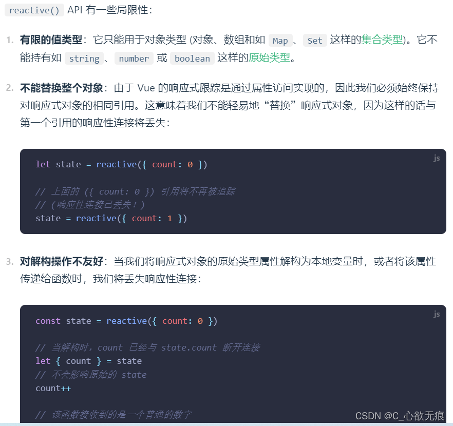

# reactive 定义响应式数据进行列表赋值时，视图没有更新的解决方案

[[toc]]

## 1，问题

在 Vue 3.0 中我们使用 `reactive()` 定义的响应式数据的时候，当是一个数组或对象时，我们直接进行赋值，发现数据已经修改成功，但是页⾯并没有自动渲染成最新的数据；这是为什么呢？

就如同官网所说的 reactive 存在一些`局限性`：（[官方的描述](https://cn.vuejs.org/guide/essentials/reactivity-fundamentals.html#limitations-of-reactive)）

{width="90%"}

## 2，原因

原因就是 reactive 函数会返回一个`Proxy`包装的对象，所以当我们这样直接赋值时：（看下面例子）

```js
import { reactive } from "vue";

let userInfo = reactive([{ name: "Eula" }]);
console.log(userInfo); // Proxy(Array) 打印出来是一个Proxy对象 当然具备响应式

// 直接后端数据进行赋值
userInfo = [{ name: "优菈" }];
console.log(userInfo); // [{name:'优菈'}] 可以看出 就是打印出了一个普通的数组 所以不具备响应式
```

这样赋值的话，就会把 Proxy 对象给覆盖掉，从而无法触发对应的 set 和 get，最终就会导致丢失掉响应性了；

上面的代码 `reactive([{name:'Eula'}]) `创建了一个响应式数组，返回一个 Proxy 包装的对象由`userInfo`变量进行存放，但是后面我又把一个普通的数组（也就是后端返回的数据）赋值给`userInfo`，注意这时`userInfo`这个变量存放的已经是一个普通的数组了，当然也就不具备响应式了；

**所以**：对于`reactive`创建的响应式数据应该避免直接使用`=`号进行赋值；会覆盖响应式;

## 3，解决方案

### 3.1、再封装一层数据，即定义属性名，在后期赋值的时候，对此属性进行直接赋值

再封装一层数据，注意`myRenderList` 这个属性就是新增的属性用来存放列表数据，就是比较麻烦了一些。

```js
<script setup>
import { reactive, ref } from "vue";
// 定义响应式
let list1 = reactive({myRenderList:[]});

// 请求的数据
let newList1 = [
  { name: "Eula", age: "18", isActive: false },
  { name: "Umbra", age: "17", isActive: false },
]

// 更改数据
const setList1 = () => {
  list1.myRenderList = newList1
}
</script>
```

### 3.2、使用数组的`splice`来直接更改原数组

还是用`reactive`来定义响应式数据，只不过改数据的方式变了，使用数组的原生方法`splice()`来更改原数组，不是直接覆盖所以并不会影响响应式；

`splice`有三个参数时，可以对数组进行修改， 第一项是起始索引， 第二项是长度， 第三项是新插入的元素，可以有多个；

下面的代码是把之前数组的每一项删除掉，然后插入新的数据`newList1`，使用`...`扩展符进行展开每一项；

```js
list1.splice(0, list1.length, ...newList1);
```

当然，`push()`方法也是可以触发响应式的，只不过只能在后面新增数据。还有 pop，shift，unshift 等方法（用的不多）

```js
<script setup>
import { reactive, ref } from "vue";
// 定义响应式
let list1 = reactive([]);

// 请求的数据
let newList1 = [
  { name: "Eula", age: "18", isActive: false },
  { name: "Umbra", age: "17", isActive: false },
]

// 更改数据
const setList1 = () => {
  // splice三个参数时 第一项是起始索引  第二项是长度  第三项是新插入的元素,可以有多个
  list1.splice(0,list1.length,...newList1)
}
</script>
```

### 3.3、使用 ref 来定义数据

复杂数据类型也可以使用`ref`进行定义，而且数据都是响应式的；原理就有点像第一种方式，重新包装了一层 value；每次使用的时候都要写`.value`;

::: tip 注意

ref 实际就是对一个普通值做了一层包装，包装成一个对象，并通过其 get 和 set 实现依赖收集和更新,其实现原理类似于 computed;

:::

```js
<script setup>
import { reactive, ref } from "vue";
// 定义响应式
let list1 = ref([]);

// 请求的数据
let newList1 = [
  { name: "Eula", age: "18", isActive: false },
  { name: "Umbra", age: "17", isActive: false },
]

// 更改数据
const setList1 = () => {
  list1.value = newList1;
}
</script>
```
