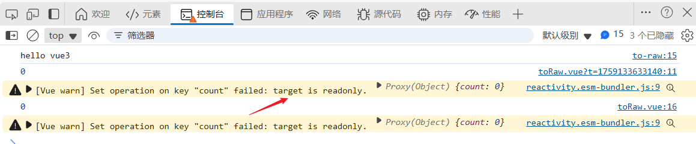

# readonly：只读的响应式对象

[[toc]]

在 **Vue 3** 中，`readonly` 是一个非常有用的响应式工具，它用于将一个对象或数组转换为只读的响应式对象，意味着这个对象的属性不能被修改。`readonly` 的主要用途是在确保对象不被意外修改的场景中，如传递给子组件时，确保它们只读取数据而不改变它。

## 1. `readonly` 的作用

`readonly` 主要作用是创建一个 **只读的响应式对象**。与 `reactive` 不同，`readonly` 会返回一个新对象，该对象的所有属性都无法被修改。如果试图修改这个对象的属性，Vue 会抛出警告（开发模式下）。

## 2. `readonly` 的基本用法

```javascript
import { reactive, readonly } from "vue";

const state = reactive({
  count: 0
});

// 使用 readonly 创建一个只读对象
const readonlyState = readonly(state);

console.log(readonlyState.count); // 0

// 尝试修改只读对象的属性，会触发警告（开发模式下）
readonlyState.count = 10; // 会在控制台看到警告
```

**警告如图所示：**



## 3. `readonly` 的应用场景

#### 1. **防止意外修改**

`readonly` 可以用于防止对某个对象的意外修改。通常，传递给子组件或函数的数据需要保持只读，确保不会被修改。

#### 2. **与 `reactive` 配合使用**

`readonly` 和 `reactive` 可以结合使用。例如，当你有一个响应式对象时，可以通过 `readonly` 只暴露一个只读的对象接口，防止外部修改它。

#### 3. **共享数据的只读视图**

你可以将某些数据通过 `readonly` 提供给多个组件或者模块，而不担心这些组件会修改共享的状态。

#### 4. **代码优化和设计**

在大型应用中，保持数据不可变是一种良好的编程习惯，尤其在需要调试和追踪状态变化时。`readonly` 使得你能够创建明确的只读状态，减少不必要的副作用。

## 4. 示例：与 `reactive` 配合使用

```javascript
import { reactive, readonly } from "vue";

const state = reactive({
  count: 0
});

// 创建只读对象
const readonlyState = readonly(state);

// 传递给子组件时，保证它不修改父组件的 state
const ChildComponent = {
  setup() {
    return {
      readonlyState
    };
  },
  template: `<div>{{ readonlyState.count }}</div>`
};
```

在这个例子中，`readonlyState` 是一个只读对象，确保 `ChildComponent` 只能读取数据，不能修改它。父组件的 `state` 被保护起来，避免了意外修改。

### `readonly` 的使用注意事项

- **开发模式警告**：在开发环境下，`readonly` 会对修改属性的操作进行警告，但在生产环境中不会报错。它只是一种开发时的警告机制，用于提醒开发者不要修改只读对象。

- **只读对象不支持修改**：虽然 `readonly` 返回的是响应式对象，但你不能通过该对象进行修改操作。如果尝试修改，会触发警告。
