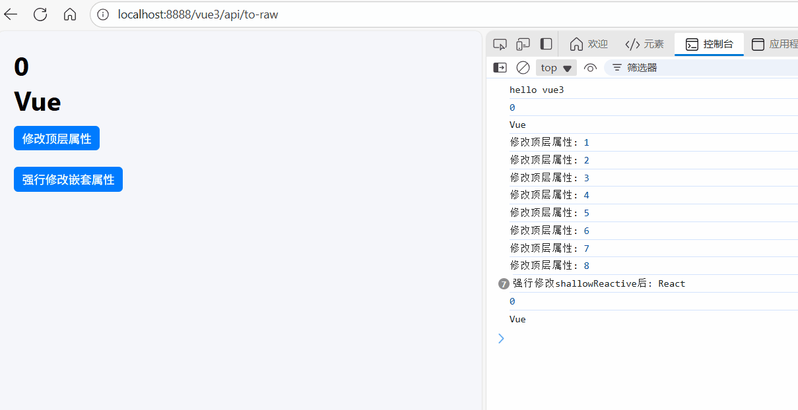

# shallowReactive 函数

[[toc]]

在 **Vue 3** 中，`shallowReactive` 是响应式系统提供的一个函数，它与 `reactive` 类似，但有一个关键区别：它只对对象的 **顶层属性** 进行响应式处理，而不会递归地对嵌套对象或数组进行响应式代理。这与 `shallowRef` 的思想类似，但作用在 **对象本身** 而不是引用上。

## 1. `shallowReactive` 的作用

- 创建一个 **浅层响应式对象**。
- 顶层属性（第一层属性）会被 Vue 的响应式系统代理。
- 嵌套的对象或数组不会被代理为响应式。
- 适合那些只需要顶层响应式、或者嵌套对象不需要深度追踪的场景。

## 2. 基本用法

```vue
<template>
  <div>
    <h1>{{ state.count }}</h1>
    <h1>{{ state.nested.name }}</h1>
    <button @click="updateCount">修改顶层属性</button> <br />
    <button @click="updateShallowReactive">强行修改嵌套属性</button>
  </div>
</template>
<script setup lang="ts">
import { shallowReactive } from "vue";

const state = shallowReactive({
  count: 0,
  nested: { name: "Vue", version: 3 }
});

console.log(state.count); // 0
console.log(state.nested.name); // 'Vue'

// 定义一个方法来修改顶层属性
function updateCount() {
  state.count++; // 修改顶层属性，会触发视图更新
  console.log("修改顶层属性:", state.count); // 输出 累加
}
// 定义一个方法来强行修改 shallowReactive
function updateShallowReactive() {
  // 修改嵌套对象的属性，不会触发视图更新
  state.nested.name = "React";
  console.log("强行修改嵌套属性后:", state.nested.name); // 输出 React
}
</script>
```

- `state.count` 是顶层属性，修改它会触发响应式更新。
- `state.nested` 是嵌套对象，其内部属性 `name` 不会被代理，因此修改它不会触发更新。

**如图所示：**



### **`shallowReactive` 与 `reactive` 的区别**

| 特性       | `reactive`                     | `shallowReactive`              |
| ---------- | ------------------------------ | ------------------------------ |
| 响应式深度 | 深度响应式（递归代理嵌套对象） | 浅层响应式（只代理顶层属性）   |
| 性能开销   | 较大                           | 较小                           |
| 适用场景   | 需要深度追踪对象变化           | 只关心顶层属性变化，或优化性能 |

## 3. 使用场景

1. **性能优化**

   - 当对象嵌套层级较深或对象很大时，使用 `shallowReactive` 可以减少 Vue 对嵌套对象递归代理的开销。

2. **只关心顶层属性**

   - 如果你只关心对象顶层的变化，而不需要追踪嵌套对象的变化，可以使用 `shallowReactive`。

## 4. 总结

- **`shallowReactive`** 创建一个 **浅层响应式对象**，只代理顶层属性。
- 它适合 **性能优化**、只关心顶层属性变化或嵌套对象不需要响应式的场景。
- 与 `reactive` 相比，它减少了不必要的代理和性能开销，但使用时要注意嵌套对象的变化不会被追踪。
