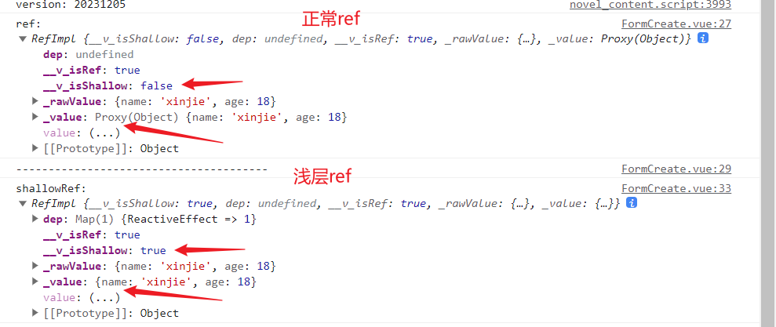

# 浅层响应式shallowRef和shallowReactive使用

---


`在 Vue 3 中，shallowRef 和 shallowReactive `是用于创建浅层响应式数据的工具。

`与 ref 和 reactive 不同`，它们只对顶层属性进行响应式处理，而不递归地处理嵌套的对象或数组。这可以提高性能，特别是在处理大型数据结构时。

## 1、shallowRef

::: tip 简述

ref的浅层作用形式。shallowRef与普通的 ref 的区别在于，shallowRef 不会对对象进行深度的响应式处理。

也就是 shallowRef 包含的对象内部的属性发生变化时，shallowRef 本身不会触发重新渲染或响应式更新，所以使用shallowRef时只关心顶层的引用变化。
:::


创建一个浅层的 `ref`，只对顶层值进行响应式处理。

```js
<script lang="ts" setup>
  import { shallowRef } from 'vue';

  const state = shallowRef({ name: 'xinjie', age: 18 });

  // 修改顶层引用会触发响应式更新
  state.value = { name: 'Eula', age: 20 };

  // 修改内部属性不会触发响应式更新  既视图不会更新
  state.value.age = 30;
</script>

```

从下面图上就可以看出：

浅层响应式里面的属性：`__v_isShallow：true`  
_value也是通过Proxy代理的。

::: info shallowRef

:::


上面的例子说明只有对 `state.value `进行整体赋值操作才会触发响应式更新，对内部属性修改不会触发视图的更新。

**总结：**

这对于一些列表数据需要重新替换或赋值的场景非常有用。减少不必要的视图更新，提高性能。


## 2、shallowReactive

 `reactive` 的浅层作用形式, 和 `shallowRef` 的功能比较类似。
 
 `shallowReactive` 与普通的 `reactive` 的区别在于，shallowReactive 不会对对象进行深度的响应式处理，也就是 shallowReactive 包含的对象内部的属性发生变化时，shallowReactive 本身不会触发重新渲染或响应式更新，所以使用shallowReactive时只关心顶层的引用变化。

```js
<script lang="ts" setup>
const state = shallowReactive({
  foo: 1,
  nested: {
    bar: 2
  }
})

// 更改状态自身的属性是响应式的
state.foo++

// ...但下层嵌套对象不会被转为响应式
isReactive(state.nested) // false

// 不是响应式的
state.nested.bar++
</script>

```
