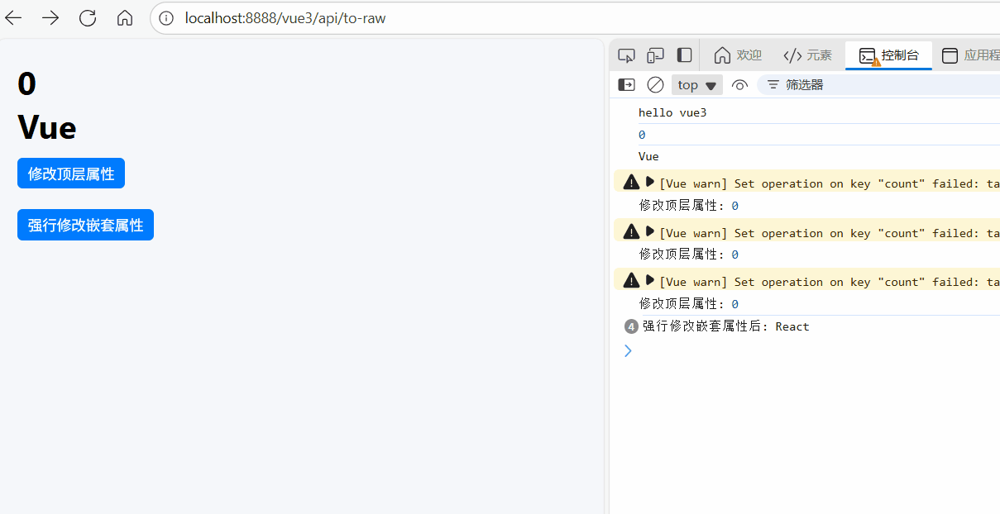

# shallowReadonly：浅层只读响应式对象

[[toc]]

在 **Vue 3** 中，`shallowReadonly` 是一个用于创建 **浅层只读响应式对象** 的 API，它与 `readonly` 类似，但有一个重要区别：**它只会让顶层属性只读，而不会递归地把嵌套对象也变成只读**。

下面我详细讲解 `shallowReadonly` 的作用、用法，以及与 `readonly` 的区别。

## 1. `shallowReadonly` 的作用

- 将对象转换为 **只读响应式对象**。
- **只对顶层属性只读**，嵌套对象仍然可以被修改。
- 适合只需要保护顶层属性不被修改，而嵌套对象无需深度只读的场景。
- 与 `readonly` 相比，它不会对嵌套对象递归处理，从而减少性能开销。

## 2. 基本用法

```vue
<template>
  <div>
    <h1>{{ state.count }}</h1>
    <h1>{{ state.nested.name }}</h1>
    <button @click="updateCount">修改顶层属性</button> <br />
    <button @click="updateShallowReadonly">强行修改嵌套属性</button>
  </div>
</template>
<script setup lang="ts">
import { shallowReadonly } from "vue";

const state = shallowReadonly({
  count: 0,
  nested: { name: "Vue" }
});

console.log(state.count); // 0
console.log(state.nested.name); // 'Vue'

// 定义一个方法来修改顶层属性
function updateCount() {
  state.count++; // 修改顶层属性，会触发警告（开发模式下）
  console.log("修改顶层属性:", state.count); // 警告：避免直接修改只读属性
}
// 定义一个方法来强行修改 shallowReadonly
function updateShallowReadonly() {
  // 修改嵌套对象的属性，不会触发视图更新
  state.nested.name = "React";
  console.log("强行修改嵌套属性后:", state.nested.name); // 输出 React
}
</script>
```

- `state.count` 是顶层属性，Vue 会阻止修改。
- `state.nested.name` 是嵌套属性，Vue 不会阻止修改，也不会触发警告,但视图不会更新。

**如图所示：**



## 3. `shallowReadonly` 与 `readonly` 的区别

| 特性             | `readonly`                         | `shallowReadonly`                          |
| ---------------- | ---------------------------------- | ------------------------------------------ |
| 响应式深度       | 深度只读（递归处理嵌套对象）       | 浅层只读（只处理顶层属性）                 |
| 修改嵌套对象行为 | 嵌套对象不可修改，会触发警告       | 嵌套对象可修改，不触发警告，视图也不会更新 |
| 性能开销         | 较大（递归代理整个对象）           | 较小（只代理顶层属性）                     |
| 适用场景         | 需要完整深度保护对象，防止所有修改 | 只需保护顶层属性，优化性能                 |

## 4. 使用场景

1. **性能优化**

   - 对大对象或深层嵌套对象，使用 `shallowReadonly` 可以避免递归代理，减少性能开销。

2. **只保护顶层属性**

   - 如果你只希望顶层属性保持只读，嵌套对象不必严格保护，使用 `shallowReadonly` 更合适。

## 5. 与 `readonly` 对比示例

```javascript
import { readonly, shallowReadonly } from "vue";

const deepObj1 = readonly({ nested: { value: 0 } });
const deepObj2 = shallowReadonly({ nested: { value: 0 } });

// 修改嵌套属性
deepObj1.nested.value = 1; // 会触发警告（深度只读）
deepObj2.nested.value = 1; // 不会触发警告（浅层只读）

// 修改顶层属性
deepObj1.nested = { value: 2 }; // 会触发警告
deepObj2.nested = { value: 2 }; // 会触发警告
```

- **`readonly`**：无论是顶层属性还是嵌套属性，都不可修改。
- **`shallowReadonly`**：只阻止顶层属性修改，嵌套属性可以修改。
