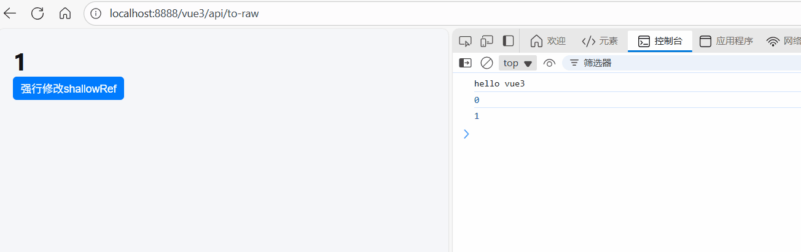

# shallowRef：浅层响应式引用

[[toc]]

在 **Vue 3** 中，`shallowRef` 是一个新的响应式工具，它与 `ref` 有些相似，但有一个重要的区别：`shallowRef` 仅对 **引用类型**（如对象、数组等）进行 **浅层响应式** 处理，而不是对其深层次的属性进行响应式包装。

## 1. `shallowRef` 的作用

`shallowRef` 用于创建一个 **响应式引用**，但是它 **不会** 对引用类型的数据进行深度响应式处理。换句话说，如果你将一个对象或数组传递给 `shallowRef`，它会将这个引用变为响应式，但 **对象或数组的内部属性不会被代理为响应式**，只有引用本身是响应式的。也就是说只有对 `.value `的访问是响应式的。

## 2. `shallowRef` 的基本用法

```vue
<template>
  <div>
    <h1>{{ shallowObj.count }}</h1>
    <button @click="updateShallowRef">强行修改shallowRef</button>
  </div>
</template>
<script setup lang="ts">
import { shallowRef } from "vue";

const obj = { count: 0 };

// 使用 shallowRef 创建一个响应式引用
const shallowObj = shallowRef(obj);

console.log(shallowObj.value.count); // 输出 0

// 修改引用对象本身，会触发更新
shallowObj.value = { count: 1 }; // 这是响应式的

console.log(shallowObj.value.count); // 输出 1

// 定义一个方法来强行修改 shallowRef
function updateShallowRef() {
  shallowObj.value.count = 2; // 这个修改不会触发更新
  console.log("强行修改shallowRef后:", shallowObj.value.count); // 输出 2，但视图不会更新
}
</script>
```

**如图所示：**



可以看到 `updateShallowRef` 方法 强行修改 `shallowRef` ,打印变为 2，但是视图不会更新。

### `shallowRef` 的行为分析

1. **创建响应式引用**：与 `ref` 一样，`shallowRef` 也返回一个响应式引用，它包含一个 `value` 属性，指向实际的数据。

2. **浅层响应式**：`shallowRef` 只会让对象本身成为响应式，**不会递归处理对象内部的属性**。例如，如果你创建一个对象并将它传递给 `shallowRef`，它的顶层属性会变成响应式的，但是对象内部的嵌套属性不会变为响应式。

3. **修改引用触发更新**：如果你直接修改 `shallowRef` 引用的对象（例如替换 `shallowObj.value`），视图会更新，因为引用本身是响应式的。

4. **修改对象的属性不触发更新**：如果你直接修改对象的内部属性（例如 `shallowObj.value.count = 2`），**视图不会更新**，因为 Vue 只会追踪引用的变化，而不是对象内部属性的变化。

## 3. `shallowRef` 的适用场景

#### 1. 性能优化

当你只关心对象本身的变化，而不关心其内部属性时，使用 `shallowRef` 可以减少不必要的响应式代理，从而提升性能。

#### 2. 不需要深度响应式的场景

如果你只关心某个对象的整体变化，而不关心它的每个属性变化，可以使用 `shallowRef`。例如，当你使用 Vue 的响应式对象来管理复杂数据结构时，只需要监听对象的引用变化而不需要关心每个嵌套的属性变化。

## 4. `shallowRef` 的总结

- `shallowRef` 用于创建一个 **浅层响应式引用**，只有对象的引用是响应式的，而其内部属性不会被代理为响应式。
- `shallowRef` 适用于只关心对象整体变化的场景，而不需要对其内部属性进行深度代理。
- 与 `ref` 和 `reactive` 比较，`shallowRef` 是一种 **优化手段**，减少不必要的性能开销。
