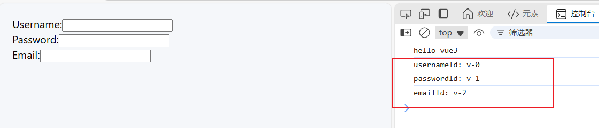

# useId：生成唯一标识符

`useId` 是 Vue 3 中的一个 Composition API，用于生成一个 **唯一的标识符**。它通常在 **组件中使用**，并且每次调用都会返回一个 **唯一的 ID**。这个 ID 是与组件实例相关联的，因此同一个组件实例每次渲染时会保持相同的 ID，而不同的组件实例会获得不同的 ID。

### 1. `useId` 基本用法

#### 案例 1：`useId` 与表单输入元素

在这个案例中，我们使用 `useId` 来生成一个唯一的 `id`，并将它应用到 HTML 元素的 `id` 属性上。

```vue
<template>
  <div>
    <div>
      <label :for="usernameId">Username:</label>
      <input :id="usernameId" type="text" v-model="username" />
    </div>
    <div>
      <label :for="passwordId">Password:</label>
      <input :id="passwordId" type="password" v-model="password" />
    </div>
    <div>
      <label :for="emailId">Email:</label>
      <input :id="emailId" type="email" v-model="email" />
    </div>
  </div>
</template>

<script setup lang="ts">
import { useId, ref } from "vue";
const username = ref("");
const password = ref("");
const email = ref("");

// 使用 useId 生成唯一的 ID
const usernameId = useId();
const passwordId = useId();
const emailId = useId();

console.log("usernameId:", usernameId); // 输出：usernameId: v-0
console.log("passwordId:", passwordId); // 输出：passwordId: v-1
console.log("emailId:", emailId); // 输出：emailId: v-2
</script>
```

**如图所示：**

生成递增的唯一 ID。



**解释**：

- `useId` 分别为 `usernameId`、 `passwordId` 和 `emailId` 生成唯一的 ID。
- 将这些唯一的 ID 绑定到表单输入元素的 `id` 属性和 `<label>` 元素的 `for` 属性上。
- 每次渲染时，`useId` 会确保生成的 ID 是唯一的，不会与其他表单元素的 ID 冲突。

#### 案例 2：使用 `useId` 在组件中生成唯一 `key`

`useId` 也可以用于生成组件的唯一 `key`，特别是在 `v-for` 渲染多个组件或元素时，保证每个元素有唯一的 `key`。

```vue
<template>
  <div>
    <ul>
      <li v-for="item in items" :key="useId()">{{ item.name }}</li>
    </ul>
  </div>
</template>

<script>
import { useId } from "vue";

export default {
  setup() {
    const items = [{ name: "Item 1" }, { name: "Item 2" }, { name: "Item 3" }];
    return { items };
  }
};
</script>
```

**解释**：

- 在 `v-for` 中，`useId` 被用作每个列表项的 `key`。
- 通过每次调用 `useId`，确保每个列表项都有一个 **唯一的标识符**，即使它们在渲染过程中被重复生成。

#### 案例 3：结合 `ref` 使用 `useId`

`useId` 还可以与 `ref` 一起使用，以便为 DOM 元素或组件实例生成唯一的标识符。

```vue
<template>
  <div>
    <input :id="inputId" ref="inputRef" type="text" />
  </div>
</template>

<script>
import { useId, ref } from "vue";

export default {
  setup() {
    const inputId = useId(); // 使用 useId 生成唯一的 ID
    const inputRef = ref(null);

    // 你可以通过 inputRef 直接访问 DOM 元素
    return { inputId, inputRef };
  }
};
</script>
```

**解释**：

- `useId` 为 `inputId` 生成一个唯一的标识符。
- 使用 `ref` 创建 `inputRef` 引用，允许直接访问 DOM 元素。
- 结合 `useId` 和 `ref`，你可以同时为元素提供唯一标识符并进行 DOM 操作。

### **总结**

- **`useId`** 是 Vue 3 中用于生成 **唯一标识符** 的 Composition API，确保组件实例的每个渲染周期都有一个稳定的标识符。
- 广泛应用于 **表单控件、HTML 元素的 `id` 属性、动态组件的 `key` 属性** 等场景。
- 在组件的 `setup` 函数中调用 `useId`，可以轻松生成唯一的标识符，避免手动管理 ID 和冲突问题。
