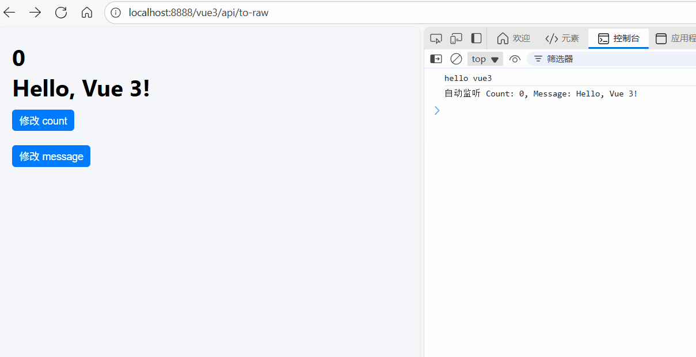

# watchEffect：响应式副作用管理

[[toc]]

`watchEffect` 会在组件初始化时 **自动执行** 回调函数，并且会 **自动追踪** 在回调函数内部访问的响应式数据。当这些数据发生变化时，`watchEffect` 会重新执行回调函数。它与 `watch` 的区别在于，`watch` 需要显式声明依赖，而 `watchEffect` 是 **自动侦测** 依赖的变化。

### 1. 基本用法

```vue
<template>
  <div>
    <h1>{{ count.num }}</h1>
    <h1>{{ message }}</h1>
    <button @click="updateCount">修改 count</button> <br />
    <button @click="updateMessage">修改 message</button>
  </div>
</template>
<script setup lang="ts">
import { ref, watchEffect } from "vue";

const count = ref({ num: 0 });
const message = ref("Hello, Vue 3!");

watchEffect(() => {
  console.log(`自动监听 Count: ${count.value.num}, Message: ${message.value}`);
});

function updateCount() {
  count.value.num++;
}
function updateMessage() {
  message.value = "Updated!";
}
</script>
```

**如图所示：**

当点击 `修改 count` 按钮时，`watchEffect` 会自动监听 `count.value.num` 的变化，并重新执行回调函数。而点击 `修改 message` 按钮时，`watchEffect` 会自动监听 `message.value` 的变化，并重新执行回调函数。



### 2. `watchEffect` 的特点和工作原理

**特点：**

- **自动依赖追踪**：`watchEffect` 会自动追踪回调函数中访问的响应式数据，无需手动声明依赖。
- **立即执行**：`watchEffect` 会在第一次定义时立即执行一次回调函数。
- **多次执行**：每当被追踪的数据发生变化时，`watchEffect` 会重新执行回调函数。

**工作原理**

当你调用 `watchEffect` 时，它会在内部创建一个副作用（effect），并且 **自动收集** 你在回调函数中使用的所有响应式数据（比如 `ref`、`reactive` 中的属性）。然后，任何一个被追踪的数据发生变化时，`watchEffect` 会重新执行回调。

### 3. 与 `watch` 的区别

`watch` 和 `watchEffect` 都可以用来监听响应式数据的变化，但它们的使用方式有所不同：

- **`watchEffect`**：

  - 自动追踪依赖，不需要显式声明要观察的数据。
  - 一开始就执行一次，并且每次依赖的变化都会触发回调。
  - 适用于简单的响应式数据变化场景。

- **`watch`**：

  - 需要显式声明要观察的数据。
  - 只有当被观察的数据发生变化时，才会执行回调。
  - 适用于需要精准控制、或者依赖变化较为复杂的场景。

### 4. `watchEffect` 的停止机制

`watchEffect` 会在组件销毁时自动停止追踪，但也可以手动停止：

```javascript
import { ref, watchEffect } from "vue";

const count = ref(0);

const stop = watchEffect(() => {
  console.log(count.value);
});

// 手动停止
stop();
```

调用 `stop()` 会停止 `watchEffect` 的执行，不再响应数据变化。

### 5. 使用场景

`watchEffect` 适用于以下场景：

1. **自动追踪依赖**：你不需要显式地声明依赖，只要回调函数中访问了响应式数据，它会自动追踪这些依赖。
2. **简单的副作用**：例如打印调试信息，更新 DOM 等。
3. **计算数据的副作用**：在计算数据时，自动更新其他依赖它的数据。
4. **无需细粒度控制**：适用于不需要复杂依赖控制的场景。
