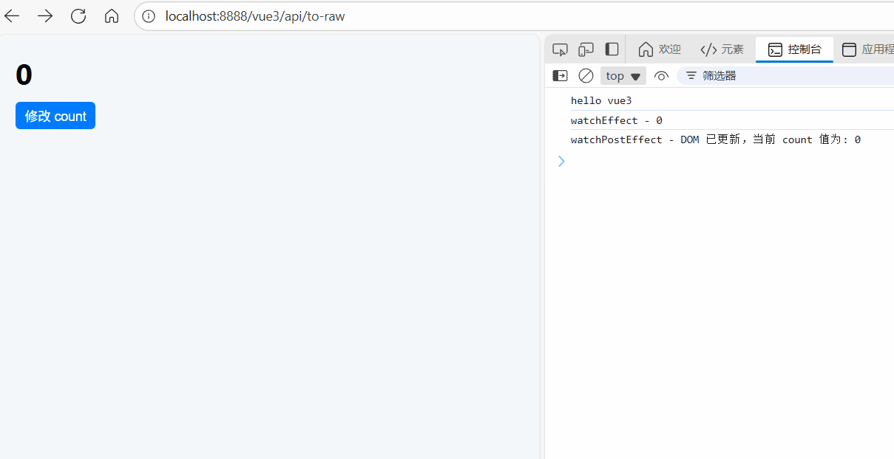

# watchPostEffect：DOM 更新后的副作用处理

[[toc]]

`watchPostEffect` 用于在 **DOM 更新完成后** 执行回调。这是 Vue 响应式系统中一个相对较新的 API，允许你执行那些需要在 Vue 完成更新后进行的任务，例如 DOM 操作、第三方库更新等。它的行为与 `watchEffect` 类似，但执行时机更加延迟，确保所有 DOM 更新都已完成。

## 1. `watchPostEffect` 的基本用法

```vue
<template>
  <div>
    <h1>{{ count }}</h1>
    <button @click="updateCount">修改 count</button> <br />
  </div>
</template>
<script setup lang="ts">
import { ref, watchPostEffect, watchEffect } from "vue";

const count = ref(0);

// 执行比watchPostEffect要早，因为它是在 DOM 更新之前执行的
watchEffect(() => {
  console.log(`watchEffect - ${count.value}`);
});

// 执行比watchEffect要晚，因为它是在 DOM 更新之后执行的
watchPostEffect(() => {
  console.log(`watchPostEffect - DOM 已更新，当前 count 值为: ${count.value}`);
});
function updateCount() {
  count.value++; // 数据变化，视图更新后，watchPostEffect 执行
}
</script>
```

在这个例子中：

- `watchPostEffect` 会在 `count` 改变之后，视图更新完成后执行回调，打印出最新的 `count` 值。执行时机始终是比 `watchEffect` 要晚的。

**如图所示：**



## 2. `watchPostEffect` 与 `watchEffect` 的对比

| 特性         | `watchEffect`                            | `watchPostEffect`                                          |
| ------------ | ---------------------------------------- | ---------------------------------------------------------- |
| **执行时机** | 在响应式数据变化后，**立即执行**回调函数 | 在响应式数据变化后，**DOM 更新完成后执行**回调             |
| **适用场景** | 当你希望在数据变化后立刻执行副作用       | 当你希望在 DOM 更新后执行副作用，如操作 DOM 或调用第三方库 |
| **常见用途** | 计算值、触发数据相关的副作用             | DOM 操作、与非 Vue 的库交互、做布局等操作                  |

## 3. 使用场景

`watchPostEffect` 主要用于那些需要在 **DOM 更新之后** 执行的副作用操作。这包括但不限于：

- **DOM 操作**：例如，调整元素的位置、大小、或者在更新后执行的动画。
- **第三方库**：如果你在 Vue 中使用了第三方库（例如图表库、地图插件等），而这些库需要等到 Vue 完成 DOM 更新后再进行渲染或者更新。
- **性能优化**：确保某些操作仅在 DOM 更新后才执行，避免不必要的更新操作。
