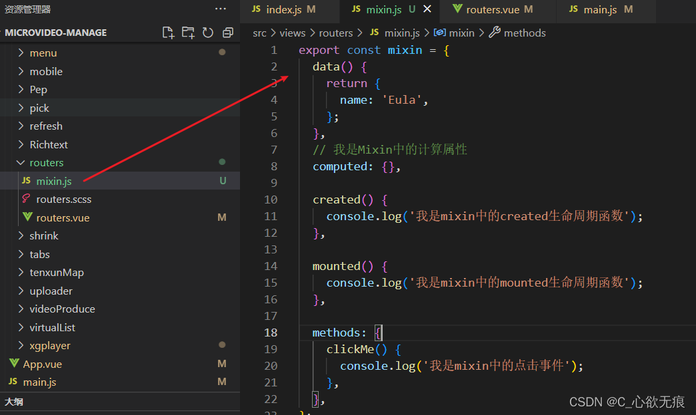
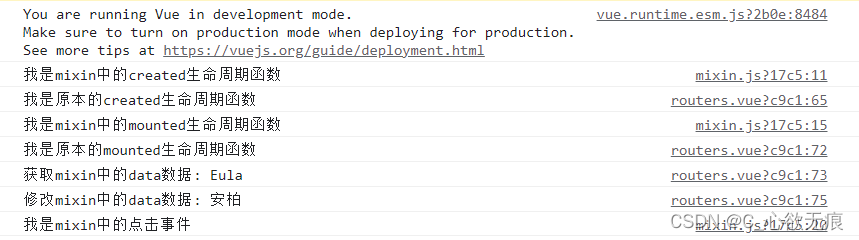

# mixin 混入的使用(已经不推荐使用)

## 1，概念

[官方解释：](https://v2.cn.vuejs.org/v2/guide/mixins.html)

>` 混入 (mixin) `提供了一种非常灵活的方式，来分发 `Vue` 组件中的可复用功能。一个混入对象可以包含任意组件选项。当组件使用混入对象时，所有混入对象的选项将被“混合”进入该组件本身的选项。

**其实就是：** 

`vue` 提供的一种混合机制，能够更好的实现组件功能复用，混合对象（`mixins`）可以包含任意组件选项`（data、created、mounted、methods、filters `等），组件引入后相关选项会进行合并，相当于引入后，父组件各属性进行扩充；

## 2，使用场景

第一种：可复用的一些方法和属性可以放到 `mixin` 里面；  
第二种：一些特殊的模块处理或逻辑处理可以放到 `mixin` 里面；使 `vue` 文件上下文逻辑清晰；  
第三种：还可以做代码分割，如果一个 `vue` 文件的行数太多，可以把一些复杂的操作方法单独放到 `mixin` 里面然后引入即可；

**注意：**  
1，当组件和混入对象含有同名选项时，这些选项将以恰当的方式进行合并；   
2，数据对象在内部会进行递归合并，并在发生冲突时以组件数据优先；

## 3，开始使用

**1，先定义一个 mixin 文件**

先新建一个 mixin.js ; 文件名可以随意定义；

上面代码如下：

```javascript
export const mixin = {
  data() {
    return {
      name: "Eula"
    };
  },
  // 我是Mixin中的计算属性
  computed: {},

  created() {
    console.log("我是mixin中的created生命周期函数");
  },

  mounted() {
    console.log("我是mixin中的mounted生命周期函数");
  },

  methods: {
    clickMe() {
      console.log("我是mixin中的点击事件");
    }
  }
};
```

**2，组件中引入**

引入之后直接 `mixins:[mixin],`即可使用上面定义的属性和方法，最终会被合并在一起；注意引入里面不要加引号；

注意这里使用的是局部引入方式，后面会介绍全局引入方式；

```javascript
// 局部混入
import { mixin } from "@/views/routers/mixin";

export default {
  mixins: [mixin],
  data() {
    return {};
  },
  created() {
    console.log("我是原本的created生命周期函数");
  },
  mounted() {
    console.log("我是原本的mounted生命周期函数");
    console.log("获取mixin中的data数据:", this.name);
    this.name = "安柏";
    console.log("修改mixin中的data数据:", this.name);
    // 调用mixin中的方法
    this.clickMe();
  }
};
```

打印结果如下：



**`可以看出`：**

1、`mixin` 里面的声明周期都会执行而且还是先执行的  
2、组件可以获取和更改 `mixin` 定义的响应式数据  
3、组件可以调用 `mixin` 定义的方法  
4、`mixins` 与 vue 文件合并时，会将 `created` 等钩子函数合并成数组，`mixins `的钩子优先调用，当` data、methods` 对象健值冲突时，以组件优先  
5、值为对象的选项，`(methods、components 和 directives)`将被合并为同一个对象。两个对象键名冲突时，取组件对象的键值对  

**3，mixin 的数据在其他不同的组件中不会共享**

对于一个混合对象而言，如果 `mixin` 同时在组件 A和组件 B 中同时使用；如果组件 A对 mixin 中的数据进行改变了，是不会影响组件 B 中的数据的；

## 4，局部混入和全局混入

局部混入就是上面使用的在组件中混入方式：`mixins:[mixin]`；一般局部混入使用的多；因为全一旦使用全局混入，它将影响每一个之后创建的 Vue 实例(包括第三方组件)；请谨慎使用全局混入方式；大多数情况下，只应当应用于自定义选项，就像上面示例一样。推荐将其作为插件使用，以避免重复应用混入。

**全局混入**

定义：

```javascript
let myMixin = {
  data() {
    return {
      name2: "Umbra",
      age: "20"
    };
  }
};
```

在 main.js 里面使用： `Vue.mixin（）`

```javascript
import { myMixin } from "@/views/routers/myMixin";
Vue.mixin(myMixin);
```

## 5，总结

我们可以将 `mixin` 当做组件模块化，灵活运用组件模块化，可以将组件内的重复代码提取出来，做到代码分割，实现代码复用，也使我们的代码更加清晰，效率也大大提高。
