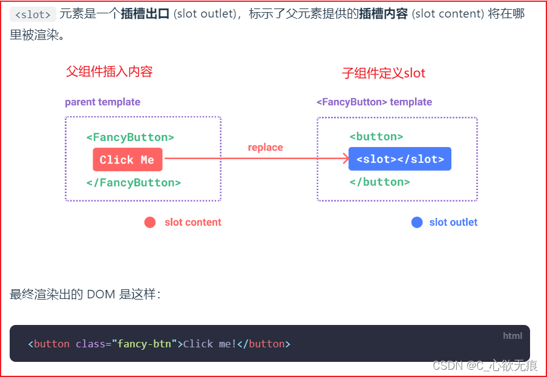
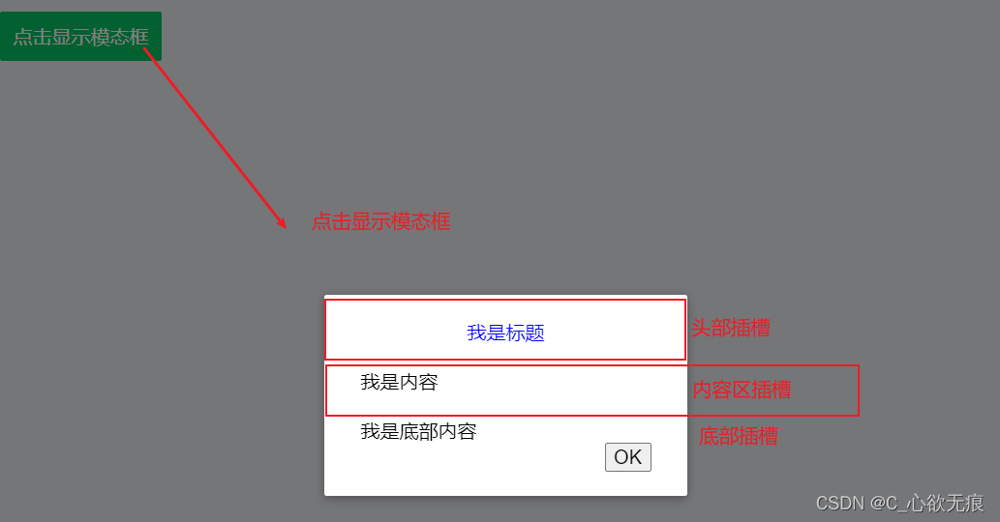

# vue3 中插槽 Slots 的使用

[[toc]]

::: tip 
提示虽然标题上是 `vue3` 的插槽使用，其实 `vue2` 也是一样的用法。没什么区别，只是案例上使用的是 `vue3` 的写法，会有些不同； 
:::

### 1，插槽使用的场景

我们知道子组件能够接收父组件任意类型的 js 变量作为 `props`进行使用，那如果父组件想要传递给子组件 html 标签、模板片段、甚至是一个组件呢，那么子组件应该怎么接收呢？

所以插槽的出现就可以解决上面的问题；`插槽slots`可以细化分为：默认内容、具名插槽、作用域插槽；

**下面是官网的图解**：



其实就是把内容插入到子组件指定的预留位置，这个位置就是`<slot>`

### 2，默认内容插槽

在父元素没有提供任何内容的情况下，可以为插槽指定默认内容。比如有这样一个 `SlotButton`组件；

子组件 SlotButton.vue：

```js
<script setup>
import { reactive, ref, createApp } from "vue";
</script>

<template>
  <button class="btn primary">
    <!-- 插槽出口 -->
    <slot>默认内容</slot>
  </button>  <br>
</template>
```

父组件中使用插槽：

```js
<!-- 只传文本 -->
 <SlotButton> 我是插槽按钮 </SlotButton><br />
```

最终渲染的按钮如下：


如果父组件什么也不传，那么默认使用子组件插槽里面的`默认内容`：

```js
 <SlotButton> </SlotButton><br />
```

如下：


也就是说父组件传入的内容会被 插入到子组件 `<slot><slot>`的位置进行渲染，`css样式`尽量写在父组件中，子组件只做内容的展示即可；

那么我们现在只插入了 text 文本内容，那么 html 标签以及组件也同样可以插入到插槽里面。下面的案例会讲到的；

### 3，具名插槽

有时在一个组件中会同时包含多个插槽，比如 `header头部，body内容区，footer底部区`，那样我们可以使用具名插槽来区分这些各个位置的插槽，也就是说给每个插槽都起一个名字用来规范。

见下面的案例：

 点击按钮显示模态框，模态框里面的内容又分为头部插槽，内容区插槽，和底部插槽；

父组件代码：

```js
<script setup>
import { reactive, ref, createApp } from "vue";
import SlotButton from "@/components/component/SlotButton.vue";
import Modal from "@/components/component/Modal.vue";//引入组件
let isShowModal = ref(false);//控制是否显示模态框
const showModal = () => {
  isShowModal.value = true;
};
const closeModal = () => {
  isShowModal.value = false;//点击OK关闭模态框
};
</script>
<template>
  <div class="slot">
  	主要内容：
    <Modal @close="closeModal" :show="isShowModal">
      <template #header><p class="title">我是标题</p> </template>
      <template v-slot:body><p class="body">我是内容</p></template>
      <template v-slot:footer><p class="footer">我是底部内容</p></template>
    </Modal>
  </div>
</template>
<style scoped lang="less">
.title {
  text-align: center;
  color: blue;
}
</style>
```

可以看出具名插槽在定义插槽入口的时候，我们需要使用一个含 `v-slot` 指令的 `<template>` 元素，并将目标插槽的名字传给该指令：

`v-slot` 有对应的简写 `#`，因此 `<template v-slot:header>` 可以简写为 `<template #header>`。其意思就是“将这部分模板片段传入子组件的 header 插槽中”。

接下来看子组件怎么写的：

`子组件Modal.vue`: 这里只展示了插槽出口部分，css 样式太多了不再展示

```js
<template>
  <Transition name="modal">
    <div v-if="show" class="modal-mask">
      <div class="modal-container">
        <!-- 头部插槽的位置 -->
        <div class="modal-header">
          <slot name="header">default header</slot>
        </div>
        <!-- 内容区插槽的位置 -->
        <div class="modal-body">
          <slot name="body">default body</slot>
        </div>
        <!-- 底部插槽的位置 -->
        <div class="modal-footer">
          <slot name="footer"> </slot>
        </div>
        <!-- 关闭按钮 -->
        <button class="modal-default-button" @click="onClick">OK</button>
      </div>
    </div>
  </Transition>
</template>
```

这种带 `name`属性 的插槽被称为 **具名插槽出口** ，没有提供 `name` 的 `<slot>` 出口会隐式地命名为“default”。与父组件传入的 #header 等一一对应，各自渲染负责的部分；

至此，具名插槽介绍完毕，可以看出插槽里面不仅可以传文本，也可以传标签和组件；

### 4，动态插槽名

[动态指令参数](https://cn.vuejs.org/guide/essentials/template-syntax.html#dynamic-arguments)在 `v-slot` 上也是有效的，即可以定义下面这样的动态插槽名：

```js
<base-layout>
  <template v-slot:[dynamicSlotName]>
    ...
  </template>

  <!-- 缩写为 -->
  <template #[dynamicSlotName]>
    ...
  </template>
</base-layout>
```

### 5，作用域插槽

我们知道，插槽的内容无法访问到子组件的状态，也就是说父组件无法拿到子组件插槽出口里面的值；

然而在某些场景下插槽的内容可能想要同时使用父组件域内和子组件域内的数据。要做到这一点，我们需要一种方法来让子组件在渲染时将一部分数据提供给插槽（父组件）。

子组件：SlotButton.vue

```js
<template>
  <button class="btn primary">
    <!-- 插槽出口 -->
    <slot text="子组件内容" count="1">默认内容</slot>
  </button>  <br>
</template>
```

可以看出我们在 slot 上面定义了两个自定义属性，就是想把这些值传给父组件的插槽入口；

父组件:

```js
  <!--5, 作用域插槽 -->
    <div>
      <SlotButton v-slot="slotProps">  {{ slotProps.text }} - {{ slotProps.count }} </SlotButton>
    </div>
```

父组件中可以拿到一个对象，命名随意（我这里是 slotProps），这样就能拿到插槽里面的值了；渲染如下： 

当然这里的对象也是可以是使用解构语法的：

```js
	<!--5,作用域插槽 使用对象的解构 -->
    <div>
      <SlotButton v-slot="{text,count}">  {{ text }} - {{ count }} </SlotButton>
    </div>
```

### 6，具名作用域插槽

具名作用域插槽的工作方式也是类似的，插槽 props 可以作为 `v-slot` 指令的值被访问到：`v-slot:name="slotProps"`。当使用缩写时 是 `<template #name="headerProps"></template>`

父组件：

```js
	<div>
      <SlotButton>
        <template #btn="btnProps">
          {{btnProps.text}} - {{btnProps.count}}
        </template>
      </SlotButton>
    </div>
```

既然是具名插槽，那必须要有`name`属性，所以写成 `<template #btn="btnProps"> btn`就是插槽出口的 name 名，如下：

子组件 SlotButton.vue：

```js
 <button class="primary">
    <!-- 插槽出口 -->
    <slot name="btn" text="子组件内容" count="1">默认内容</slot>
  </button>  <br>
```
