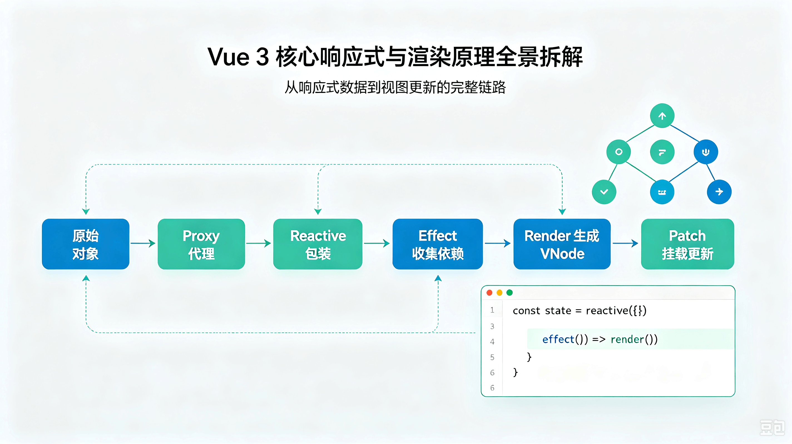

# Vue 3 核心响应式与渲染原理全景拆解

[[toc]]


> 如果说 Vue 2 的响应式是一套设计精巧的“面向对象类系统（Watcher / Dep）”，那么 Vue 3 则彻底演变为一套基于 ES6+ 现代特性的 **“高并发、轻量化、函数式系统（Proxy / Effect）”**。




## 1. 响应式基石：`Proxy` 与 `Reflect`

Vue 3 抛弃了 `Object.defineProperty`，转而使用 ES6 的 **`Proxy`（代理）** 配合 **`Reflect`（反射）** 实现数据的响应式劫持。

### 为什么 `Proxy` 优于 `Object.defineProperty`？

| 维度 | Vue 2 (`Object.defineProperty`) | Vue 3 (`Proxy`) |
| --- | --- | --- |
| **劫持对象** | 属性级别（需要递归遍历每一个 key） | **对象级别**（直接代理整个对象） |
| **新增/删除属性** | 无法侦测，需借助 `this.$set` / `$delete` | **天然支持**（`set` / `deleteProperty` 拦截） |
| **数组支持** | 依赖拦截重写 7 个变异方法，无法感知下标修改 | **天然支持**（正常拦截数组索引修改与 `length` 变化） |
| **初始化性能** | 递归初始化所有属性，层级越深越慢 | **按需惰性代理**（只有读取到深层对象时才递归创建 `reactive`） |

### 关键代码逻辑（简化版）

```javascript
function reactive(target) {
  if (typeof target !== 'object' || target === null) return target;

  return new Proxy(target, {
    get(target, key, receiver) {
      // 1. 依赖收集 (track)
      track(target, key);

      const res = Reflect.get(target, key, receiver);
      // 2. 惰性响应式：取值时发现是对象，才进行深层代理
      return typeof res === 'object' && res !== null ? reactive(res) : res;
    },
    set(target, key, value, receiver) {
      const oldValue = target[key];
      const result = Reflect.set(target, key, value, receiver);

      // 3. 值发生变化时派发更新 (trigger)
      if (hasChanged(value, oldValue)) {
        trigger(target, key);
      }
      return result;
    }
  });
}

```


## 2. 依赖收集核心：`Effect` 与全景 `targetMap` 映射表

Vue 3 废弃了 Vue 2 的 `Dep` 类，引入了全局统一的 **双重 WeakMap / Map / Set 依赖数据结构**（`targetMap`）和底层执行单元 **`Effect`（作用/副作用）**。

### 依赖关系映射结构（`targetMap`）

在内存中，响应式依赖通过如下关系精确绑定：

```text
targetMap (WeakMap)
 └── target 对象 (Key)
      └── depsMap (Map)
           └── key 属性 (Key)
                └── dep (Set: 存放所有依赖该属性的 ReactiveEffect)

```

```javascript
// 全局依赖树
const targetMap = new WeakMap();
let activeEffect = null; // 当前正在运行的 Effect

// 1. 依赖收集：track
function track(target, key) {
  if (!activeEffect) return;

  let depsMap = targetMap.get(target);
  if (!depsMap) {
    targetMap.set(target, (depsMap = new Map()));
  }

  let dep = depsMap.get(key);
  if (!dep) {
    depsMap.set(key, (dep = new Set()));
  }

  // 将当前副作用添加进 Set 集合（自动去重）
  dep.add(activeEffect);
}

// 2. 派发更新：trigger
function trigger(target, key) {
  const depsMap = targetMap.get(target);
  if (!depsMap) return;

  const dep = depsMap.get(key);
  if (dep) {
    // 拷贝一份防止无限循环，依次执行副作用
    const effectsToRun = new Set(dep);
    effectsToRun.forEach(effect => {
      if (effect.scheduler) {
        effect.scheduler(); // 如果有调度器（如组件渲染队列、computed 脏标记），优先走调度器
      } else {
        effect.run(); // 否则直接运行
      }
    });
  }
}

```


## 3. `ref` 与 `reactive` 原理拆解

Vue 3 提供了两种主要的响应式声明 API：`reactive` 和 `ref`。

### `reactive`

* **作用对象：** 仅接收 **复杂数据类型（Object / Array / Map / Set）**。
* **实现原理：** 底层基于 ES6 `Proxy` 对对象进行全方位包装。

### `ref`

* **作用对象：** 既可以接收 **原始值（String / Number / Boolean）**，也可以接收对象。
* **实现原理：**
* 由于 ES6 `Proxy` 无法直接代理原始值，Vue 3 包装了一个 **`RefImpl` 类**；
* 利用 **`getter` / `setter`（属性访问器）** 拦截 `.value` 的读写动作；
* 如果 `ref` 传入的是对象，底层会自动调用 `reactive` 转为 `Proxy`。


```javascript
class RefImpl {
  constructor(value) {
    this._rawValue = value;
    // 如果是对象则调用 reactive 代理，否则返回原值
    this._value = isObject(value) ? reactive(value) : value;
    this.__v_isRef = true; // 属性标记，用于自动解包
  }

  get value() {
    trackRefValue(this); // 手动触发 ref 的依赖收集
    return this._value;
  }

  set value(newVal) {
    if (hasChanged(newVal, this._rawValue)) {
      this._rawValue = newVal;
      this._value = isObject(newVal) ? reactive(newVal) : newVal;
      triggerRefValue(this); // 触发更新
    }
  }
}

```


## 4. 渲染与 Diff 优化：编译时与运行时的高效协同

Vue 3 不仅重构了响应式，还大幅优化了编译（Compiler）与运行时（Runtime）的配合，实现了极其高效的 DOM Diff。

### ① Block Tree 与动态节点标记（`PatchFlag`）

Vue 2 在数据更新时，需要逐层对整棵虚拟 DOM 树（VNode）进行递归对比。
Vue 3 引入了 **静态提升（Static Hoisting）** 和 **动态节点标记（PatchFlag）**：

* **动态节点（Dynamic Nodes）：** 编译阶段分析出哪些节点带数据绑定（如 `:class="cls"` 或  `\{\{ text \}\}`），并赋予对应的位掩码 `PatchFlag`（如 `1` 代表仅动态文本，`2` 代表仅动态 class）。
* **Block 容器：** 根节点将所有动态子节点收集到一个一维数组 `dynamicChildren` 中。
* **更新阶段：** Diff 过程**跳过所有静态节点**，直接遍历 `dynamicChildren` 数组，并且**只对比 `PatchFlag` 指定的属性**（如只比对 class，不比对属性与文本）。

### ② 最长递增子序列算法（Fast Diff）

在列表 Diff 阶段（如 `v-for` 顺序大洗牌），Vue 2 使用双端对比算法（Four-pointer Diff），而 Vue 3 采用了效率更高的 **Fast Diff 算法**：

1. **预处理同步头尾：** 先分别从头、从尾比对相同节点，直接复用并挂载。
2. **构建映射表：** 对中间剩余的乱序子节点建立新旧索引映射。
3. **最长递增子序列（LIS）：** 求解旧节点在新列表中位置的**最长递增子序列**。子序列中的节点意味着“相对顺序未变”，在 DOM 更新时**完全不需要移动**，从而将 DOM 移动操作降至最低。


## 5. 组件级渲染机制与异步更新队列

在 Vue 3 中，每个组件实例在挂载（`mount`）时，都会创建一个**专门负责渲染的 ReactiveEffect**：

```javascript
// 组件渲染逻辑简化
const setupRenderEffect = (instance, container) => {
  const componentUpdateFn = () => {
    if (!instance.isMounted) {
      // 1. 首次渲染：执行 render 生成 VNode -> 挂载 DOM
      const subTree = (instance.subTree = instance.render.call(instance.proxy));
      patch(null, subTree, container);
      instance.isMounted = true;
    } else {
      // 2. 重新渲染：生成新 VNode -> 比对 Diff -> 更新 DOM
      const nextTree = instance.render.call(instance.proxy);
      const prevTree = instance.subTree;
      instance.subTree = nextTree;
      patch(prevTree, nextTree, container);
    }
  };

  // 创建渲染 Effect，并传入 scheduler 实现批量异步更新
  const effect = (instance.effect = new ReactiveEffect(
    componentUpdateFn,
    () => queueJob(update) // 数据变化时不立即计算，而是入队微任务
  ));

  const update = (instance.update = () => effect.run());
  update();
};

```

### 异步队列（`queueJob`）与 `nextTick`

* 当修改多个 `ref` 或 `reactive` 属性时，`trigger` 会触发 `effect.scheduler()`，将更新任务推进全局的 `queue` 调度队列。
* 队列通过 `Promise.resolve().then(flushJobs)` 在微任务中统一去重并执行（按组件创建顺序自顶向下刷新），保证组件在同一 Tick 内只会重新 Render 一次。


## 6. Vue 2 vs Vue 3 全景架构对比总结

| 架构模块 | Vue 2 底层方案 | Vue 3 底层方案 |
| --- | --- | --- |
| **响应式核心** | `Object.defineProperty` (Getter/Setter) | ES6 `Proxy` + `Reflect` |
| **依赖管理结构** | 闭包内的 `Dep` 实例 + `Watcher` 依赖数组 | 全局 `targetMap` (WeakMap) + `ReactiveEffect` (Set) |
| **计算属性原理** | `Watcher` (`lazy: true`) + `dirty` 标记 | `ComputedRefImpl` + `ReactiveEffect` 链式调度 |
| **侦听器原理** | `User Watcher` + 递归 `traverse()` 依赖收集 | `watch` / `watchEffect` + `onCleanup` 副作用清理 |
| **渲染比对 (Diff)** | 树形全量对比（双端 Diff 算法） | Block Tree + `PatchFlag` 靶向比对 + **最长递增子序列** |
| **内存开销** | 较重（大量的组件级 / 属性级 Watcher 实例化） | 极轻（无类实例化开销，结构扁平） |
