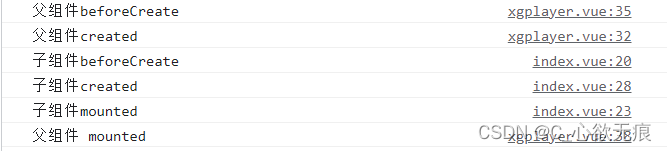

# vue 的生命周期和执行顺序

[[toc]]

## 1，Vue 生命周期都有哪些？

| 序号 | 生命周期 | 描述 |
| --- | --- | --- |
| 1 | `beforecreate`创建前 | vue 实例初始化阶段，不可以访问 data,methods； 此时打印出的 this 是 undefined； |
| 2 | `created`创建后 | vue 实例初始化完成，可以访问 data，methods，但是节点尚未挂载，不能获取 dom 节点； |
| 3 | `beforeMount`挂载前 | 实际上与 created 阶段类似，同样的节点尚未挂载，此时模板已经编译完成，但还没有被渲染至页面中（即为虚拟 dom 加载为真实 dom）注意的是这是在视图渲染前最后一次可以更改数据的机会，不会触发其他的钩子函数； |
| 4 | `mounted`挂载完成 | 这个阶段说说明模板已经被渲染成真实 DOM，实例已经被完全创建好了； |
| 5 | `beforeUpdate`更新前 | data 里面的数据改动会触发 vue 的响应式数据更新，也就是对比真实 dom 进行渲染的过程； |
| 6 | `updated`更新完成 | data 中的数据更新完成，dom 节点替换完成 ； |
| 7 | `activited` | 在组件被激活时调⽤（使用了 `<keep-alive>` 的情况下）； |
| 8 | `deactivated` | 在组件被销毁时调⽤（使用了 `<keep-alive>` 的情况下）； |
| 9 | `beforeDestroy`销毁前 | 销毁前执行（$destroy 方法被调用的时候就会执行）,一般在这里善后：清除计时器、监听等； |
| 10 | `destroyed`销毁后 | 销毁后 （Dom 元素存在，只是不再受 vue 控制）,卸载 watcher，事件监听，子组件； |

## 2，父子组件生命周期执行顺序

```js
  ->父beforeCreate
  ->父created
  ->父beforeMount
  ->子beforeCreate
  ->子created
  ->子beforeMount
  ->子mounted
  ->父mounted
```

`验证如下图`：



**更新过程**

```js
父beforeUpdate->子beforeUpdate->子updated->父updated
```

**销毁过程**

```js
父beforeDestroy->子beforeDestroy->子destroyed->父destroyed
```

`keep-alive`可以实现组件缓存，当组件切换时不会对当前组件进行卸载。

**使用 keepAlive 后生命周期变化（重要）：**

首次进入缓存页面：beforeRouteEnter --> created --> mounted --> activated --> deactivated   
再次进入缓存页面：beforeRouteEnter --> activated --> deactivated

::: tip 注意

配置了 `keepAlive` 的页面，在再次进入时不会重新渲染（第一次进来时会触发所有钩子函数），该页面内的组件同理不会再次渲染。  
而这可能会导致该组件内的相关操作（那些每次都需要重新渲染页面的操作：如父子组件间的传值）不再生效。 这一点可能会导致一些莫名其妙而又无从查证的 bug；

:::

## 3，vue 中各属性初始化的顺序

---

下面这段代码是 Vue 中初始化组件状态的核心部分。

```js
export function initState(vm: Component) {
  const opts = vm.$options
  if (opts.props) initProps(vm, opts.props)

  // Composition API
  initSetup(vm)

  if (opts.methods) initMethods(vm, opts.methods)
  if (opts.data) {
    initData(vm)
  } else {
    const ob = observe((vm._data = {}))
    ob && ob.vmCount++
  }
  if (opts.computed) initComputed(vm, opts.computed)
  if (opts.watch && opts.watch !== nativeWatch) {
    initWatch(vm, opts.watch)
  }
```

可以看到依次初始化了:

**props > setup > methods > data > computed > watch**
