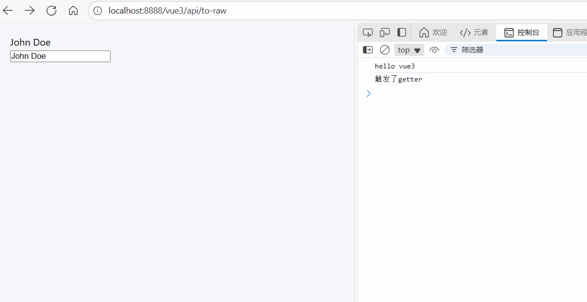

# computed 计算属性：提升开发效率的利器

[[toc]]

在 Vue 中，计算属性（`computed`）是 **响应式数据** 和 **UI 之间的桥梁**，它们通过对已有数据的计算和处理来生成新的数据。

计算属性不仅能够简化模板中的逻辑，还能够提高性能，因为 Vue 会对计算属性进行缓存，只有在相关依赖发生变化时才会重新计算。这使得计算属性在处理复杂逻辑时非常高效和实用。

## 1. 计算属性的概念

**计算属性** 是一种依赖于其他响应式数据的属性，它的值是基于现有数据动态计算出来的。和普通的属性不同，计算属性具有缓存特性——**只有当依赖的数据发生变化时，计算属性才会重新计算**。

**特点：**

- **响应式**：计算属性的值会随着它依赖的响应式数据变化而自动更新。
- **缓存**：计算属性的值会被缓存，只有当依赖的响应式数据发生变化时，才会重新计算。避免了不必要的重复计算，提高了性能。
- **适用于需要处理较为复杂的逻辑**：如果你需要将多个数据源的值进行组合、转换或进行计算，计算属性提供了优雅的解决方案。

## 2. 计算属性的语法

计算属性可以通过 `computed` 选项来定义，在 Vue 的 `data` 中存储的响应式数据变化时，计算属性会自动更新其值。

**基本用法**

```javascript
<template>
  <div>
    <p>{{ fullName }}</p>
    <input v-model="firstName" placeholder="First Name" />
    <input v-model="lastName" placeholder="Last Name" />
  </div>
</template>

<script setup>
import { ref, computed } from 'vue';

    const firstName = ref('John');
    const lastName = ref('Doe');

    // 定义计算属性
    const fullName = computed(() => {
      return `${firstName.value} ${lastName.value}`;
    });

</script>
```

**解释：**

- 在 `setup` 函数中，我们通过 `ref` 创建了 `firstName` 和 `lastName` 两个响应式数据。
- 使用 `computed` 创建了 `fullName` 计算属性，它会基于 `firstName` 和 `lastName` 自动计算并返回一个拼接后的字符串。
- 在模板中，`{{ fullName }}` 会自动显示计算后的结果。当 `firstName` 或 `lastName` 改变时，`fullName` 会自动重新计算并更新视图。

## 3. 计算属性的 Getter 和 Setter

计算属性除了可以定义一个 **getter** 计算属性，还可以通过 `set` 方法定义一个 **setter**，用于更新计算属性的值。

### 示例：

```vue
<template>
  <div>
    <p>{{ fullName }}</p>
    <input v-model="fullName" placeholder="Full Name" />
  </div>
</template>

<script setup>
import { ref, computed } from "vue";

const firstName = ref("John");
const lastName = ref("Doe");

// 定义计算属性的 getter 和 setter
const fullName = computed({
  // Getter
  get() {
    console.log("触发了getter");
    return `${firstName.value} ${lastName.value}`;
  },
  // Setter
  set(value) {
    console.log("触发了setter", value); // 每一次更改 fullName 时都会触发 setter
    const names = value.split(" ");
    firstName.value = names[0];
    lastName.value = names[1] || "";
  }
});
</script>
```

**如图所示：**



**解释：**

- `fullName` 计算属性不仅有一个 **getter**，用于返回拼接后的值，还定义了一个 **setter**，当我们修改 `fullName` 时，`setter` 会被触发，并根据修改的内容更新 `firstName` 和 `lastName`。

## 4. 计算属性 vs 监听器

`computed` 和 `watch`（监听器）都可以用于 **响应式数据变化时** 执行一些副作用操作，但它们的使用场景和行为有所不同。

### 1) **计算属性（computed）**：

- **主要用于**：当你需要基于已有的响应式数据计算出一个新值时，适用于 **同步** 的计算。
- **特性**：返回一个计算后的结果，自动缓存，只有依赖的数据发生变化时才会重新计算。

### 2) **监听器（watch）**：

- **主要用于**：当你需要 **异步** 或 **复杂操作** 时，适用于执行副作用（如 API 请求、数据处理等）。
- **特性**：监视数据的变化，执行一些副作用操作，如数据更新时执行异步请求、手动更新 DOM 等。

**示例：计算属性与监听器的区别**

```vue
<template>
  <div>
    <p>{{ message }}</p>
    <input v-model="name" />
  </div>
</template>

<script>
import { ref, computed, watch } from "vue";

export default {
  setup() {
    const name = ref("");

    // 计算属性
    const message = computed(() => `Hello, ${name.value}!`);

    // 监听器
    watch(name, (newValue, oldValue) => {
      console.log(`Name changed from ${oldValue} to ${newValue}`);
    });

    return { name, message };
  }
};
</script>
```

**解释：**

- **计算属性** `message` 会返回一个基于 `name` 的计算结果，并且只会在 `name` 改变时重新计算。
- **监听器** `watch` 监听 `name` 的变化，并执行一个副作用操作，输出变化的日志。
