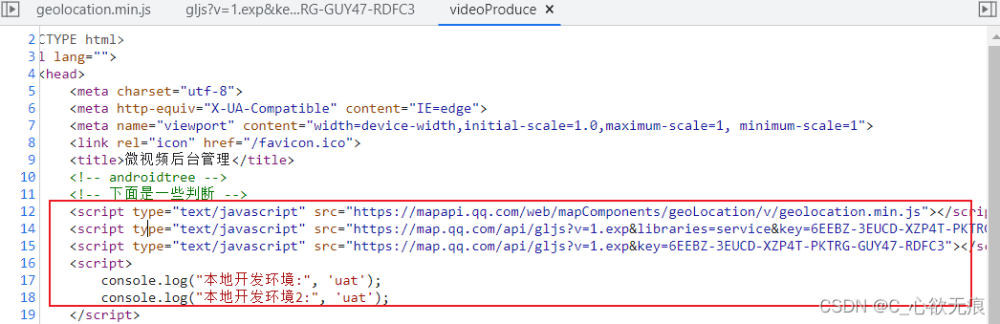

# vue的index.html中获取环境变量和业务判断


## 1，前言

对`vue来说index.html`是一个总的前端项目入口文件，vue是单页面应用，挂载在id为app的div标签下，然后动态渲染路由模板;

## 2，获取环境变量

我们可以正常在vue组件中正常访问自定义的环境变量和vue中默认的环境：如

```javascript
  console.log('当前环境', process.env.NODE_ENV);
  打印为：development
  
  console.log('当前自定义的环境变量', process.env.VUE_APP_RUN_ENV);
  打印为：uat
  
```

但是在`index.html`中只能使用 `<%= VUE_APP_xxx %> 或<%- VUE_APP_xxx %> ` 字符串获取到 

```javascript
 <script>
     console.log("本地开发环境:",'<%= VUE_APP_RUN_ENV %>');
     console.log("本地开发环境2:",'<%- VUE_APP_RUN_ENV %>');
 </script>
```

vue-cli官网的解释： [链接](https://cli.vuejs.org/zh/guide/html-and-static-assets.html#index-%E6%96%87%E4%BB%B6)

{width=90%}

注意：`<% expression %>` 可以用来做 JavaScript 的流程控制，可以结合 if else 语句使用：

```javascript
  <% if (process.env.VUE_APP_RUN_ENV=== 'production' ) { %>
    <script>
      // js 代码
    </script>
  <% } else if (process.env.VUE_APP_RUN_ENV=== 'test')  {%>
    <script>
      // js 代码
    </script>
  <% } else {%>
    <script>
      // js 代码
    </script>
  <% } %>
```

## 3，使用

我们在 index.html中获取到环境变量可以做一些特殊的业务需求；

比如：使用腾讯地图中我们要引入一些必要的 js文件，但是要携带key值用来效验用户，但是`生产环境的key值和开放环境的key值是不一样的`，此时我们可以在`index.html`中进行对环境的判断进行按需引入；

下面是腾讯地图的一些js 文件：
```javascript
 <script type="text/javascript" src="https://map.qq.com/api/gljs?v=1.exp&libraries=service&key=6EEBZ-3EUCD-XZP4T-PKTRG-GUY47-ROFC3"></script>
 <script type="text/javascript" src="https://map.qq.com/api/gljs?v=1.exp&key=6EEBZ-3EUCD-XZP4T-PKTRG-GUY47-ROFC3"></script>
```

判断如下：

```javascript
<!DOCTYPE html>
<html lang="">
  <head>
    <meta charset="utf-8">
    <meta http-equiv="X-UA-Compatible" content="IE=edge">
    <meta name="viewport" content="width=device-width,initial-scale=1.0,maximum-scale=1, minimum-scale=1">
    <link rel="icon" href="<%= BASE_URL %>favicon.ico">
    <title>微视频后台管理</title>
    
    <!-- 下面是判断 ------------------------------------------------------>
    
    <% if (process.env.VUE_APP_RUN_ENV === 'production' ) { %>
      <script type="text/javascript" src="https://mapapi.qq.com/web/mapComponents/geoLocation/v/geolocation.min.js"></script>
      <script type="text/javascript" src="https://map.qq.com/api/gljs?v=1.exp&libraries=service&key=V6VBZ-KD2OW-ATORL-RRKFW-QICF2-O3B7H"></script>
      <script type="text/javascript" src="https://map.qq.com/api/gljs?v=1.exp&key=V6VBZ-KD2OW-ATORL-RRKFW-QICF2-O3B7H"></script>
      <script>
        console.log("生产环境");
      </script>
    <% } else if (process.env.VUE_APP_RUN_ENV === 'test')  {%>
      <script>
        console.log("测试环境");
      </script>
    <% } else {%>
      <script type="text/javascript" src="https://mapapi.qq.com/web/mapComponents/geoLocation/v/geolocation.min.js"></script>
      <script type="text/javascript" src="https://map.qq.com/api/gljs?v=1.exp&libraries=service&key=6EEBZ-3EUCD-XZP4T-PKTRG-GUY47-ROFC3"></script>
      <script type="text/javascript" src="https://map.qq.com/api/gljs?v=1.exp&key=6EEBZ-3EUCD-XZP4T-PKTRG-GUY47-ROFC3"></script>
      <script>
         console.log("本地开发环境:",'<%= VUE_APP_RUN_ENV %>');
         console.log("本地开发环境2:",'<%- VUE_APP_RUN_ENV %>');
      </script>
    <% } %>
  </head>
  <body>
    <noscript>
      <strong>We're sorry but <%= htmlWebpackPlugin.options.title %> doesn't work properly without JavaScript enabled. Please enable it to continue.</strong>
    </noscript>
    <div id="app"></div>
  </body>
</html>

```


::: tip 运行项目
通过f12审查资源可以看到所需的js已经加载进来了；且也已经区别了开发环境和生产环境；如下图：

:::

**1，本地开发环境**：



**2，生产部署环境**：


