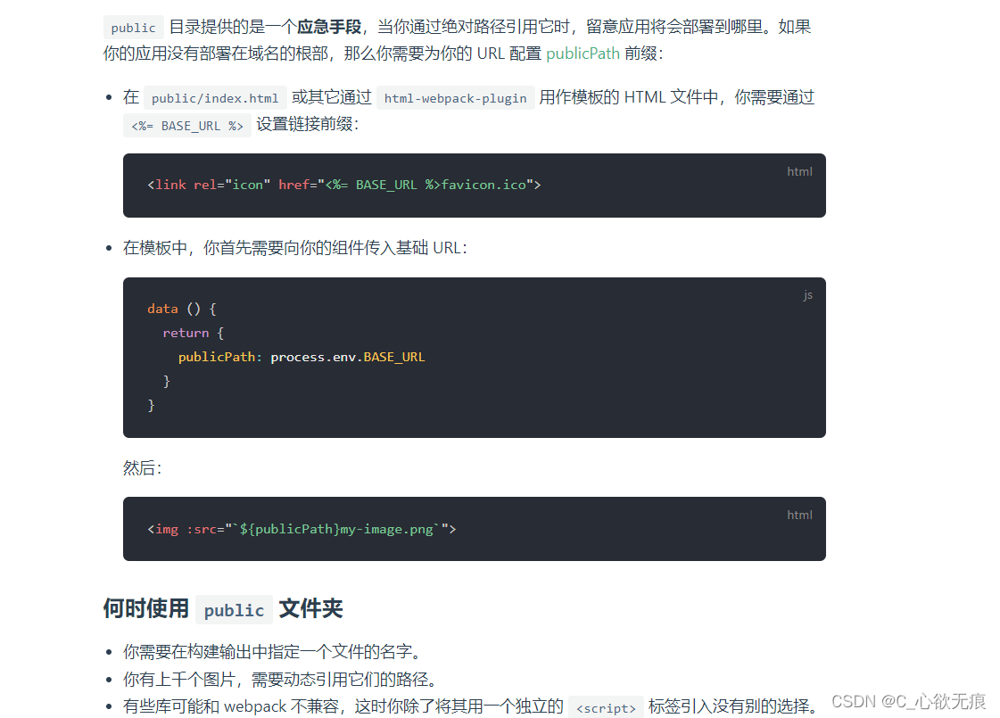

# vue配置中的 publicPath 讲解

`vue.config.js 里面的 publicPath `是部署应用包时的基本 URL；(从 Vue CLI 3.3 起 baseUrl 已被 publicPath 替代；)

如果想要了解 `vue` 的环境变量 `process.env` 可以阅读这篇文章：

 [vue 中的 process.env.NODE_ENV 讲解](https://blog.csdn.net/qq_43886365/article/details/128370109)

## 一、publicPath

`publicPath` 是部署应用包时的基本 URL；默认情况下，`Vue CLI` 会假设你的应用是被部署在一个域名的根路径上(https://www.my-app.com/)

如果应用被部署在一个子路径上，你就需要用这个选项指定这个子路径。如果你的应用被部署在 `https://www.my-app.com/my-app/`，则设置 `publicPath` 为`/my-app/`。

这个值也可以被设置为空字符串 ('') 或是相对路径 ('./')，这样所有的资源都会被链接为相对路径，这样打出来的包可以被部署在任意路径；

但相对路径的 `publicPath` 有一些使用上的限制。在以下情况下，应当避免使用相对 `publicPath`:

1、当使用基于` HTML5 history.pushState` 的路由时；  
2、当使用 `pages` 选项构建多页面应用时。

## 二、哪里会用到 publicPath

在 vue 中的项目中一般静态文件路径要使用 `publicPath` 和项目打包部署时都会用到 `publicPath`;

### 2.1 静态文件使用 publicPath

如果你的项目里面的静态文件都放在**public 文件中**，那么使用的时候要使用 `publicPath` 这个变量，防止打包后静态文件找不到；你需要通过绝对路径来引用它们。

因为：任何放置在 `public` 文件夹的静态资源都会被简单的复制，而不经过 `webpack；`

下图是 `vue-cli` 官网给出的使用说明：[链接](https://cli.vuejs.org/zh/guide/html-and-static-assets.html#public-%E6%96%87%E4%BB%B6%E5%A4%B9)

`注意`：这里用到了 `process.env.BASE_URL`,下面会解释的



### 2.2 项目打包使用 publicPath

如果你想把开发服务器架设在根路径，你可以使用一个条件式的值：

这里判断是否是生产环境 如果是那么前面的部署路径加上 /app/；如果不是 默认使用根路径 / ; 生产环境经常配合前端服务器的中 nginx 代理使用；

```javascript
module.exports = {
  publicPath: process.env.NODE_ENV === "production" ? "/app/" : "/"
};
```

## 三、publicPath 和 process.env.BASE_URL

1，如果你在 `vue.config.js `里面设置了` publicPath`：

```javascript
module.exports = {
  publicPath: process.env.NODE_ENV === "production" ? "/video/" : "/"
};
```

::: tip process.env.BASE_URL

那么 process.env.BASE_URL 其实就是 publicPath;

不信你可以在组件中 console.log(process.env.BASE_URL) 打印出来；BASE_URL 会被 vue.config.js 中 publicPath 变量覆盖。

:::

2，如果没有在 `vue.config.js `里面设置 `publicPath`；那么 `process.env.BASE_UR`L 默认就是根路径 ：`/ `;

3，在 `vue` 路由的配置项中也会用到 `process.env.BASE_URL`：

```javascript
const router = new VueRouter({
  mode: "history",
  base: process.env.BASE_URL,
  routes
});
```

`mode history` 代表路由不再显示#，会像如下形式：`localhost:8080/user/list`；主要是 `base` 属性 代表着是基本的路由请求的路径：

如：`base: '/app/'` 说明项目部署在 `app` 目录下，那么 vue 所有的路由前面都会自动加上: `/app`
