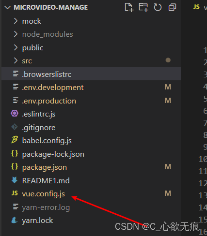

# vue.config.js 配置文件介绍

[[toc]]

## 一、前言：

::: warning 注意：

使用 vue-cli 3.x 以上的脚手架创建的 vue 项目不再有 build 文件夹，若需要进行相关配置，需在项目目录下新建文件 vue.config.js ;如下： 

:::



## 二、常用配置项如下：

注意：baseUrl 从 Vue CLI 3.3 起已弃用从而使用 publicPath 来替代；

```javascript
/* 引入打包分析插件 */
const BundleAnalyzerPlugin = require("webpack-bundle-analyzer").BundleAnalyzerPlugin;
/* 引入压缩插件 但是导致项目启动的比较慢*/
const UglifyJsPlugin = require("uglifyjs-webpack-plugin");

let isProduction = process.env.NODE_ENV === "production"; // 判断是否是生产环境
let isTest = process.env.NODE_ENV === "test"; // 判断是否是测试环境

// 服务端ip  -- Uat环境
const api = "http://10.1.12.181:26341";
// 自己启动的node服务 代理到本地
const nodeApi = "http://127.0.0.1:3000";

module.exports = {
  /* 打包后的文件夹名字及路径  根目录下 */
  outputDir: "dist/video",

  /* 生产的项目名   development是开发环境 可以用三元运算符*/
  publicPath: process.env.NODE_ENV === "production" ? "/video/" : "/",

  /* 保存时是否校验 */
  lintOnSave: false,

  /* 开发环境跨域情况的代理配置 */
  devServer: {
    https: false, // 链接是否使用https访问 但可能在微信中不能打开（安全性问题） 不写此行配置默认 使用http协议打开
    port: "31001", // 指定要监听请求的端口号
    open: true, // 是否运行好直接在默认浏览器打开
    inline: true, // 用于设置代码保存时是否自动刷新页面。
    hot: true, // 用于设置代码保存时是否进行热更新（局部刷新，不刷新整个页面）

    disableHostCheck: true, //可以被外网访问

    /* 当出现编译器错误或警告时，在浏览器中显示全屏覆盖层。默认禁用。两种写法*/
    // overlay: true, // 第一种
    overlay: {
      //第二种
      warnings: false, //是否警告
      errors: false
    },

    /* 接口代理器设置 可以配置多个*/
    proxy: {
      "/backend": {
        // 实际访问的服务器地址
        target: nodeApi,
        // 控制服务器收到的请求头中Host字段的值  host就是主机名加端口号  实际上就是欺骗后端服务器
        changeOrigin: true,
        // 是否启用websockets
        ws: false
        // 重写请求路径  开头是/api的替换为 空串
        // pathRewrite: { '/api': '' },
      }
    }
  },

  /* css相关设置 */
  css: {
    extract: false, // 是否使用css分离插件 ExtractTextPlugin  开启extract后，组件样式以内部样式表的形式加载的, 打包的结果会多出一个 css 文件夹以及css 文件。
    sourceMap: true, // 开启 CSS source maps?

    /* 向所有 Sass/Less 样式传入共享的全局变量 */
    loaderOptions: {
      //注意：在 sass-loader v8 中，这个选项名是 "prependData"  global.scss这里面定义的是一些全局变量
      scss: {
        prependData: '@import "~@/assets/scss/global.scss";'
      }
    }
  },

  /* webpack相关配置
   *该对象将会被 webpack-merge 合并入最终的 webpack 配置
   */
  configureWebpack: (config) => {
    // 生产环境配置
    if (process.env.NODE_ENV === "production") {
      /* js 压缩 */
      config.plugins.push(
        new UglifyJsPlugin({
          uglifyOptions: {
            uglifyOptions: {
              compress: {
                drop_debugger: true,
                drop_console: true // 生产环境自动删除console
              },
              warnings: false
            },
            sourceMap: false,
            parallel: true // 使用多进程并行运行来提高构建速度。默认并发运行数：os.cpus().length - 1。
          }
        })
      );
    } else {
      // 测试环境开启打包分析
      config.plugins.push(new BundleAnalyzerPlugin());
    }
  },

  /* 对内部的 webpack 配置（比如修改、增加Loader选项）(链式操作) */
  chainWebpack: (config) => {
    /* 关闭 console.log 生产环境
    如果为了安全起见，需要在正式环境关闭调试的话，可以在vue.config.js文件里加入以下代码*/
    config.optimization.minimizer("terser").tap((args) => {
      // 移除 console*
      args[0].terserOptions.compress.drop_console = true;
      // 移除 debugger
      args[0].terserOptions.compress.drop_debugger = true;
      // 移除 console.log
      args[0].terserOptions.compress.pure_funcs = ["console.log"];
      // 去掉注释 如果需要看chunk-vendors公共部分插件，可以注释掉就可以看到注释了
      args[0].terserOptions.output = {
        comments: false
      };
      return args;
    });

    // 设置路径别名
    config.resolve.alias.set("@", resolve("src")).set("assets", resolve("src/assets")).set("components", resolve("src/components"));

    // 压缩图片插件
    config.module
      .rule("images")
      /* 注意会报这个错误 Cannot find module 'imagemin-gifsicle' 需要下载cnpm install --save-dev image-webpack-loader 才有效*/
      .use("image-webpack-loader")
      .loader("image-webpack-loader")
      .options({
        mozjpeg: { progressive: true, quality: 65 },
        optipng: { enabled: false },
        pngquant: { quality: [0.8, 0.9], speed: 4 },
        gifsicle: { interlaced: false },
        webp: { quality: 75 }
      });
  },

  /* 第三方插件配置 */
  pluginOptions: {
    "process.env": {
      NODE_ENV: '"development"'
    }
    // 我这里用的是 vue-cli-plugin-mock 插件；用来开发前期模拟后端的请求
    // debug 为true时 vscode的控制台会打印接口日志
    // mock: { entry: './mock/index.js', debug: false },
  }
};
```

## 三、常用配置项说明：

### 3.1，outputDir

打包后的文件输出路径，比如`：dist/video`就是默认在根目录下面新建 dist 目录和 video 文件夹(打包好的包)

```javascript
outputDir: 'dist/video',
```

### 3.2，publicPath

publicPath 是部署应用包时的基本 URL；写法上可以使用三元运算符进行判断是否是生产环境和开发环境； 这个配置在项目部署时比较重要；`详细介绍见这篇文章`：[vue 中的 publicPath 讲解](https://blog.csdn.net/qq_43886365/article/details/128372030?ops_request_misc=%257B%2522request%255Fid%2522%253A%2522167818765716800211549947%2522%252C%2522scm%2522%253A%252220140713.130102334.pc%255Fblog.%2522%257D&request_id=167818765716800211549947&biz_id=0&utm_medium=distribute.pc_search_result.none-task-blog-2~blog~first_rank_ecpm_v1~rank_v31_ecpm-6-128372030-null-null.blog_rank_default&utm_term=vue.cofig&spm=1018.2226.3001.4450)

```javascript
publicPath: process.env.NODE_ENV === 'production' ? '/video/' : '/',
```

注意：baseUrl 从 原先的 Vue CLI 3.3 版本起被已弃用从而使用 publicPath 来替代；

### 3.3，lintOnSave

设置是否在开发环境下每次保存代码时都启用`eslint`进行验证。

```javascript
 /* 保存时是否校验 */
  lintOnSave: false,
```

### 3.4，devServer 模块

此模块也比较重要，涉及到开发时项目的一些基本配置和解决接口的跨域问题( Node 代理)；

```javascript
 /* 开发环境跨域情况的代理配置 */
  devServer: {
    https: false,   // 链接是否使用https访问 但可能在微信中不能打开（安全性问题） 不写此行配置默认 使用http协议打开
    port: '31001',  // 指定要监听请求的端口号
    open: true,     // 是否运行好直接在默认浏览器打开
    inline: true,   // 用于设置代码保存时是否自动刷新页面。
    hot: true,      // 用于设置代码保存时是否进行热更新（局部刷新，不刷新整个页面）

    disableHostCheck: true, //可以被外网访问

    /* 当出现编译器错误或警告时，在浏览器中显示全屏覆盖层。默认禁用。两种写法*/
    // overlay: true, // 第一种
    overlay: {
      //第二种
      warnings: false, //是否警告
      errors: false,
    },

    /* 接口代理器设置 可以配置多个*/
    proxy: {
      '/backend': {
        // 实际访问的服务器地址
        target: nodeApi,
        // 控制服务器收到的请求头中Host字段的值  host就是主机名加端口号  实际上就是欺骗后端服务器
        changeOrigin: true,
        // 是否启用websockets
        ws: false,
        // 重写请求路径  开头是/api的替换为 空串
        // pathRewrite: { '/api': '' },
      },
    },
  },
```

proxy 中的参数 `target`是要代理的后端接口 ip；`changeOrigin：true`设置跨域请求； `ws: true`如果要代理 websockets，配置这个参数；`pathRewrite：{ '/api': '' }`为重写路径，我这样设置的效果为接口开头是`/api`的就替换为空，这个要根据实际情况进行变换；

### 3.5，css 相关设置

```javascript
 css: {
    extract: false, // 是否使用css分离插件 ExtractTextPlugin  开启extract后，组件样式以内部样式表的形式加载的, 打包的结果会多出一个 css 文件夹以及css 文件。
    sourceMap: true, // 开启 CSS source maps?

    /* 向所有 Sass/Less 样式传入共享的全局变量 */
    loaderOptions: {
      //注意：在 sass-loader v8 中，这个选项名是 "prependData"  global.scss这里面定义的是一些全局变量
      scss: {
        prependData: '@import "~@/assets/scss/global.scss";',
      },
    },
  },
```

### 3.6，webpack 相关配置

webpack 配置分为两个配置模块：`configureWebpack`和`chainWebpack`配置项；

**1，配置 `configureWebpack`有两种写法：**

`第一种`：调整 webpack 配置最简单的方式就是在 vue.config.js 中的 configureWebpack 选项提供一个对象：

```javascript
// vue.config.js
module.exports = {
  configureWebpack: {
    plugins: [new MyAwesomeWebpackPlugin()]
  }
};
```

该对象将会被 webpack-merge 合并入最终的 webpack 配置。

`第二种`：如果你需要基于环境有条件地配置行为，或者想要直接修改配置，那就换成一个函数 (该函数会在环境变量被设置之后懒执行)。该方法的第一个参数会收到已经解析好的配置。

在函数内，你可以直接修改配置，或者返回一个将会被合并的对象：

```javascript
// vue.config.js
module.exports = {
  configureWebpack: (config) => {
    if (process.env.NODE_ENV === "production") {
      // 为生产环境修改配置...
    } else {
      // 为开发环境修改配置...
    }
  }
};
```

`我配置的`：我这里使用了第二种的配置写法；判断 vue 运行环境进行有条件的进行配置；在生产环境中我使用 `UglifyJsPlugin`插件进行对 js 代码的压缩；

在测试环境下面 我使用了 `BundleAnalyzerPlugin`打包分析工具，用于分析代码的构成和大小；

```javascript
configureWebpack: (config) => {
    // 生产环境配置
    if (process.env.NODE_ENV === 'production') {
      /* js 压缩 */
      config.plugins.push(
        new UglifyJsPlugin({
          uglifyOptions: {
            uglifyOptions: {
              compress: {
                drop_debugger: true,
                drop_console: true, // 生产环境自动删除console
              },
              warnings: false,
            },
            sourceMap: false,
            parallel: true, // 使用多进程并行运行来提高构建速度。默认并发运行数：os.cpus().length - 1。
          },
        })
      );
    } else {
      // 测试环境开启打包分析
      config.plugins.push(new BundleAnalyzerPlugin());
    }
  },
```

**2，配置 `chainWebpack`：**

chainWebpack 是可以进行链式操作的，它允许我们更加精确的进行内部配置，在对于一些`loader` 时非常有用；如下比较 vue 的`chainWebpack`链式配置和 webpack 中的`webpack.config.js`文件‘：左侧是 vue 的右侧是 webpack 的配置文件：  更加详细的配置说明请见[vue-cli 官网](https://cli.vuejs.org/zh/guide/webpack.html#%E9%93%BE%E5%BC%8F%E6%93%8D%E4%BD%9C-%E9%AB%98%E7%BA%A7)

`下面是我常用的chainWebpack配置：` 主要配置了关闭 vconsole 和配置路径别名以及 使用 `image-webpack-loader`图片压缩插件；

```javascript

  /* 对内部的 webpack 配置（比如修改、增加Loader选项）(链式操作) */
  chainWebpack: (config) => {

    /* 关闭 console.log 生产环境
    如果为了安全起见，需要在正式环境关闭调试的话，可以在vue.config.js文件里加入以下代码*/
    config.optimization.minimizer('terser').tap((args) => {
      // 移除 console*
      args[0].terserOptions.compress.drop_console = true;
      // 移除 debugger
      args[0].terserOptions.compress.drop_debugger = true;
      // 移除 console.log
      args[0].terserOptions.compress.pure_funcs = ['console.log'];
      // 去掉注释 如果需要看chunk-vendors公共部分插件，可以注释掉就可以看到注释了
      args[0].terserOptions.output = {
        comments: false,
      };
      return args;
    });

    // 设置路径别名
    config.resolve.alias
      .set('@', resolve('src'))
      .set('assets', resolve('src/assets'))
      .set('components', resolve('src/components'))


    // 压缩图片插件
    config.module
      .rule('images')
      /* 注意会报这个错误 Cannot find module 'imagemin-gifsicle' 需要下载cnpm install --save-dev image-webpack-loader 才有效*/
      .use('image-webpack-loader')
      .loader('image-webpack-loader')
      .options({
        mozjpeg: { progressive: true, quality: 65 },
        optipng: { enabled: false },
        pngquant: { quality: [0.8, 0.9], speed: 4 },
        gifsicle: { interlaced: false },
        webp: { quality: 75 },
      });
  },
```

### 3.7，pluginOptions(第三方插件配置)

`pluginOptions`模块是第三方插件配置：我这边配置了 使用`vue-cli-plugin-mock` 模拟后端的请求数据流程；不想使用此插件的时候直接注释掉即可；

```javascript
 /* 第三方插件配置 */
  pluginOptions: {
    // 我这里用的是 vue-cli-plugin-mock 插件；用来开发前期模拟后端的请求
    // debug 为true时 vscode的控制台会打印接口日志
    mock: { entry: './mock/index.js', debug: false },
  },
```
