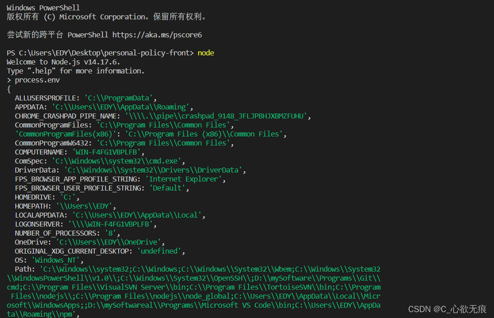
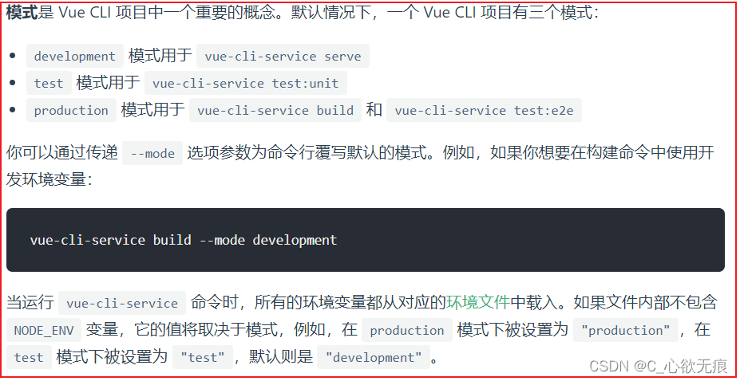
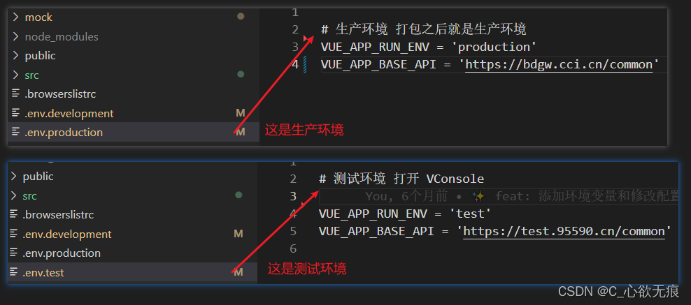
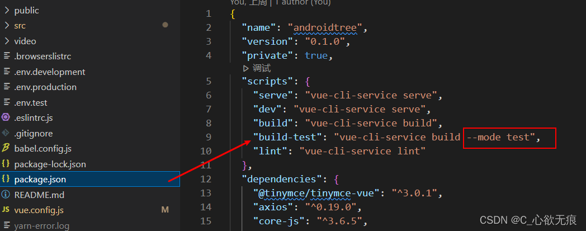

# 环境变量和 process.env.NODE_ENV 理解

## 1，什么是 process.env

`process.env` 是 `Node.js` 中的一个环境对象。其中保存着系统的环境的变量信息。可使用 `Node.js `命令行工具直接进行查看。如下：



而 `NODE_ENV` 就是其中的一个环境变量。这个变量主要用于标识当前的环境（生产环境，开发环境）。默认是没有这个环境变量的，需要自己手动配置。

## 2，vue 中的 NODE_ENV

在 `Vue` 项目中， Vue 提供了自己的配置方式。这就要涉及到 `Vue CLI` 中模式的概念了。 `Vue CLI` 文档说明了这个问题。

[VueCli 官方链接：](https://cli.vuejs.org/zh/guide/mode-and-env.html#%E6%A8%A1%E5%BC%8F)

{width="90%"}


也就是说，在 Vue 中 ,`NODE_ENV` 可以通过 `.env .[mode]`文件配置。配置过后，运行 Vue CLI 指令（ `npm run dev(serve) ，npm run build` ）时，就会将该模式下的`NODE_ENV`载入其中了。而这些命令，都有自己的默认模式：

- `npm run dev(serve)` ，其实是运行了 `vue-cli service serve` ，默认模式为 `development` 。可以在 `.env.development` 文件下修改该模式的 `NODE_ENV`
- `npm run build` ，其实运行了 `vue-cli service build `，默认模式为 `production` 。可以在`.env.production` 文件下修改该模式的 `NODE_ENV` ；不推荐修改；

- 在开发阶段 process.env.NODE_ENV 默认是 `development`
- 当运行 npm run build 打包后 process.env.NODE_ENV 状态就自动改为了`production`

## 3，环境变量

> 在日常开发中我们可能分为测试环境开发环境和生产环境，但是这两个环境所请求的后端接口是不一样的，或者生产环境下关闭 `Vconsole` 等这些跨环境的需求；
>
> 此时我们可以新建 `.env.development 和 .env.production` 这些文件来新增一些配置，作为重要的依赖项，
>
> 你可以在你的项目根目录中放置下列文件来指定环境变量：

```javascript
.env                # 在所有的环境中被载入
.env.local          # 在所有的环境中被载入，但会被 git 忽略
.env.[mode]         # 只在指定的模式中被载入
.env.[mode].local   # 只在指定的模式中被载入，但会被 git 忽略
```

一个环境文件只包含环境变量的“键=值”对：

```javascript
FOO = "bar";
VUE_APP_BASE_API = "https://bdgw.cci.cn/common";
```

只有以`VUE_APP` 开头的变量会被` webpack.DefinePlugin `静态嵌入到客户端侧的包中。你可以在应用的代码中这样访问它们：

```javascript
console.log(process.env.VUE_APP_BASE_API);
```

**1，新建文件**

可以看到下图我新建了三个文件：`.env.development 和.env.production 和.env.test;`

可以看出我在测试环境和生产环境新建了一个 `process.env.VUE_APP_BASE_API` 这个属性来表示测试环境和生产环境请求不同的后端接口 ip；我只需要运行不同的打包命令即可；



**2，使用：**

package.json 里面新的运行命名后面要新增 `--mode '自定义的名字'`；

我这里为什么没有使用--mode development 或 production 呢？因为上面讲到 vue 默认开发环境就是 development ，生产环境就是 production ；

所以不需要多此一举了；



看到我上面红框里面的变量是 `--mode test` 说明当我运行 `npm run build-test` 时，.env.test 文件里面配置的一些环境变量就已经加载进来的，可以在代码中做一些相应的判断；
