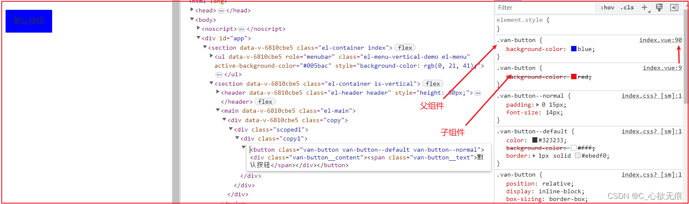

# 深入理解vue中的scoped属性

[[toc]]
## 1，前言

> 我们知道vue为了防止css样式污染，在每个组件中提供了 `scoped`属性进行限定css作用域；
> 当 `<style>` 标签有 scoped 属性时，它的 CSS 只作用于当前组件中的元素。

## 2，scoped原理


::: tip 原理
1. vue中的 `scoped` 属性，其实就是给每一个dom节点元素都添加了不重复的自定义属性（如：data-v-6810cbe5）
2. 然后编译时再给样式的末尾添加`属性选择器`进行样式私有化（如.btn[data-v-6810cbe5]）
:::

转译前的代码：

btn组件（使用了Vant组件库的button组件）：
```javascript
<template>
  <div class="copy1">
    <van-button type="default">默认按钮</van-button>
  </div>
</template>

<style scoped lang="scss">
.van-button {
    background-color: red;
  }
</style>
```
浏览器编辑的结果如下：

{width=90%}

可以看到，van-button类名后面添加了`[data-v-03f66e5f]`;他的节点上面也自动添加了自定义属性 `data-v-03f66e5f`；
所以：就算在两个互不相关的组件使用同样的类名，他们的样式也是互不影响的；


## 3，父子组件使用scoped的不同情况

`scoped的`这一操作，虽然达到了组件样式模块化的目的，但是会出现无论父组件样式的权重有多大，也可能无法修改子组件的样式；

下面就分四种情况具体说明scoped的作用：

## 4，第一种：父组件未添加scoped，子组件未添加scoped



这是最原始的一种情况，可以看到按钮的背景颜色为蓝色。此时父组件声明了`background-color: blue;`,子组件声明了`background-color: red`,权重是一样的，但是父组件style会覆盖子组件的style;
查看Elements后会发现，父组件的样式文件插入位置在子组件样式文件后面(上图可以看出一个是第9行一个是第90行)，对于权重相同的样式，后面的会覆盖前面，所以父组件的style生效。

## 5，第二种：父组件未添加scoped，子组件添加scoped

子组件：btn.vue

```javascript
<template>
  <div class="copy1">
    <van-button type="default">默认按钮</van-button>
  </div>
</template>

<style lang="scss" scoped>
.van-button {
    background-color: red;
  }
</style>

```


我们可以看到子组件的`.van-button{background-color: red}`;被编译成`.van-button[data-v-03f66e5f]{background-color: red}`；
子组件中button样式的权重`=类选择器(.button)+属性选择器([data-v-03f66e5f])`，而父组件中button样式的权重=类选择器(.button)，所以子组件样式的权重加重了，覆盖本来能产生作用的父组件样式，导致按钮背景颜色为红色。

## 6，第三种：父组件添加scoped，子组件未添加scoped

父组件：

```javascript
<template>
  <div>
    <!-- 使用子组件 -->
    <div class="scoped1">
      <btn></btn>
    </div>
  </div>
</template>

<script>
//引入
import Btn from './copy1/index.vue';
export default {
  name: 'copy',
  components: {
    Btn,
  },  
};
</script>

<style lang="scss" scoped>
.scoped1 {
  .van-button {
    background-color: blue;
  }
}
<style>
```
子组件：btn.vue

```javascript
<template>
  <div class="copy1">
    <van-button type="default">默认按钮</van-button>
  </div>
</template>

<style lang="scss">
.van-button {
    background-color: red;
  }
</style>

```


我们可以看到按钮的背景颜色为红色，父组件style添加scoped后，所有元素都加上data-v属性，包括子组件的根节点，但是子组件的内层元素就`不会受影响`，所以父组件的`.van-button[data-v-ae1b895c] {background-color:blue;}`作用不到子组件的.van-button上。

> 这也是直接修改element-ui或vant-ui子组件的样式不生效的原因，就算要写，也需要借助深度作用选择器或样式不写在scoped属性中。

`注意`：

> 如果只修改子组件根节点的样式，还是可以写到父组件的scoped CSS里面，因为一个子组件的根节点会同时存在 两个data-v属性的，一个是父组件本来的，另一个是子组件根节点上面的；（见上图左边部分）；所以也会影响到子组件的根节点元素；
> 
## 7，第四种：父组件添加scoped，子组件也添加scoped

效果图如下：


我们可以看到，子组件的根节点不仅有子组件的data-v属性，还有父组件的data-v属性。而.van-button元素依然不受父组件的影响，只拥有自己组件的data-v属性，所以按钮颜色依旧为红色。
这和上面第三种的情况是一样的；如法直接覆盖子组件的样式；

## 8，解决方案

那如果我就是想让父组件的样式覆盖子组件的样式，怎么办呢？

**1，第一种使用两个style，一个用于私有样式（加scoped），一个用于共有样式。**

```javascript
<style lang="scss" scoped>
.van-button {
    ....
}
// 公共样式
<style lang="scss" >
.van-button {
  background-color: blue;
}
```
**2，深度作用选择器（推荐）**

父元素使用 /deep/  或 >>>进行穿透

```javascript
<style lang="scss" scoped>
/deep/ .scoped1 {
  .van-button {
    background-color: blue;
  }
  
  编译如下：
  [data-v-ae1b895c] .scoped1 .van-button {
    background-color: blue;
  }
}
<style>
```

有些像 Sass 之类的预处理器无法正确解析 >>>。这种情况下你可以使用 /deep/ 或 ::v-deep 操作符取而代之——两者都是 >>> 的别名，同样可以正常工作。

推荐使用 `/deep/`  简单方便；

## 9，总结

1，`scoped CSS`里每个样式的权重加重了，理论上我们可以修改某一个样式，但是却需要更高的权重去覆盖这个样式；

2，无论父组件样式的权重多大，也可能无法修改子组件的样式，除了子组件的根节点。


 