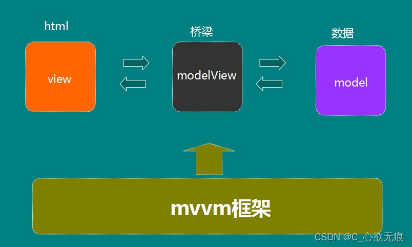
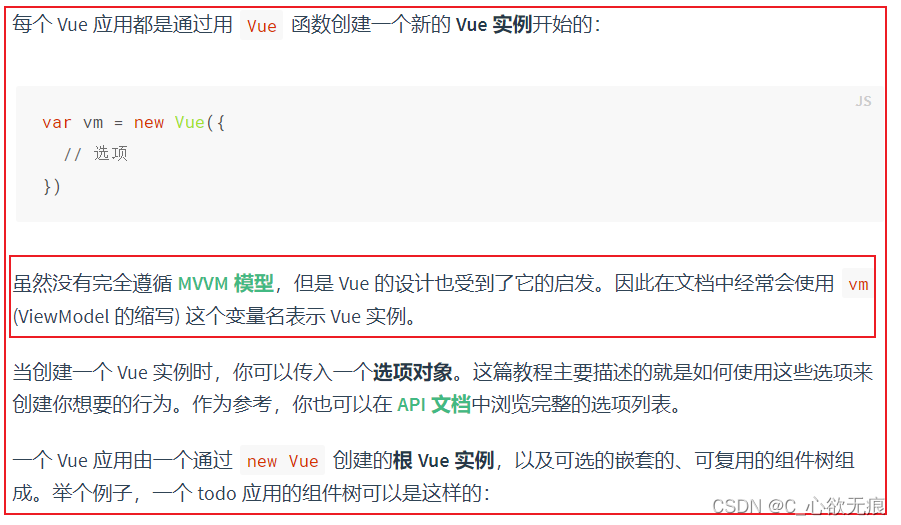

# vue 是 mvvm 模型吗

## 1.什么是 mvvm 模型？

::: tip 标准的 mvvm 模型

- **M**: Model；既是数据，主要负责业务数据相关；
- **V**: View；即是视图，展示给用户看的页面，细分下来就是 html+css 层；
- **VM**: ViewModel；是连接界面 View 和数据 Model 桥梁，负责监听 M 或者 V 的修改，是实现 MVVM 双向绑定的核心；

:::

图解见下图：

{width=500px}

下面我们看一下使用`vue`的一个简单示例：

## 2.vue 的文件结构

{width=90%}

由上图可知：`MVVMM`设计模型和`Vue`的设计会有以下对应关系：

```
Vue中的data <====>  MVVM模型中Model

Vue中的template <====>   MVVM模型中View

Vue中的new Vue实例 <====>   MVVM模型中ViewModel
```

**实现 mvvm 主要包含两个方面：数据变化更新视图，视图变化更新数据**

`视图变化更新数据`： 可以利用 v-model 指令，也可以用户手动输入监听@input 事件来实现，更改数据;

`数据变化更新视图`：Model 变更触发 View 更新必须通过 VewModel (Vue 实例),当`Object.defineProperty()`数据劫持中的`set`方法触发时会通知 render 函数进行异步更新视图；

以上是 MVVM 的思想。

**当然，** Vue 也是按照这样的设计的，但是 vue 中添加了一个属性`ref`，通过`this.$ref`可以直接获取 dom 节点对象，通过 ref 直接去操作视图。

这一点上，违背了`MVVM`模型，所以说 vue 并没有完全遵循`MVVM`模型。

放一张[官网的说明图](https://v2.cn.vuejs.org/v2/guide/instance.html)

{width=90%}

**总结：vue 并虽然没有完全遵循 MVVM 模型，但也是属于 MVVM 模型的**
