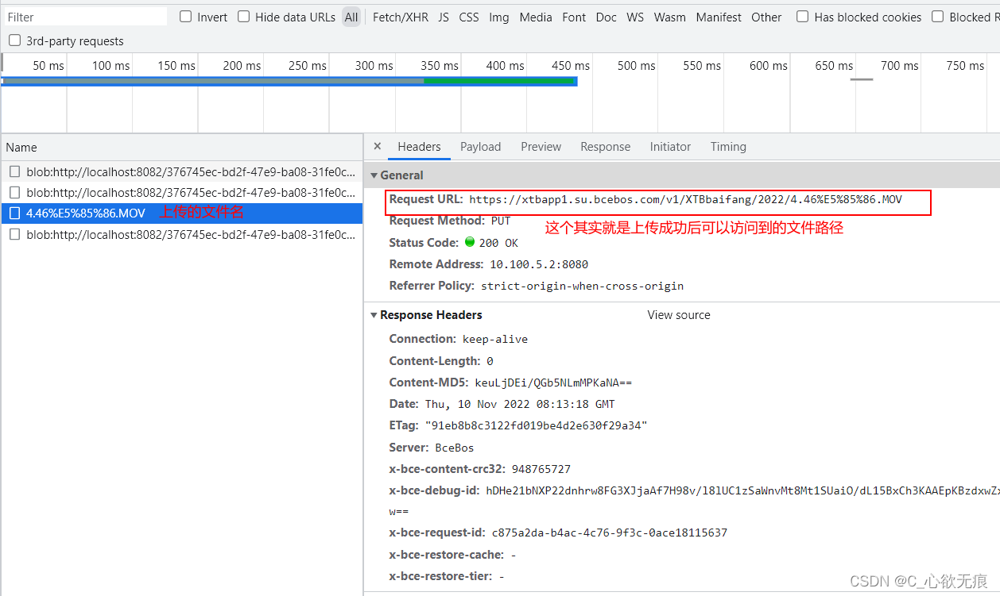

# vue 项目使用 BOS(百度云对象存储)上传文件

> 百度云的 JavaScript 地址：[https://cloud.baidu.com/doc/BOS/s/Djwvyrhiw](https://cloud.baidu.com/doc/BOS/s/Djwvyrhiw)

___
**1，安装 SDK** 支持 Node 4.x 以及更高版本

```javascript
npm install @baiducloud/sdk
```

**2，配置信息（一般是由公司提供）**

```javascript

import {BosClient} from '@baiducloud/sdk';

const config = {
    endpoint: <EndPoint>,         //传入Bucket所在区域域名
    credentials: {
        ak: <AccessKeyID>,         //您的AccessKey
        sk: <SecretAccessKey>       //您的SecretAccessKey
    }
};

let bucket = 'my-bucket';
let key = 'hello.js';

// 这个要放在mounted里面进行初始化
let client = new BosClient(config);
```

**3，上传方式介绍**

这里官方提供了四种文件的上传方式 我使用的是以 blob 对象形式上传(putObjectFromBlob())

::: tip 上传方式
上传 Object；Object是BOS中最基本的数据单元，您可以把 Object 简单的理解为文件。

对于一个简单的Object的上传，BOS 为您提供了四种方式：文件形式上传、数据流形式上传、二进制串上传和字符串上传。
:::


```javascript

function done(response) {
  // 上传完成
}
function fail(fail) {
  // 上传失败
}

// 以字符串形式上传
client.putObjectFromString(bucket, object, 'hello world')
  .then(done)
  .catch(fail);

// 以buffer形式上传
var buffer = new Buffer('hello world'); client.putObject(bucket, object, buffer)
  .then(done)
  .catch(fail);

// 以文件形式上传，仅支持Node.js环境
client.putObjectFromFile(bucket, object, <path-to-file>)
  .then(done)
  .catch(fail);

// 以blob对象形式上传，仅支持浏览器环境
client.putObjectFromBlob(bucket, object, <blob对象>)
  .then(done)
  .catch(fail);
```

**4，开始使用 putObjectFromBlob 进行上传**

::: tip 上传
vue 项目选择文件时拿到的有 file 格式至直接上传或转为 blob 格式进行上传（都可以）；
:::


下面代码是我上传的案例，因为是多个文件上传 所以我这边使用的是 for 循环进行循环上传；但要进行计数 上传成功的和上传总数是否一样；一样说明全部上传成功；全部成功之后的处理需要你这边自行处理；

**putObjectFromBlob（）：参数说明：** 

::: tip 参数说明
1. 第一个参数是：桶名 （配置信息里面有）
2. 第二个参数是：上传的文件名 （如果想要上传到指定的文件夹 需要在文件名前面加文件夹的路径 如：/XTBbaifang/文件名 ”）
3. 第三个参数是：你要上传的文件的 file 格式 或者是 blob 格式 这两个都可以 （建议使用直接使用 file，blob 还需要转换一下）
4. then():是成功的回调: 成功的回调不会返回给你此文件上传成功后的网络地址 这个需要你自己去拼接； 
**拼接格式是：endpoint（配置信息里面的路径） + 文件名（如果在指定的文件夹需要 添加文件夹的名称）** 
5. catch():是上传失败的回调

:::


```javascript
// 案例： 开始进行批量上传
boldList是存放blod格式的数组;
for (let i = 0; i < boldList.length; i++) {
  // 上传的计数
  this.uploadCount++;

  if (boldList[i].bold) {
    this.client
      .putObjectFromBlob(bucket, this.fileBaseUrl + boldList[i].filename, boldList[i].bold) // 使用blod的形式上传

      .then((res) => {
        console.log("上传成功");
        // 成功的计数
        this.uploadSuccessCount++;
        // 上传成功后的文件的网络路径 需要自己去拼接
        let fileUrl = `${publicConfig.config.endpoint}${this.fileBaseUrl}${boldList[i].filename}`;
        // 把成功的添加到本地的数组里面
        this.totalUploadedList.push({ mainIndex: boldList[i].mainIndex, isUpload: true, fileUrl }); //需要传给后端的 路径数组
        // 全部上传成功的处理  这个需要根据需求来进行向对应的处理
        if (this.uploadCount === this.uploadSuccessCount) {
          console.log("全部上传成功的处理");
        }
      })

      .catch((error) => {
        this.isShowUploaderMask = false;
        console.error("上传百度云失败 error:", error);
      });
  }
}
```

**5，百度云也是使用 xhr 请求进行上传的 可以在 network 中看到** 


