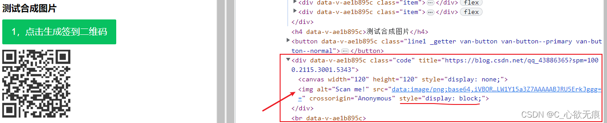

# vue中使用canvas图片合并

## 前言
如何合成一个二维码和背景图片：其实就是多次调用canvas的`drawImage`方法进行不同坐标的图像；

但是因为涉及到微信长按分享图片或保存到本地，所以不能直接使用canvas来放置图片（因为微信中长按识别不出来），只能使用img标签来引入canvas合成的`base64`路径。

## 一、canvas介绍
Canvas API 提供了一个通过JavaScript 和 HTML的canvas元素来绘制图形的方式。它可以用于动画、游戏画面、数据可视化、图片编辑以及实时视频处理等方面。

canvas 看起来和img元素很相像，唯一的不同就是它并没有src和alt 属性。实际上，canvas标签只有两个属性：`width和height`。这些都是可选的，并且同样利用 `DOM properties` 来设置。

当没有设置宽度和高度的时候，canvas 会初始化宽度为 300 像素和高度为 150 像素。该元素可以使用CSS来定义大小，但在绘制时图像会伸缩以适应它的框架尺寸：如果 CSS 的尺寸与初始画布的比例不一致，它会出现扭曲。

::: warning 备注
如果你绘制出来的图像是扭曲的，尝试用 width 和 height 属性为canvas明确规定宽高，而不是使用 CSS。
:::


## 二、名词解释

**1，画布**

这里创建了一个canvas也就是画布；

```javascript
 let canvas = document.createElement('canvas');
```
**2，渲染上下文**

也可以理解为画笔： getContext()只有一个参数，上下文的格式

```javascript
// 使用它的getContext() 方法来访问绘画上下文
let ctx = canvas.getContent('2d');
```
**方法：**

**1，rect** 

可以用此方法来绘制图形；
```javascript
const canvas = document.getElementById("canvas");
const ctx = canvas.getContext("2d");
ctx.rect(10, 20, 150, 100); // ctx.rect(x, y, width, height);
ctx.fill();
```
**2，`drawImage(image, x, y)`** 

```javascript
// 使用方法
void ctx.drawImage(image, dx, dy);
void ctx.drawImage(image, dx, dy, dWidth, dHeight);
void ctx.drawImage(image, sx, sy, sWidth, sHeight, dx, dy, dWidth, dHeight);
```
详细介绍：
| 参数名  | 是否必填 | 类型                                                         | 描述                                                         |
| ------- | -------- | ------------------------------------------------------------ | ------------------------------------------------------------ |
| image   | 是        | CSSImageValue，HTMLImageElement，SVGImageElement，HTMLVideoElement，HTMLCanvasElement，ImageBitmap, OffscreenCanvas | 绘制到上下文的元素                                           |
| sx      | 否       | number                                                       | 需要绘制到目标上下文中的，image的矩形（裁剪）选择框的左上角 X 轴坐标 |
| sy      | 否       | number                                                       | 需要绘制到目标上下文中的，image的矩形（裁剪）选择框的左上角 Y 轴坐标 |
| sWidth  | 否       | number                                                       | 需要绘制到目标上下文中的，image的矩形（裁剪）选择框的宽度。如果不说明，整个矩形（裁剪）从坐标的sx和sy开始，到image的右下角结束 |
| sHeight | 否       | number                                                       | 需要绘制到目标上下文中的，image的矩形（裁剪）选择框的高度    |
| dx      | 是       | number                                                       | image的左上角在目标canvas上 X 轴坐标                         |
| dy      | 是       | number                                                       | image的左上角在目标canvas上 Y 轴坐标                         |
| dWidth  | 否       | number                                                       | image在目标canvas上绘制的宽度。 允许对绘制的image进行缩放。 如果不说明， 在绘制时image宽度不会缩放 |
| dHeight | 否       | number                                                       | image在目标canvas上绘制的高度。 允许对绘制的image进行缩放。 如果不说明， 在绘制时image高度不会缩放 |

## 三、实现图片合成

下面是我案例最终实现的效果图：主要流程是后端返回给我一个背景图片的链接，我本地生成一个二维码，然后合并到一起组成一个新的图片；


**主要代码如下：**

第一步：点击【点击生成签到二维码】按钮生成一个二维码；(这里生成二维码使用的是`qrcodejs2`第三方的库）

**`第二步(重点)`**：点击【点击合成图片】按钮调用`composeImgs`方法，参数分别是两张图片的资源(html节点)；


::: warning 注意
如果你其中传的一个参数是一个图片的链接资源，那么你需要`new Image()` 创建一个新的HTMLImageElement实例；
因为 `drawImage()`方法的第一参数就是期望一个html实例；写法可以参考下面案例中的 `composeImgs` 方法；
:::

```javascript
<template>
  <div class="copy">
    <h4>测试合成图片</h4>
    <van-button type="primary" class="line1 _getter" @click="makeQrcode">1，点击生成签到二维码 </van-button>
    <!-- 存放图片的容器 -->
    <div class="code" ref="qrcode"></div>

    <br />
    <van-button type="primary" class="line1 _getter" @click="handleImg">2，点击合成图片</van-button>
    
  </div>
</template>
<script>
//引入二维码库
import Qrcode from 'qrcodejs2';
export default {
  data() {
    return {
      // 两张图片的链接
      imgSrc: '',
      bgSrc: 'http://xtbapp1.su.bcebos.com/QRCode/image/2023/37010ec1-49dd-4403-a87c-4f27afa6b71b.png',
    };
  },
  methods: {
   
    // 点击生成二维码
    makeQrcode() {
      new Qrcode(this.$refs.qrcode, {
        // text 需要转二维码的内容 可以是文本也可以是一个链接 是链接会直接跳走
        text: 'https://blog.csdn.net/qq_43886365?spm=1000.2115.3001.5343', // https://www.csdn.net/
        width: 120,
        height: 120,
        colorDark: '#333', //二维码颜色
        colorLight: '#fff', //二维码背景颜色
        correctLevel: Qrcode.CorrectLevel.L, //容错率,L/M/H
      });
    },

    /* 合成图片 */
    async handleImg() {
      // 拿到二维码的资源
      let codeElement = document.querySelector('.code img');
      codeElement.crossOrigin = 'Anonymous' // 设置跨域属性
      console.dir(codeElement);
      let imgSource = codeElement.attributes.src.value;
      let base64 = await this.composeImgs(this.bgSrc, codeElement);
      this.imgSrc = base64;
    },
    //图片合成
    composeImgs(img1, img2) {
      return new Promise((resolve, reject) => {
        // 1，先创建一个画布
        let canvas = document.createElement('canvas');
        //2，创建画笔
        const context = canvas.getContext('2d');
        //3，设置背景的宽高
        canvas.width = 687;
        canvas.height = 1104;

        // context.rect(0, 0, canvas.width, canvas.height);
        
        // 第一张图片传的是个链接 需要new Image 创建一个html元素
        // 如果本身就是一个html元素 那么可以直接调用 drawImage 方法进行绘制图片
        const myImage1 = new Image();
        myImage1.src = img1;
        myImage1.crossOrigin = 'Anonymous';// 跨域设置

        myImage1.onload = () => {
          context.drawImage(myImage1, 0, 0, 687, 1104); // 开始画第一张
          context.drawImage(img2, 365, 770, 190, 190); // 开始画第二张
          const base64 = canvas.toDataURL('image/png'); //获取base64的图片流
          resolve(base64); // 成功之后返回出去
        };
      })
    },
  },
};
</script>
<style scoped lang="scss">
.code {
  margin-top: 10px;
}
.imgSrc {
  display: block;
  // width: 400px;
  // height: 685px;
  // transform: scale(0.5);
  zoom: 0.51;
}
</style>

```

如果`composeImgs`方法传的两个参数都是图片的链接，代码修改如下：

```javascript
 data() {
    return {
      // 背景图片的链接
      bgSrc: 'http://xtbapp1.su.bcebos.com/QRCode/image/2023/37010ec1-49dd-4403-a87c-4f27afa6b71b.png',
      // 二维码的链接
      qrSrc: '您的二维码的链接',
    };
  },
  methods:{
   // 合成图片
    composeImgs(img1, img2) {
      return new Promise((resolve, reject) => {
        // 1，先创建一个画布
        let canvas = document.createElement('canvas');
        //2，创建画笔
        const context = canvas.getContext('2d');
        //3，设置背景的宽高
        canvas.width = 687;
        canvas.height = 1104;
        
        //第一张图片====================================
        const myImage1 = new Image();
        myImage1.src = img1;
        myImage1.crossOrigin = 'Anonymous';
        myImage1.onload = () => {
          context.drawImage(myImage1, 0, 0, 687, 1104); // 设置坐标并绘制
          //第二张图片
          const myImage2 = new Image();
          myImage2.src = img2;
          myImage2.crossOrigin = 'Anonymous';
          myImage2.onload = () => {
            context.drawImage(myImage2, 365, 770, 190, 190);
            const base64 = canvas.toDataURL('image/png'); //获取base64的图片流
            resolve(base64); // 成功之后返回图片路径
          };
        };
      });
    },
  }
```
End;

还有我为什么使用   `let codeElement = document.querySelector('.code img');`来获取二维码的img 节点；因为 `qrcodejs2`生成的二维码 img元素中没有可以拿到的类名和id值；所以我使用了父元素的类名 .code



