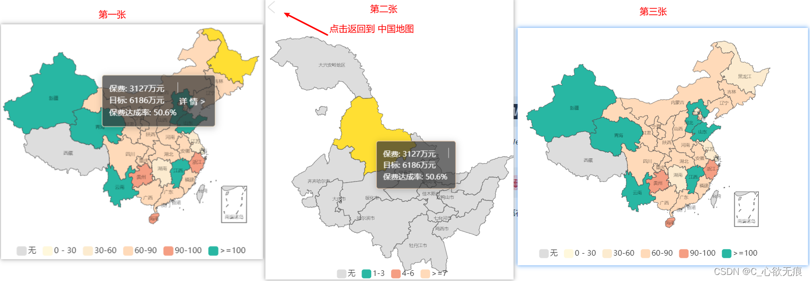

# 使用 echarts 实现中国地图和点击省份进行查看

[[toc]]

## 1，实现的效果和功能

::: tip 实现的功能如下

1.  第一张是实现中国地图，点击任意省份能够显示 tooltip 提示框.
2.  第二张是点击`详情`能够在原来的位置显示此省的地图并可以查看详细.
3.  第三张是点击第二张左上角的返回箭头 重新返回到 第一张`中国地图`. 需要的保费模拟数据我会放到文章的最后面； 
   
:::

echarts 官网参考：[https://echarts.apache.org/examples/zh/index.html](https://echarts.apache.org/examples/zh/index.html)

map 地图参考：[https://echarts.apache.org/zh/option.html#series-map](https://echarts.apache.org/zh/option.html#series-map)

::: info 效果图： 
 
:::

## 2，安装 ECharts

```javascript
npm install echarts --save // 最新版本
### 之前版本
npm install echarts@4.8.0 --save
### 卸载echarts
npm uninstall echarts
```

::: warning 注意： 
echarts5.0 版本下会有地图的数据，5.0 版本以上则没有地图的数据，需要自己下载；
或者安装低版本的 echart 把 map 文件夹的地图数据复制到高版本的对应文件下面也是可以的；
:::


### 2.1 地图数据的位置

中国地图和各省的地图绘制信息需要放到依赖里面的 echarts 下面的 map 文件夹下面；如下图：

 

### 2.2 还可以自己下载这些地图数据

下载地址：[https://datav.aliyun.com/portal/school/atlas/area_selector](https://datav.aliyun.com/portal/school/atlas/area_selector) 

## 3，main.js 里面引入 echarts

```javascript
// 引入echarts
import * as echarts from "echarts";
Vue.prototype.$echarts = echarts; //挂载到原型上面 也可以选择不挂载 直接在页面上引入
```

## 4，实现如下

主要流程如下：


::: tip 流程

 1. 需要有一个容器 <div id="chinaMap" v-if="pyName === 'china'"></div> 且有唯一 id 值 
 2. this.$echarts.init(document.getElementById('chinaMap')); 用来初始化节点 id 和上面的相对应；
 3. require('../../../node_modules/echarts/map/json/china.json');用来导入相对应的地图数据，echarts 进行渲染 
 4. options配置项用来设置 echarts 图表的样式和展示数据相关； 
 5. this.myEchartsOfChina.setOption(options);设置图表实例的配置项以及数据，万能接口，所有参数和数据的修改都可以通过 setOption 完成，ECharts 会合并新的参数和数据，然后刷新图表；
 6. options：formatter; html 里面的点击事件需要在 mounted 里面先行注册一下，否则此方法会报错：undefined；
   
:::


全部代码如下：

```javascript
<template>
  <div>
    <h1>echarts可视化</h1>
    <hr />
    <div class="container">
      <!-- 全国地图 机构趋势模块 -->
      <div class="china">
        <!-- 点击返回全国-->
        <div @click="returnCh">
          
        </div>
        <div id="chinaMap" v-if="pyName === 'china'"></div>
        <div id="provinceMap" v-if="pyName !== 'china'">111</div>
      </div>
    </div>
  </div>
</template>
<script>
import { cityArr, totalMap } from './data/mapData';
export default {
  components: {},
  data() {
    return {
      // 全省保费信息
      totalMap: null,
      // 各个城市的数据
      cityArr: null,
      myEchartsOfChina: null,
      // 默认选择的城市 这是拼音
      pyName: 'china',
      // 保留一份省名的中文
      pyNameOfChinese: '',
    };
  },

  created() {
    // 拿到数据
    this.totalMap = totalMap;
    this.cityArr = cityArr;
    // 页面进来注册tooltip上面的点击事件 否则会报此事件undefined
    window.lookVideoGo = this.lookVideoGo;
  },

  // 页面挂载完成后调用
  mounted() {
    this.chinaMapFun();
  },

  methods: {
    /*中国地图 参考文章：https://echarts.apache.org/zh/option.html#series-map*/
    chinaMapFun(cityName) {
      // 先处理数据 很重要
      let mapData = [];
      for (let i = 0; i < this.totalMap.length; i++) {
        let obj = { value: 0, datas: [] }; // 数组里面是多个对象
        obj.name = this.totalMap[i].comname2; // names属性时数据所对应的地图区域的名称，例如 '广东'，'浙江';参考文章： https://echarts.apache.org/zh/option.html#series-map.data
        obj.value = this.totalMap[i].achieveRate; // 该区域的数据值 number类型
        obj.datas[0] = this.totalMap[i].preium;
        obj.datas[1] = this.totalMap[i].target;

        //注意： 此行是模拟下面的省份用的 实际开发中每个省份的数据是后端返回的
        if (this.totalMap[i].children) {
          obj.children = this.totalMap[i].children;
        }
        mapData.push(obj);
      }

      // 这里进行筛选传进来的省份数据 模拟黑龙江省份下面的和黑河市
      if (this.pyNameOfChinese) {
        mapData = mapData.map((item) => {
          if (item.children) {
            return { name: item.children.comname2, value: item.children.achieveRate, datas: [item.children.preium, item.children.target] };
          }
        });
      }
      console.log('当前渲染的地图:', this.pyName);
      console.log('当前渲染的数据2：', mapData);

      // 1，初始化节点
      // 检测是否已经存在echarts实例，如果不存在，则不再去初始化
      if (this.pyName === 'china') {
        this.myEchartsOfChina = this.$echarts.init(document.getElementById('chinaMap'));
      } else {
        this.myEchartsOfChina = this.$echarts.init(document.getElementById('provinceMap'));
      }

      // 显示加载动画
      this.myEchartsOfChina.showLoading();
      if (this.pyName === 'china') {
        let province = require('../../../node_modules/echarts/map/json/china.json');
        // 注册地图数据
        this.$echarts.registerMap(this.pyName, province);
      } else {
        // 单独引入其他省份的地图  注意：registerMap方法的第一参数要和引入的省名相同
        let province = require('../../../node_modules/echarts/map/json/province/' + this.pyName + '.json');
        this.$echarts.registerMap(this.pyName, province);
      }

      this.myEchartsOfChina.hideLoading();
      /* 参考文档： https://echarts.apache.org/zh/option.html#series-map */
      // 设置整个中国地图的参数
      let options = {
        title: {
          show: false, // 是否显示标题组件
          text: '中国地图', // 主标题文本
          subtext: '注：展示当月和当年累计情况',
          left: '3%',
          top: '85%',
        },
        tooltip: {
          enterable: true, // 允许点击触发tooltip中的事件
          show: true, // 是否显示提示框组件，包括提示框浮层和 axisPointer。 [ default: true ]
          trigger: 'item', // 触发类型。 [ default: 'item' ]
          triggerOn: 'click', // 只有点击时才触发 不设置默认随鼠标移动并显示
          formatter: (array, returnData, callback) => {
            if (isNaN(array.value)) {
              if (this.cityArr.includes(array.name)) {
                return '保费: 暂无' + '<br/>' + '目标: 暂无' + '<br/>' + '保费达成率: 暂无';
              } else {
                return '保费: 暂无' + '<br/>';
              }
            } else {
              let result =
                '<div style="display: flex"><div style="float:left;">保费: ' +
                array.data.datas[0] +
                '万元  <br/>  目标: ' +
                array.data.datas[1] +
                '万元  <br/>  保费达成率: ' +
                array.data.value +
                '%</div>' +
                '<div style="float:left; margin-left: 0.1rem;width: 0.05rem;height: 1rem; background: #D8D8D8;"></div>' +
                '<div style="float:left; margin-left: 0.1rem; "onclick="lookVideoGo(\'' +
                array.name +
                '\')"><p style="height:2rem; line-height:2rem;">详 情 >&nbsp</p></div></div>';
              return result;
            }
          },
          backgroundColor: 'rgba(50,50,50,0.7)', // tooltip 背景颜色 rgba
          // 文本设置
          textStyle: {
            color: 'rgb(255,255,255)', // 值域文字颜色
            fontSize: 12,
          },
        },

        // 底部小导航图标
        visualMap: {
          // text: ['注：展示当月和当年累计情况'],
          orient: 'horizontal',
          itemWidth: 15,
          textGap: 2,
          // calculable: false,
          show: true,
          left: 'center',
          y: 'bottom',
          splitList: [
            { end: 0, label: '无', color: '#DDDDDD' },
            { end: 30, color: 'rgb(255,248,220)' },
            { start: 30, end: 60, label: '30-60', color: 'rgb(252,235,207)' },
            { start: 60, end: 90, label: '60-90', color: '#FFDAB9' },
            { start: 90, end: 100, label: '90-100', color: 'rgb(245,158,131)' }, // 245 158  131
            { start: 100, label: '>=100', color: 'rgb(40,183,163)' }, // 40 183 163
          ],
        },
        backgroundColor: '#fff', // 图表背景色

        series: [
          {
            name: '省份',
            type: 'map', // 指定是地图类型
            map: this.pyName, // 和上面registerMap中的第一个参数值一致才可以正常加载地图
            zoom: 1.2,
            roam: true, // 是否开启平游或缩放
            // geoIndex: 0,
            // aspectScale: 0.75,
            // scaleLimit: { // 滚轮缩放的极限控制
            //   min: 1,
            //   max: 2
            // },
            selectedMode: 'single', // 选中模式，表示是否支持多个选中，默认关闭，支持布尔值和字符串，字符串取值可选'single'表示单选，或者'multiple'表示多选。
            itemStyle: {
              areaColor: '#FFFFFF',
              borderColor: '#0f0f0f',
              normal: { label: { show: true }, areaColor: '#DDDDDD' },
              emphasis: { label: { show: true } },
            },
            emphasis: {
              // 强调的样式，也就是鼠标移入后的样式==高亮状态下的多边形和标签样式。
              itemStyle: {
                areaColor: '#000000',
              },
            },
            label: {
              normal: {
                show: true, // 是否显示标签，这里显示的就是省份的名字。默认就是false
                textStyle: {
                  fontWeight: 300,
                  color: '#000000', // 值域文字颜色
                  fontSize: 7, // 文字的字体大 小
                },
              },
              emphasis: {
                show: false, // 在鼠标移入时，是否显示，如果不写，默认是显示的
              },
            },
            data: mapData, // 各省地图数据导入
          },
        ],
      };

      // 设置各个省份地图的参数
      let options1 = {
        title: {
          show: false, // 是否显示标题组件
          subtext: '注：展示当月和当年累计情况',
          left: '3%',
          top: '85%',
        },
        tooltip: {
          enterable: true, // 允许点击触发tooltip中的事件
          show: true, // 是否显示提示框组件，包括提示框浮层和 axisPointer。 [ default: true ]
          trigger: 'item', // 触发类型。 [ default: 'item' ]
          backgroundColor: 'rgba(50,50,50,0.7)', // tooltip 背景颜色 rgba
          // 文本设置
          textStyle: {
            color: 'rgb(255,255,255)', // 值域文字颜色
            fontSize: 12,
          },
          formatter: (array, returnData, callback) => {
            console.log(array);
            if (isNaN(array.value)) {
              if (this.cityArr.includes(array.name)) {
                return '保费: 暂无' + '<br/>' + '目标: 暂无' + '<br/>' + '保费达成率: 暂无';
              } else {
                return '保费: 暂无' + '<br/>';
              }
            } else {
              let result =
                '<div style="display: flex"><div style="float:left;">保费: ' +
                array.data.datas[0] +
                '万元  <br/>  目标: ' +
                array.data.datas[1] +
                '万元  <br/>  保费达成率: ' +
                array.data.value +
                '%</div>' +
                '<div style="float:left; margin-left: 0.1rem;width: 0.05rem;height: 1rem; background: #D8D8D8;"></div>' +
                '<div style="float:left; margin-left: 0.1rem; "onclick="lookVideoGo(\'' +
                  array.name +
                '\')"><p style="height:2rem; line-height:2rem;">详 情 >&nbsp</p></div></div>';
              return result;
            }
          },
        },
        // 底部小导航图标
        visualMap: {
          // text: ['注：展示当月和当年累计情况'],
          orient: 'horizontal',
          itemWidth: 15,
          textGap: 2,
          // calculable: false,
          show: true,
          left: 'center',
          y: 'bottom',
          splitList: [
            { start: 6, label: '>=7', color: '#FFDAB9' },
            { start: 3, end: 6, label: '4-6', color: 'rgb(245,158,131)' }, // 245 158  131
            { start: 1, end: 3, label: '1-3', color: 'rgb(40,183,163)' }, // 40 183 163
            { end: 0, label: '无', color: '#DDDDDD' },
          ],
        },
        series: [
          {
            name: '省份', // 系列名称，用于tooltip的显示，legend 的图例筛选，在 setOption 更新数据和配置项时用于指定对应的系列。见上：可以在tooltip中获取到
            type: 'map', // 指定是地图类型
            map: this.pyName, // 和上面registerMap中的一直
            zoom: 1.2,
            selectedMode: 'single', // 选中模式，表示是否支持多个选中，默认关闭，支持布尔值和字符串，字符串取值可选'single'表示单选，或者'multiple'表示多选。
            itemStyle: {
              areaColor: '#FFFFFF',
              borderColor: '#0f0f0f',
              normal: { label: { show: true }, areaColor: '#DDDDDD' },
              emphasis: { label: { show: true } },
            },
            emphasis: {
              // 强调的样式，也就是鼠标移入后的样式==高亮状态下的多边形和标签样式。
              itemStyle: {
                areaColor: '#000000',
              },
            },
            label: {
              normal: {
                show: true, // 是否显示标签，这里显示的就是省份的名字。默认就是false
                textStyle: {
                  fontWeight: 300,
                  color: '#000000', // 值域文字颜色
                  fontSize: 7, // 文字的字体大 小
                },
              },
              emphasis: {
                show: false, // 在鼠标移入时，是否显示，如果不写，默认是显示的
              },
            },
            // 数据对不上 省下面的地区对不上
            data: mapData,
          },
        ],
      };
      // 判断是否是各个省份
      if (this.pyName === 'china') {
        this.myEchartsOfChina.setOption(options);
      } else {
        this.myEchartsOfChina.setOption(options1);
      }
    },

    /* 传过来的参数是省份名 */
    lookVideoGo(cityName) {
      // 保留一份中文
      this.pyNameOfChinese = cityName;
      // this.myEchartsOfChina.clear(); // 清空当前实例，会移除实例中所有的组件和图表。
      this.myEchartsOfChina.dispose(); // 销毁后实例无法在使用

      // 获取城市拼音
      for (var i = 0, len = this.cityArr[0].length; i < len; i++) {
        if (cityName === this.cityArr[0][i]) {
          // 获取得城市拼音
          this.pyName = this.cityArr[1][i];
          // 使用nextTick Api 防止echarts初始化时避免节点不存在的报错
          this.$nextTick(() => {
            this.chinaMapFun(this.pyName);
          });
          break;
        } else {
          console.warn('没有找到此城市的拼音');
        }
      }
    },
    /* 点击返回全国 */
    returnCh() {
      // this.myEchartsOfChina.clear(); // 清空当前实例，会移除实例中所有的组件和图表。
      this.myEchartsOfChina.dispose(); // 销毁后实例 这里使用dispose防止残留
      this.pyName = 'china';
      this.pyNameOfChinese = '';

      // 使用nextTick Api 防止echarts初始化时避免节点不存在的报错
      this.$nextTick(() => {
        this.chinaMapFun();
      });
    },
  },
};
</script>
<style lang="scss" scoped>
.container {
  width: 90%;
  // margin: 0 auto;
  border: 1px solid balck;
  display: flex;
  justify-content: flex-start;
  align-items: center;
  flex-direction: row;
  flex-wrap: wrap;
  #chinaMap,#provinceMap {
    width: 400px;
    height: 400px;
    margin-right: 30px;
    margin-top: 20px;
  }
  .china{
  }
  // 返回箭头
  .returnImg{
    cursor: pointer;
    display: block;
    width: 25px;
  }
}
</style>
```

## 5，遇到的问题

### 5.1 渲染中国地图时警告地图不存在：

 **原因：series 里面的 map 属性没有和上面 registerMap 中的第一个参数值保持一致**

**正确写法：**


### 5.2 点击 tooltip 提示框中的详情 生成省份地图时失败（显示的是空白），并且报错如下：

 

**原因：没有拿到 dom 节点，需要在 this.$nextTick API 里面获取 dom 节点**

**正确写法：**

```javascript
// 获取城市拼音
for (var i = 0, len = this.cityArr[0].length; i < len; i++) {
  if (cityName === this.cityArr[0][i]) {
    // 获取得城市拼音
    this.pyName = this.cityArr[1][i];
    // 使用nextTick Api 防止echarts初始化时避免节点不存在的报错
    this.$nextTick(() => {
      this.chinaMapFun(this.pyName);
    });
    break;
  } else {
    console.warn("没有找到此城市的拼音");
  }
}
```

## 6，用到的模拟数据

mapData.js

```javascript
// 定义全国省份的数组
export const cityArr = [
  [
    "上海",
    "河北",
    "山西",
    "内蒙古",
    "辽宁",
    "吉林",
    "黑龙江",
    "江苏",
    "浙江",
    "安徽",
    "福建",
    "江西",
    "山东",
    "河南",
    "湖北",
    "湖南",
    "广东",
    "广西",
    "海南",
    "四川",
    "贵州",
    "云南",
    "西藏",
    "陕西",
    "甘肃",
    "青海",
    "宁夏",
    "新疆",
    "北京",
    "天津",
    "重庆",
    "香港",
    "澳门",
    "台湾"
  ],
  [
    "shanghai",
    "hebei",
    "shanxi",
    "neimenggu",
    "liaoning",
    "jilin",
    "heilongjiang",
    "jiangsu",
    "zhejiang",
    "anhui",
    "fujian",
    "jiangxi",
    "shandong",
    "henan",
    "hubei",
    "hunan",
    "guangdong",
    "guangxi",
    "hainan",
    "sichuan",
    "guizhou",
    "yunnan",
    "xizang",
    "shanxi1",
    "gansu",
    "qinghai",
    "ningxia",
    "xinjiang",
    "beijing",
    "tianjin",
    "chongqing",
    "xianggang",
    "aomen",
    "taiwan"
  ]
];

// 全省保费信息
export const totalMap = [
  {
    achieveRate: 104.1,
    comname2: "山东",
    preium: 22855,
    target: 21960
  },
  {
    achieveRate: 154,
    comname2: "新疆",
    preium: 893,
    target: 580
  },
  {
    achieveRate: 128.6,
    comname2: "青海",
    preium: 935,
    target: 727
  },
  {
    achieveRate: 84.7,
    comname2: "四川",
    preium: 7357,
    target: 8687
  },
  {
    achieveRate: 79.4,
    comname2: "陕西",
    preium: 5102,
    target: 6427
  },
  {
    achieveRate: 84.6,
    comname2: "内蒙古",
    preium: 10448,
    target: 12357
  },
  {
    achieveRate: 0,
    comname2: "无锡",
    preium: 21,
    target: 0
  },
  {
    achieveRate: 74.8,
    comname2: "甘肃",
    preium: 5468,
    target: 7308
  },
  {
    achieveRate: 93.4,
    comname2: "海南",
    preium: 3746,
    target: 4009
  },
  {
    achieveRate: 71.4,
    comname2: "湖北",
    preium: 2870,
    target: 4017
  },
  {
    achieveRate: 39.4,
    comname2: "厦门",
    preium: 188,
    target: 477
  },
  {
    achieveRate: 63.3,
    comname2: "宁夏",
    preium: 1292,
    target: 2042
  },
  {
    achieveRate: 135.2,
    comname2: "江西",
    preium: 5616,
    target: 4155
  },
  {
    achieveRate: 0,
    comname2: "东莞",
    preium: 0,
    target: 0
  },
  {
    achieveRate: 95,
    comname2: "贵州",
    preium: 6931,
    target: 7298
  },
  {
    achieveRate: 39.1,
    comname2: "江苏",
    preium: 2303,
    target: 5893
  },
  {
    achieveRate: 0,
    comname2: "上海",
    preium: 6,
    target: 0
  },
  {
    achieveRate: 85.7,
    comname2: "天津",
    preium: 1672,
    target: 1950
  },
  {
    achieveRate: 60.1,
    comname2: "广东",
    preium: 3260,
    target: 5428
  },
  {
    achieveRate: 58.6,
    comname2: "青岛",
    preium: 1979,
    target: 3380
  },
  {
    achieveRate: 67.7,
    comname2: "吉林",
    preium: 12375,
    target: 18288
  },
  {
    achieveRate: 45.3,
    comname2: "湖南",
    preium: 4527,
    target: 9995
  },
  {
    achieveRate: 52.2,
    comname2: "北京",
    preium: 6,
    target: 12
  },
  {
    achieveRate: 86.1,
    comname2: "河南",
    preium: 5733,
    target: 6659
  },
  {
    achieveRate: 71.6,
    comname2: "安徽",
    preium: 3201,
    target: 4471
  },
  {
    achieveRate: 50.6,
    comname2: "黑龙江",
    preium: 3127,
    target: 6186,
    children: {
      comname2: "黑河市",
      preium: 3127,
      target: 6186,
      achieveRate: 50.6
    }
  },
  {
    achieveRate: 0,
    comname2: "苏州",
    preium: 193,
    target: 0
  },
  {
    achieveRate: 69.9,
    comname2: "山西",
    preium: 2051,
    target: 2935
  },
  {
    achieveRate: 77.6,
    comname2: "福建",
    preium: 4371,
    target: 5632
  },
  {
    achieveRate: 96.5,
    comname2: "浙江",
    preium: 9650,
    target: 10000
  },
  {
    achieveRate: 73.5,
    comname2: "辽宁",
    preium: 8753,
    target: 11915
  },
  {
    achieveRate: 78.1,
    comname2: "重庆",
    preium: 2587,
    target: 3313
  },
  {
    achieveRate: -0.5,
    comname2: "深圳",
    preium: 0,
    target: 24
  },
  {
    achieveRate: 112.5,
    comname2: "宁波",
    preium: 1233,
    target: 1096
  },
  {
    achieveRate: 122.7,
    comname2: "云南",
    preium: 5477,
    target: 4462
  },
  {
    achieveRate: 104.9,
    comname2: "河北",
    preium: 13750,
    target: 13107
  },
  {
    achieveRate: 66.4,
    comname2: "广西",
    preium: 1134,
    target: 1707
  }
];
```
